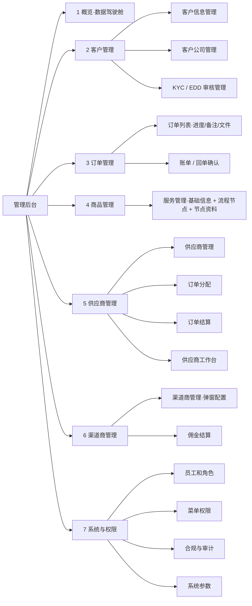
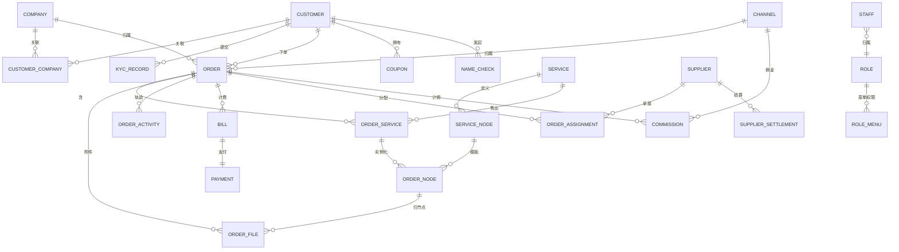

# Leapexbiz 管理后台 — 产品需求文档 PRD v1.0（现行版）

> **产品**：Leapexbiz（香港持牌 TCSP 公司秘书服务）· 管理后台
> **定位**：**承接小程序产生的全部数据与运营服务**——客户与公司档案、KYC/EDD、核名、订单履约、账单收款、交付物、供应商/渠道协同、合规留痕。
> **配套**：唯一现行《PRD_小程序完整版_v1.0》、《技术开发文档_Leapexbiz管理后台_v1.0》。
> **更新**：2026-07-02（正文已对齐小程序最新设计：登录/地区、渠道码、核名双名简繁、KYC 手机·人脸 + EDD 后台、章程语言、业务办理"线下交表约 1 周"、优惠券、**订单协同（进度/备注/文件）**、**服务流程节点**）。
> **原型**：http://124.221.97.241:8081/admin
> **作者**：产品（兼香港财务 / 合规）

---

## 〇、本版核心变化（相对 v3.0 / 旧版）

| # | 变化 | 说明 |
|---|---|---|
| A | **服务=可配置「流程节点」模型（★核心新增）** | 每个服务由一串有序**流程节点**组成，每个节点声明 **责任方 + 客户需上传的资料清单 + 时效**；此模型**同时驱动**小程序的「办理步骤 / 进度时间轴」与后台的「订单进度维护」 |
| B | **订单 = 后台 ↔ 小程序 协同枢纽** | 管理/供应商在订单里**维护进度、写备注、上传文件**；小程序端客户**实时看到进度、历史轨迹、服务人员上传的资料**，并按节点**上传所需资料** |
| C | **模块收敛为 7 大组** | 概览 / 客户管理 / 订单管理 / 商品管理 / 供应商管理 / 渠道商管理 / **系统与权限**；**删除「线索&投流」**独立模块，**工作台并入供应商/渠道商** |
| D | **供应商 / 渠道商去掉「在线结算 + 提现」** | 双方工作台只**查看订单与结算金额**（对账用），实际结算**线下转账**，后台标记「已结算」；**不做在线结算 / 提现** |
| E | **KYC → KYC / EDD 审核管理** | 明确 EDD（增强尽调）子流程；**PEP / 制裁筛查在后台内部执行**（小程序前端不展示） |
| F | **删除定价矩阵**（延续 v3.0） | 价格 = 商品**标准价**（双币），渠道差异只体现在**佣金** |
| G | **系统与权限模块** | 员工和角色 · **菜单权限（按角色配置可见菜单）** · 合规与审计 · 系统参数 |

---

## 一、产品目标与角色

### 1.1 目标
- **承接小程序全量业务数据**：客户/公司档案、KYC/EDD、核名、订单、账单、交付物、年审/变更、优惠券、渠道归属。
- 满足香港 **AMLO / 公司条例 / TCSP 牌照**的合规运营与记录保存（**7 年、不可篡改审计日志**）。
- 支撑**多方协同**：平台自营 + 供应商履约 + 渠道商获客，财务可对账（双应付台账）。

### 1.2 RBAC 角色

| 角色 | 定位 | 核心权限 |
|---|---|---|
| Super Admin 超管 | 系统最高权限 | 全量 + 角色/菜单/系统参数 |
| Admin 运营管理 | 日常运营 | 客户/订单/商品/供应商分配/渠道/账单 |
| Operations 运营 | 执行层 | 核名查册、订单进度维护、交付物上传、回单初审 |
| Compliance 合规 | 合规审查 | KYC/EDD 审核、制裁/PEP 筛查、SCR、合规报告 |
| Finance 财务 | 财务 | 账单/回单确认、退款审批、佣金/供应商应付对账、导出 |
| Channel 渠道商（外部） | 获客方（只读） | 仅本渠道带来的订单状态 + 佣金结算（**不可在线结算/提现**） |
| Supplier 供应商（外部） | 履约乙方 | 仅分配给自己的订单：看详情、更新进度、上传交付物、看结算（**不可在线结算/提现**） |
| Custom 自定义 | 自定义 | 菜单 × 操作粒度自定义 |

> **外部方隔离**：供应商 / 渠道商**看不到** 客户 KYC 明细、其他方数据、定价/佣金规则、RBAC 配置；供应商看订单只见**履约所需信息 + 客户按节点上传的资料**，不见付款金额。

---

## 二、模块结构（7 大模块）

---

## 三、各模块详细设计

### 3.1 概览（数据驾驶舱）
- **KPI（按角色）**：今日新增订单 · 待处理 KYC/EDD · 待人工核名 · 待确认回单 · 本月营收（已到账）· 待分配订单 · 本月应付佣金 · 本月供应商应付。
- **趋势图**：订单量（30 天折线）· 营收（12 月柱）· 服务类型分布（饼）· 渠道来源分布（饼）· KYC 时效（柱）。
- **待办（含 SLA）**：KYC/EDD 超时（>48h·🔴）· 回单待确认（🔴）· 制裁命中待复核（🔴 合规）· 人工核名待处理（🟠）· 待分配订单（🟠）· 年审到期/逾期（🟠/🔴）。

### 3.2 客户管理

**① 客户信息管理**（个人档案）
- 列表：姓名（中/英）/ 手机 / 邮箱 / 服务地区 / 渠道归属 / KYC 状态 / 注册来源 / 注册时间；搜索 + 筛选。
- 详情：身份档案（证件类型 港证/护照/其他 + 证件号〔加密〕+ 通讯/通常住址）、关联公司列表、订单历史、优惠券、企微/来源、**内部备注 + 标签**（高价值/需跟进）。
- **被拒 / 制裁客户 7 年留存区**（合规可查）。

**② 客户公司管理**（公司主数据）
- 列表：公司中英名 / CI / BR / 成立日期 / **下次年审日 NAR1** / SCR 状态 / 公司状态；筛选到期/逾期。
- 详情：公司档案 + **关联人（董事/股东/秘书，多对多，含持股 % 与实益拥有人标记）** + 历史订单 + 历史交付物 + SCR 登记册。
- **年审台账**：成立周年 + 42 天规则，触发 6 轮递进提醒 + 到期前 60 天自动生成年审账单。

**③ KYC / EDD 审核管理**
- 队列：待审核（提交时间 + SLA 倒计时）。
- 审核台：证件 OCR + 原件、地址证明、业务性质/资金来源、**本人验证方式（手机验证码/人脸）**、**PEP + 制裁筛查结果（后台内部）**。
- 动作：**通过 / 要求补充（退回小程序）/ 拒绝（留档 7 年 + 原因）/ 标记 EDD**。
- **EDD 流程**：PEP/高风险 → 要求资金来源证明 + 业务关系合理性 → 合规二次审核。
- **制裁命中**：自动**冻结订单** → 合规复核 → 解冻 / 上报（STR 预留）；**no tipping-off**。
- 状态机：`未开始→填写中→审核中→通过 | 待补正 | EDD | 拒绝`；命中制裁→`冻结`。

### 3.3 订单管理（★协同枢纽）

**① 订单列表**
- 列表：订单号 / 客户 / 公司 / 服务（可多子项）/ 渠道 / 金额（双币）/ 状态 / 履约方（直营/供应商）/ 创建时间；状态筛选。
- **订单详情 = 进度维护台**（对齐小程序）：
  - **进度时间轴**：按该服务的**流程节点**渲染；每个节点可**改状态**（未开始/进行中/待客户资料/已完成/已退回）、**写备注**、**上传文件**。
  - **资料区**：客户按节点上传的资料（可预览）+ 服务人员上传的交付物/文件（标记**是否对客户端可见**）。
  - **历史轨迹**：所有进度变更 / 备注 / 文件操作按时间留痕（不可篡改），**客户端可见其中"对客户可见"的条目**。
  - 子服务列表（一单多服务，各自节点与状态）、关联账单、履约方、操作（催办/补资料/取消〔限未办理前〕/续费）。
- **小程序端对应**：客户在订单详情**实时看到进度、历史轨迹、服务人员上传的资料**，并按当前节点**上传所需资料**（资料清单来自服务节点配置，见 §3.4）。

**② 账单 / 回单确认**
- 账单列表（状态/时间/金额/渠道/币种）。
- **回单审核**：查看港币线下转账回单截图 → **确认到账 / 驳回**；确认后订单进入"服务中"。
- 手动生成账单 / **作废 · 重开（≤2 次/订单）· 退款 → Finance 审批 + 留痕**。
- **优惠券抵扣**在账单体现（券种 + 抵扣额，币种感知）。
- 印花税：股份转让账单按 **从价 0.2%（对价与资产净值孰高）** 自动预估并注明。
- 状态机：`待支付→待确认(回单待核)→已到账→服务中`；旁支 `已作废 / 已驳回 / 已退款`。

### 3.4 商品管理 · 服务管理（★流程节点）

**① 服务基础信息**（可编辑）
- 字段：服务编码 / 名称 / 分类（注册·年审·变更·记账·增值）/ 类型（单项·组合）/ **标准价（人民币 + 港币双币）** / 富文本详情 / 适用人群 / 交付物清单 / 上下架状态 / 排序。
- 组合服务：可挂子服务（如"标准注册"含注册 + 首年年审 + 印章）。

**② 编辑流程节点**（每个服务一个「编辑流程节点」按钮 → 节点编辑器）
- 每个服务维护一串**有序流程节点**，每个节点：
  | 字段 | 说明 |
  |---|---|
  | 节点名 | 如"支付""KYC 认证""提交公司资料""组织章程""人工预审""业务办理""完结" |
  | 顺序 seq | 时间轴次序（支持并行标记，如 KYC 与 提交注册信息并行） |
  | 责任方 owner | 客户 / 平台 / 供应商 |
  | **所需客户上传资料** | 该节点客户须上传的资料清单（名称 + 是否必填），如"地址证明（近 3 月）""护照扫描件" |
  | 时效 SLA | 该节点预计工作日 |
  | 说明 | 节点提示文案（小程序展示） |
- **一处配置、两处驱动**：
  - **小程序**：服务详情的「办理流程」步骤条、下单后的办理进度、每步"待上传资料"提示，均读取此配置。
  - **后台**：下单时按服务节点**实例化**为订单节点（§3.3 进度维护台）。
- 示例（标准公司注册）：支付 →〔并行：KYC 认证 / 提交注册信息（公司资料→成员董事秘书→组织章程→人工预审）〕→ 业务办理（线下递交 NNC1·约 1 周取正本）→ 完结（CI/BR + 交付物）。

### 3.5 供应商管理（履约乙方）

**① 供应商管理**：账号（超管新增）· 档案（公司/联系人/邮箱/负责服务类型）· 状态（启用/暂停）· **结算规则（固定额 / 实付×比例，可逐服务配）**。
**② 订单分配**：无渠道码/自然流量订单 → 运营按规则（地域/负载/优先级，兜底转直营）分配给供应商；分配状态 `待接收→进行中→已上传→已确认 | 已驳回`。
**③ 订单结算**：按结算规则生成**供应商应付**（可多订单合并/周期）· 状态（待结算/已结算）· **线下转账后后台标记"已结算"**。
**④ 供应商工作台**（供应商登录）：
- **我分配到的订单**：查看订单履约信息（不见付款金额）+ 客户按节点上传的资料。
- **更新订单进度**：改节点状态、写备注、上传交付物文件（回推小程序）。
- **查看结算**：本人应付账单与结算状态（只读）。**去掉在线结算 / 提现模块**。

### 3.6 渠道商管理（获客方）

**① 渠道商管理**：渠道账号 + **channel code**；**配置详情采用弹窗**（渠道信息 + **渠道×服务佣金率**，可逐服务/订单不同，留空不计佣）。
**② 佣金结算**：
- 佣金基数 = 客户**实付（标准价 − 优惠券）× 佣金率**；订单**"已完成"**时生成应付佣金。
- 渠道商登录可**查看本渠道带来的订单状态 + 佣金结算**（只读）；**线下转账后后台标记"已结算"**。**去掉在线结算 / 提现模块**。

### 3.7 系统与权限

**① 员工和角色**：员工账号（超管新增，绑角色）· 角色管理（预置 7 + 自定义）· 状态（启用/停用）· 重置密码。
**② 菜单权限**：**按角色配置可见菜单 / 可用操作**（菜单树 × 角色的勾选矩阵）；外部角色（供应商/渠道商）仅开放各自工作台菜单。
**③ 合规与审计**：制裁名单管理（UN/EU/HKMA）· KYC 记录导出（含被拒，审计用）· 合规报告（AMLO 周期报告）· **STR 预留** · SCR 登记册 · **不可篡改审计日志（哈希链，7 年）**。
**④ 系统参数**：见附录参数表（时效/额度/前缀/税率等可配）。

---

## 四、★数据结构设计（承接小程序数据）

> 说明：字段为逻辑设计（落库可映射为表），敏感字段（证件号/地址/UBO）**字段级 AES-256 加密**。金额均**双币**存储（`_cny` / `_hkd`）。

### 4.1 实体关系总览（ERD）

### 4.2 核心实体与关键字段

**CUSTOMER 客户（个人）**：`id · name_zh · name_en · phone · email · wechat_openid · region(服务地区:香港/新加坡/迪拜/BVI) · channel_code(渠道归属) · id_type(港证/护照/其他) · id_no🔒 · addr_mail🔒 · addr_res🔒 · kyc_status · tags · remark · created_at`

**COMPANY 客户公司**：`id · name_zh · name_en · ci_no · br_no · incorp_date · reg_address · hsic_code(行业) · share_capital · next_nar1_date(周年+42天) · scr_status · status(注册中/正常/年审待办/年审逾期/变更中/注销中/已注销) · created_at`

**CUSTOMER_COMPANY 关联（多对多 + 身份）**：`customer_id · company_id · roles · shareholding(持股%) · is_ubo(实益拥有人) · consent_director(董事同意书)`

**KYC_RECORD**：`id · customer_id · status(未开始/填写中/审核中/待补正/EDD/冻结/通过/拒绝) · id_type · id_doc🔒 · address_proof · business_nature · fund_source · verify_method(手机/人脸) · pep_result🔒 · sanction_result🔒(UN/EU/HKMA) · submitted_at · reviewed_by · reviewed_at · reject_reason · edd_flag · retain_until(+7年)`

**SERVICE 服务/商品**：`id · code · name · category(注册/年审/变更/记账/增值) · type(单项/组合) · price_cny · price_hkd · desc_richtext · target_audience · deliverables[] · sub_services · status(上架/下架/面议/合作) · sort`

**SERVICE_NODE 服务流程节点（★）**：`id · service_id · seq · parallel_group(并行组,可空) · name · owner(客户/平台/供应商) · required_docs · sla_days · hint(小程序提示文案)`

**ORDER 订单**：`id · order_no · customer_id · company_id(可空:注册前) · channel_code · status(待支付/待补资料/待KYC/服务中/待客户确认/已完成/已取消/已退款/已关闭/部分完成) · total_cny · total_hkd · coupon_id · assigned_supplier_id · created_at`

**ORDER_SERVICE 订单子服务**：`id · order_id · service_id · price_cny · price_hkd · status`

**ORDER_NODE 订单节点进度（★协同核心）**：`id · order_service_id · service_node_id · seq · name · owner · status(未开始/进行中/待客户资料/已完成/已退回) · updated_by(员工/供应商id) · updated_at · note(备注)`

**ORDER_FILE 订单文件/资料（★）**：`id · order_id · order_node_id(可空) · name · url · uploader_role(客户/员工/供应商) · uploader_id · category(客户上传/交付物/内部) · visible_to_client(bool) · created_at`

**ORDER_ACTIVITY 订单轨迹/备注**：`id · order_id · actor · action(进度更新/备注/上传/审核) · content · visible_to_client(bool) · created_at`（不可篡改）

**BILL 账单**：`id · bill_no · order_id · order_service_id · amount_cny · amount_hkd · currency · coupon_discount · stamp_duty(印花税) · status(待支付/待确认/已到账/已作废/已驳回/已退款) · pay_method(微信/支付宝/港币转账) · receipt_url(回单) · confirmed_by · confirmed_at`

**PAYMENT 支付**：`id · bill_id(UNIQUE 1:1) · amount · method · paid_at · confirmed_by`

**SUPPLIER 供应商**：`id · name · contact · email · service_types[] · settlement_rule(fixed额/rate比例, 可逐服务) · status(启用/暂停)`
**ORDER_ASSIGNMENT 订单分配**：`id · order_id · supplier_id · assigned_by · assigned_at · status(待接收/进行中/已上传/已确认/已驳回)`
**SUPPLIER_SETTLEMENT 供应商结算**：`id · supplier_id · order_ids[] · amount · period · status(待结算/已结算) · settled_at`（无在线结算/提现）

**CHANNEL 渠道商**：`id · code(channel code) · name · contact · commission_rules · status`
**COMMISSION 佣金**：`id · channel_id · order_id · base_amount(实付) · rate · amount · period · status(待结算/已结算) · settled_at`（无在线结算/提现）

**COUPON 优惠券**：`id · customer_id · type(免费核名券/注册立减券) · value · currency · scope(适用服务) · valid_until · status(可用/已用/过期) · used_order_id`

**NAME_CHECK 核名申请**：`id · customer_id · name_zh(繁体) · name_zh_input(原简体) · name_en · tm_keyword · mode(全名/起首) · status(草稿/人工核名中/已出结果·可用/有近似/敏感词/过期) · result_json · advisor_note · free_quota_used · created_at`

**STAFF 员工**：`id · name · email · phone · role_id · status`
**ROLE 角色**：`id · name · is_system`
**ROLE_MENU 菜单权限**：`role_id · menu_key · can_view · can_operate`（角色×菜单矩阵）
**AUDIT_LOG 审计日志**：`id · actor · action · target · before🔒 · after🔒 · hash · prev_hash · created_at`（哈希链不可篡改，7 年）
**SYSTEM_PARAM 系统参数**：`key · value`（见附录）

### 4.3 关键流转与规则
- **服务节点 → 订单节点实例化**：下单 → 对每个 `order_service` 按其 `service_id` 的 `service_node[]` 生成 `order_node[]`；订单进度 = order_node 集合的状态推进。
- **进度/文件/备注同步小程序**：`order_node.status`、`order_activity(visible_to_client=true)`、`order_file(visible_to_client=true)` 即为小程序订单详情所见；客户按 `order_node` 当前"待客户资料"节点上传 → 写入 `order_file(category=客户上传)`。
- **收入确认时点**：`bill.status=已到账` 记收款（现金制），对账以银行入账为准。
- **佣金**：订单 `已完成` → 生成 `commission`；**供应商结算**：按规则生成 `supplier_settlement`。二者**月度对账、线下结清、后台标记**。
- **多对多**：客户 ↔ 公司多对多；一订单多子服务；一账单 1:1 一支付。

---

## 五、小程序 ↔ 后台 闭环对齐

| 小程序动作 | 后台模块 | 数据落点 | 回推小程序 |
|---|---|---|---|
| 登录（手机/微信）+ 服务地区 + 渠道码 | 客户信息管理 | CUSTOMER(region/channel_code) | — |
| 提交核名（中繁/英 + 商标） | 客户管理·核名 | NAME_CHECK | 人工核名结果 + 建议 |
| 提交 KYC（手机/人脸 + 证件 + 地址 + 资金来源） | 客户管理·KYC/EDD | KYC_RECORD（后台跑 PEP/制裁） | 通过/补正/拒绝/EDD |
| 下单 + 选优惠券 | 订单管理 + 商品(节点实例化) | ORDER / ORDER_SERVICE / ORDER_NODE / COUPON | 订单进度 |
| 上传港币回单 | 订单·账单/回单确认 | BILL(receipt) → 确认 | 已到账→服务中 |
| 提交注册资料（公司/成员/章程语言/人工预审） | 订单·进度维护 | ORDER_NODE + ORDER_FILE | 进度推进 |
| 查看订单进度 / 历史 / 服务人员上传资料 | 订单·进度维护台 | ORDER_NODE / ORDER_ACTIVITY / ORDER_FILE(visible) | 实时可见 |
| 按节点上传资料 | 订单·资料区 | ORDER_FILE(客户上传) | 节点流转 |
| 业务办理（线下交 NNC1·约 1 周） | 订单·进度维护 | ORDER_NODE | 时间轴 + 完结 CI/BR |
| 年审到期 | 客户公司·年审台账 | COMPANY.next_nar1_date + 6 轮提醒 | 提醒 + 年审账单 |

---

## 六、权限矩阵（模块 × 角色，关键差异）

| 模块 | Super | Admin | Ops | Compl | Fin | Channel | Supplier |
|---|:--:|:--:|:--:|:--:|:--:|:--:|:--:|
| 客户信息/公司 | ✅ | ✅ | 查看 | 查看 | 查看 | ❌ | ❌ |
| KYC/EDD 审核 | ✅ | ✅ | ✅ | ✅ | ❌ | ❌ | ❌ |
| 制裁/SCR/合规报告 | ✅ | ✅ | ❌ | ✅ | ❌ | ❌ | ❌ |
| 订单·进度维护 | ✅ | ✅ | ✅ | 查看 | 查看 | 归属只读 | 分配只读+更新进度 |
| 账单/回单/退款 | ✅ | ✅ | 初审 | ❌ | ✅ 终审 | ❌ | ❌ |
| 商品/服务节点 | ✅ | ✅ | ❌ | ❌ | ❌ | ❌ | ❌ |
| 供应商管理/分配/结算 | ✅ | ✅ | 分配 | ❌ | 应付只读+标记 | ❌ | 自己只读 |
| 渠道商/佣金 | ✅ | ✅ | ❌ | ❌ | 汇总只读 | 本渠道只读 | ❌ |
| 系统与权限 | ✅ | 部分 | ❌ | 审计只读 | ❌ | ❌ | ❌ |

---

## 七、优先级与落地范围

| 优先级 | 内容 |
|---|---|
| P0 | RBAC + 菜单权限 · 客户信息/公司 · KYC/EDD 审核 · **订单进度维护（节点/备注/文件）** · 账单/回单确认 · **服务管理 + 流程节点编辑** · 概览 |
| P1 | 供应商（管理/分配/结算/工作台）· 渠道商（弹窗配置/佣金结算）· 核名审核 · 年审台账 · 优惠券 · 审计日志 |
| P2 | 合规报告/STR · SCR 台账 · 印花税计算 · 退款审批 · 数据导出/BI |

---

## 附录 · 系统参数（可配）
`payment_deadline_days=7` · `name_lock_days=30` · `name_check_free_quota=3` · `kyc_audit_timeout_hours=48` · `data_retention_years=7` · `order_prefix=ORD-` · `bill_prefix=LEA-` · `supplier_settle_prefix=SUP-` · `nnc1_gov_process_days≈7`（线下交表→取正本）· `annual_review_advance_days=60` · `nar1_grace_days=42` · `max_bill_reopen_count=2` · `stamp_duty_rate=0.002`。

---

*管理后台 PRD v1.0（现行版）· 2026-07-02 · 已对齐《PRD_小程序完整版_v1.0》最新设计 · 取代重构 v3.0/v2.0*
