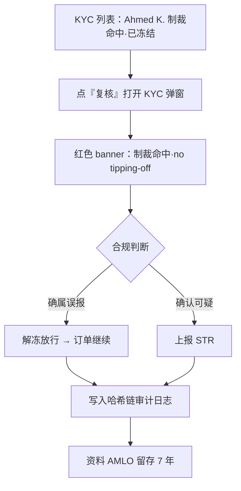
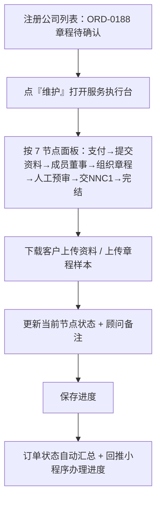
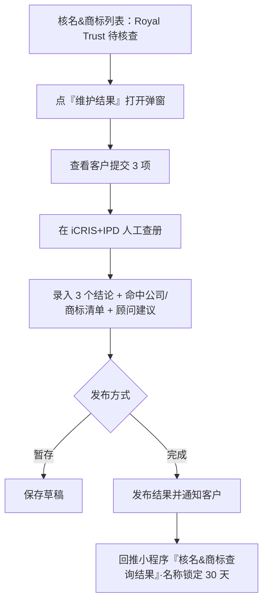
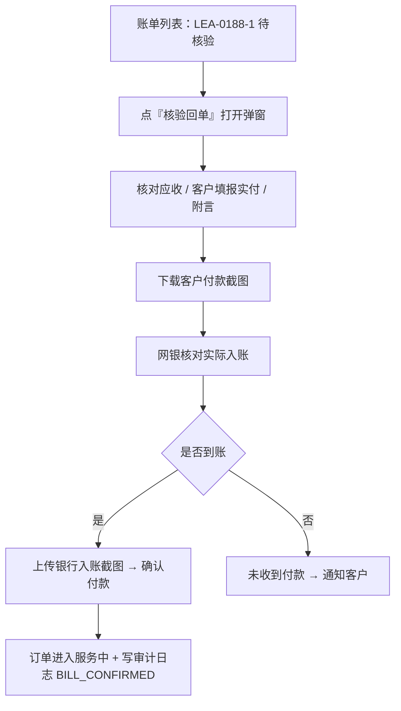
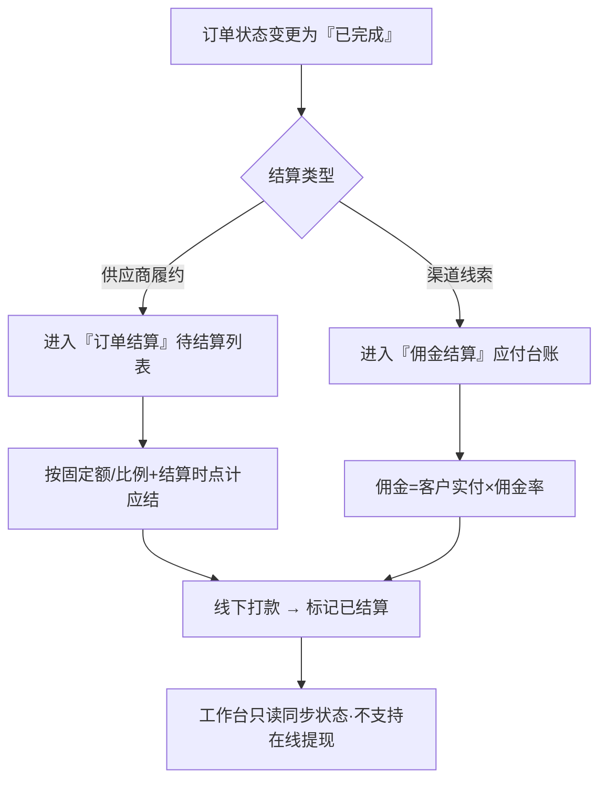
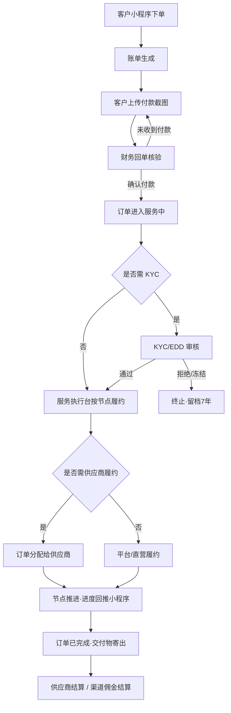
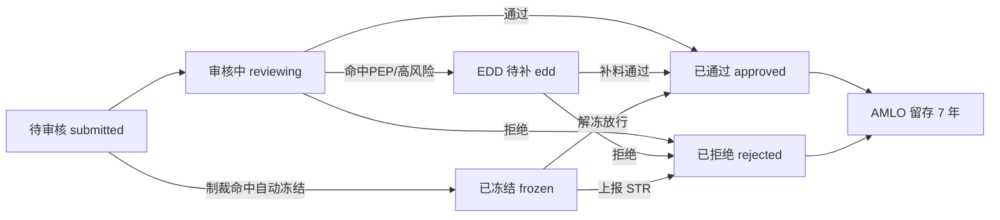
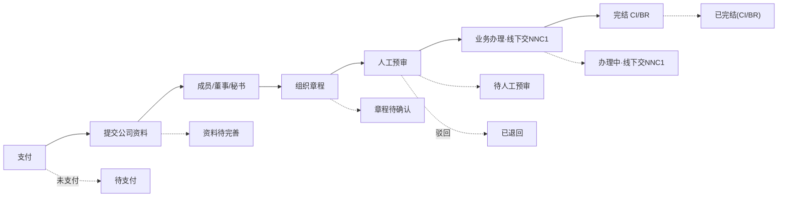
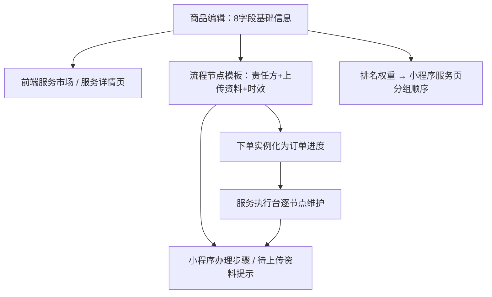

# Leapex 利柏思 · 管理后台 产品需求文档 v1.0

> 版本：v1.0 ｜ 编制日期：2026-07-14 ｜ 编制：产品部 ｜ 事实来源：`backend/static/admin.html`（原型）
> 品牌：Leapex 利柏思（原 Leapexbiz 更名）｜ 持牌 TCSP · 牌照号 TC10988 ｜ 视觉：暗黑金（黑底 `#0D0D0D` + 金 `#D4A853`），正文暖橙强调 `#C15F3C`
> 标注约定：**【原型已实现】** = 原型 HTML 中已有页面 / 弹窗 / 字段 / JS 行为；**【规划中】** = 会议方向或后端契约尚未在原型落地，需二期实现。

---

## 一、产品背景与目标

### 1.1 市场数据洞察

香港作为亚洲国际金融中心，公司注册与维护存在稳定且庞大的存量需求：

- **主体规模巨大**：香港公司注册处在册本地公司长期维持在 140 万家以上量级，每年新设本地公司稳定在 10 万+ 家、解散数万家，形成"新设 — 年审 — 变更 — 注销"的完整生命周期需求。
- **强制年度合规刚需**：每家私人公司须每年递交周年申报表 **NAR1**（成立周年日起 **42 天内**，逾期政府罚款递增），并每年办理商业登记证 BR 续期、法定秘书与注册地址维护——这是不可选、不可延后的法定动作，构成天然的年复购。
- **跨境与出海拉动增量**：大湾区一体化、内地企业出海、跨境电商与身份规划持续拉动"内地客户 + 香港主体"需求，客户对**远程办理、进度可视、中文服务**诉求强烈。
- **合规监管趋严**：香港《打击洗钱及恐怖分子资金筹集条例》(AMLO) 要求 TCSP 持牌经营，须对客户执行 KYC / EDD 尽职调查、制裁名单筛查，并将尽调资料**留存 7 年**。合规能力已成为持牌机构的核心壁垒与信任来源。

**香港公司注册处一手统计（精确可核，来源：Companies Registry 官方统计页 `cr.gov.hk`）：**

| 指标 | 2023 | 2024 | 2025 | 备注 |
|---|---|---|---|---|
| 登记册有效本地公司总数（含迁册） | 1,430,758 | 1,460,494 | **1,557,103** | 截至 2026-05 累计约 1,601,089 |
| 年度新注册本地公司数 | 132,246 | 145,053 | **195,343** | 2025 同比约 +35%，其中私人有限公司 194,125 |
| 注册非香港公司（境外公司）总数 | 14,826 | 15,126 | 15,586 | 2025 新设营业地点 1,532，较 2024（1,079）约 +42% |

- **TCSP 持牌监管（AMLO Cap. 615，2018-03-01 生效）**：所有 TCSP 须领牌、通过「适当人选」测试并履行 KYC / 记录保存义务，无牌经营属刑事罪行；牌照审批目标 2.5 个月内处理、2024/25 年度达标率 99.0%。全港 TCSP 持牌机构约 **6,000+**（*估算/待核*）。
- 上表公司总数 / 新注册数 / 非香港公司数为公司注册处官方一手统计（精确可核）；SaaS 市场规模、TCSP 精确机构数等标注**估算/待核**项，定稿前须补官方 TCSP Register / CR 年报及第三方报告来源。

> **对后台的直接意义**：主体基数逼近 156 万、2025 年新设激增 35%、境外公司持续增长——意味着后台须支撑「大批量客户 × 逐年年审到期 × 多政府表格履约」的规模化合规作业，本 PRD 的**流程节点模板化、KYC/EDD 按节点审核、年审 6 轮提醒、审计哈希链留痕**正是承接这一规模的核心能力。

### 1.2 行业挑战

| 挑战 | 传统模式痛点 | Leapex 后台的应对 |
|---|---|---|
| 服务链条长、节点多 | 注册 / 变更 / 注销涉及 NNC1 / ND2A / NR1 / NNC2 / NDR1 等多张政府表格与线下递交，人工跟单易漏 | 每项服务配置**流程节点模板**（责任方 + 上传资料 + 时效），下单实例化为可维护的订单进度 |
| 合规成本高、易出错 | KYC / 制裁筛查 / EDD 依赖人工经验，留痕不足 | KYC / EDD **按节点审核** + 制裁命中自动冻结 + 哈希链审计 + 7 年留存参数化 |
| 报价与渠道混乱 | "一渠道一售价"导致价格体系失控 | 价格跟服务走（**统一标准价**），渠道差异只体现在**佣金**（0625 会议已下线"定价矩阵"） |
| 履约方 / 渠道方协同难 | 印章、公证、地址等供应商与投流渠道商账目不清 | 供应商（履约乙方）/ 渠道商（线索方）分离建模，**订单"已完成"才结算**，线下打款 + 标记 |
| 客户端与后台脱节 | 客户看不到进度，反复电话询问 | 后台节点进度 / 核名结果 **回推小程序**「办理进度 / 核名 & 商标查询结果 / 消息中心」 |

### 1.3 用户目标

- **超级管理员 / Admin**：一屏掌握运营总览（营收 / KYC 待办 / 回单 / 佣金 / 供应商应付），配置商品、渠道、供应商、权限与系统参数。
- **运营 (Operations)**：核名查册、注册与各类变更 / 记账 / 地址服务的**执行台**逐节点推进，维护进度并回推客户端。
- **合规 (Compliance)**：KYC / EDD 审核、制裁命中复核、STR 上报、审计留痕。
- **财务 (Finance)**：回单核验（确认到账）、供应商结算、渠道佣金结算（均线下打款 + 标记）。
- **渠道商 / 供应商（外部）**：各自工作台**只读**查看归属订单与结算状态，严格数据隔离。

---

## 二、功能定义和概述

### 2.1 功能模块 × 功能点 × 优先级 × 核心价值

| 模块 | 功能点 | 优先级 | 核心价值 | 状态 |
|---|---|---|---|---|
| 01 概览 | 数据驾驶舱（8 KPI + SLA 待办） | P0 | 运营一屏掌控、SLA 优先级驱动处理 | 【原型已实现】 |
| 02 客户管理 | 客户信息管理（列表 + 详情 + 编辑） | P0 | 个人档案作为 KYC 复用源 / 跨模块公共身份 | 【原型已实现】 |
| 02 客户管理 | 客户公司管理（CI/BR/SCR + 年审驱动） | P0 | 法人主体档案，驱动「我的公司」与年审提醒 | 【原型已实现】 |
| 02 客户管理 | KYC / EDD 审核（按节点） | P0 | 合规准入、制裁冻结、7 年留存 | 【原型已实现】 |
| 03 订单管理 | 订单列表（只读，进度联动服务管理） | P0 | 全局订单视图 + 取消 + 资料下载 | 【原型已实现】 |
| 03 订单管理 | 账单 / 回单确认（核验到账） | P0 | 人工核验回单、确认付款 / 未收到 | 【原型已实现】 |
| 04 商品管理 | 商品（8 字段 + 面议 + 流程节点 + 排名权重） | P0 | 前端服务市场 + 小程序办理步骤数据源 | 【原型已实现】 |
| 04 商品管理 | 卡券（模板 + 发放 + 核销记录） | P1 | 拉新促活、账单抵扣、券驱动 GMV | 【原型已实现】 |
| 05 服务管理 | 公司注册执行台（NNC1 · 7 节点） | P0 | 核心履约主流程，交付 CI/BR | 【原型已实现】 |
| 05 服务管理 | 各类变更执行台（地址/董事/秘书/更名/转让/注销） | P0 | 对应 NR1/ND2A/NNC2/NDR1 政府表格 | 【原型已实现】 |
| 05 服务管理 | 年审 / 记账报税 / 地址租赁 / 商标执行台 | P0 | 覆盖全服务线履约 | 【原型已实现】 |
| 05 服务管理 | 核名 & 商标工作台（人工查册 3 项） | P0 | 人工查册结果录入 + 回推客户端 | 【原型已实现】 |
| 06 供应商管理 | 供应商管理 / 订单分配 / 订单结算 | P1 | 履约乙方协同 + 已完成才结算 | 【原型已实现】 |
| 07 渠道商管理 | 渠道商管理 / 佣金结算 | P1 | 投流线索归属 + 佣金台账 | 【原型已实现】 |
| 06/07 工作台 | 供应商工作台 / 渠道商工作台 | P2 | 外部方自助只读、数据隔离 | 【原型已实现】 |
| 08 系统与权限 | 员工与角色 (RBAC) / 菜单权限矩阵 | P0 | 7 角色 + 角色×菜单可见性 | 【原型已实现】 |
| 08 系统与权限 | 消息管理（模板 + 年审 6 轮 + 群发） | P1 | 承接小程序消息中心、事件触发 | 【原型已实现】 |
| 08 系统与权限 | 合规与审计（哈希链日志） / 系统参数 | P1 | 不可篡改留痕 + 全局参数化 | 【原型已实现】 |
| — 已下线 | 定价矩阵 | — | 0625 会议下线，价格跟服务走 | 【已下线】 |

### 2.2 功能结构图

```mermaid
flowchart TD
    ROOT["Leapex 利柏思 管理后台"]
    ROOT --> M1["01 概览"]
    ROOT --> M2["02 客户管理"]
    ROOT --> M3["03 订单管理"]
    ROOT --> M4["04 商品管理"]
    ROOT --> M5["05 服务管理"]
    ROOT --> M6["06 供应商管理"]
    ROOT --> M7["07 渠道商管理"]
    ROOT --> M8["08 系统与权限"]

    M1 --> M1a["数据驾驶舱 · SLA 待办"]
    M2 --> M2a["客户信息管理"]
    M2 --> M2b["客户公司管理 CI/BR/SCR"]
    M2 --> M2c["KYC / EDD 审核（按节点）"]
    M3 --> M3a["订单列表（只读·联动进度）"]
    M3 --> M3b["账单 / 回单确认"]
    M4 --> M4a["商品（编辑+流程节点+排名权重）"]
    M4 --> M4b["卡券（模板+发放+记录）"]
    M5 --> M5a["公司注册执行台 NNC1"]
    M5 --> M5b["变更执行台 NR1/ND2A/NNC2/NDR1"]
    M5 --> M5c["年审 / 记账报税 / 地址租赁 / 商标"]
    M5 --> M5d["核名 & 商标工作台（人工查册）"]
    M6 --> M6a["供应商管理"]
    M6 --> M6b["订单分配"]
    M6 --> M6c["订单结算"]
    M6 --> M6d["供应商工作台（只读）"]
    M7 --> M7a["渠道商管理"]
    M7 --> M7b["佣金结算"]
    M7 --> M7c["渠道商工作台（只读）"]
    M8 --> M8a["员工与角色 RBAC"]
    M8 --> M8b["菜单权限矩阵"]
    M8 --> M8c["消息管理"]
    M8 --> M8d["合规与审计"]
    M8 --> M8e["系统参数"]
```

---

## 三、用户角色和使用场景

### 3.1 角色说明（RBAC · 原型已定义 7 角色 + 自定义）

| 角色 | 定位 | 典型权限边界 |
|---|---|---|
| Super Admin | 超级管理员（原型头部 role-pill） | 全量菜单且不可取消；新增供应商 / 渠道商 / 员工 |
| Admin | 系统管理员 | 除系统与权限外近全量 |
| Operations 运营 | 服务执行主力 | 核名、注册、变更、订单进度维护、分配 |
| Compliance 合规 | 尽调与制裁 | KYC/EDD、审计；不含财务结算 |
| Finance 财务 | 收付与结算 | 回单确认、供应商结算、佣金结算 |
| Channel 渠道（只读） | 外部投流方 | 仅渠道商工作台，数据仅限本渠道 |
| Supplier 供应商（隔离） | 外部履约方 | 仅供应商工作台，数据仅限本供应商 |

### 3.2 核心场景

#### 场景一：合规专员审核一笔命中制裁名单的 KYC

- **痛点**：制裁筛查命中若靠人工判断易漏，且需满足 AMLO "no tipping-off"（不得泄露给客户）与 STR 上报要求。
- **用户故事**：作为合规专员，我希望命中制裁名单的 KYC 能被系统**自动冻结**，我在审核弹窗中复核后选择解冻放行或上报 STR，全过程留痕，以满足监管。

#### 场景二：运营维护公司注册进度并回推小程序

- **痛点**：注册涉及 7 个节点、线下递交 NNC1，客户反复询问进度。
- **用户故事**：作为运营，我希望在注册执行台按节点更新状态、下载客户资料、上传章程 / NNC1，保存后进度**自动回推小程序**客户端「办理进度」。

#### 场景三：运营完成核名 & 商标人工查册并发布结果

- **痛点**：香港无智能预检，须在 iCRIS + IPD 人工查册，结果需结构化回推客户。
- **用户故事**：作为运营，我希望逐项录入核名（繁体）/ 核名（英文）/ 商标 三个结论与命中清单 + 顾问建议，发布后回推小程序并通知客户。

#### 场景四：财务核验客户回单并确认到账

- **痛点**：客户上传的付款截图不等于真实到账，需网银核对后再放行。
- **用户故事**：作为财务，我希望核对应收 / 实付 / 附言，上传银行入账截图后点「确认付款」，订单进入服务中；查不到入账则「未收到付款」通知客户。

#### 场景五：财务结算供应商与渠道佣金（已完成才结算）

- **痛点**：未完成订单若提前结算会造成坏账；线下打款需留痕。
- **用户故事**：作为财务，我只对**订单已完成**的供应商结算项与渠道佣金进行线下打款后「标记已结算」。

---

## 四、核心业务流程

### 4.1 客户下单到交付主干流程

### 4.2 KYC / EDD 审核状态流转

### 4.3 服务节点驱动订单状态（以公司注册为例）

### 4.4 商品配置驱动客户端与后台（数据一致性）

---

## 五、功能详细说明（逐页面 / 逐字段）

> **全局状态色（pill）**：绿 = 完成 / 通过 / 上架；蓝 = 进行中 / 待审核；琥珀 = 待办 / 超时 / 待确认；红 = 拒绝 / 冻结 / 失败；灰 = 未开始 / 下架 / 中性；金 = 高价值 / 主推；紫 = PEP / 商标。

### 5.1 工作台 · 数据驾驶舱（`p-dash`）

**页面：** 8 张 KPI 卡片 + SLA 待办列表。【原型已实现】

| KPI（`.kpi`） | 取值示例 | 说明 / 副标注 |
|---|---|---|
| 今日新增订单 | 12 | 较昨日 +3（绿） |
| 待处理 KYC (`k-kyc`) | 5 | 含超时（琥珀） |
| 待核名 & 商标 (`k-nc`) | 3 | 待人工核查 |
| 待确认回单 (`k-bill`) | 4 | 需财务核对（琥珀） |
| 本月营收（已到账）(`k-rev`) | HKD 286K | ↑ 18% MoM（绿） |
| 渠道转化率 | 42.7% | 渠道 / 自然流量 |
| 本月应付佣金 (`k-comm`) | HKD 34.2K | 待结算 |
| 供应商应付 (`k-sup`) | HKD 8.6K | 印章 / 公证 |

**SLA 待办**（`.todo`，红=高、琥珀=中）：KYC/EDD 超时(>48h)、回单待确认、制裁名单命中待复核、人工核名待处理、注册公司待处理进度、待分配订单。KPI 数值 **【规划中】** 由 `loadDash()` 拉取后端 `/dash` 实时数据（原型 JS 已预留 `jpost`/`loadDash` 调用）。

### 5.2 客户信息管理（`p-customers`）

**列表字段**：客户（姓名 + 邮箱/电话）｜来源渠道（金 pill=渠道码 / 灰=自然流量）｜KYC 状态（已通过/审核中/EDD 中/已拒绝·留档 7y）｜公司数｜订单｜标签（高价值/PEP）｜注册时间｜操作（详情 / 编辑）。**筛选**：搜索框 + chip（全部 / 渠道客户 / 自然流量 / 需跟进）+ 导出。

**客户详情弹窗 `m-customer`**（个人档案 = KYC 复用源 · 跨模块公共身份）：
- 只读档案（`.kv`）：证件类型/号码（🔒加密）、手机/邮箱、通讯/通常住址（通常住址不公开）、服务地区/渠道归属、KYC 状态（AMLO 留存 7 年）、标签。
- 关联公司（多对多）、我的优惠券、订单历史、内部备注（textarea，仅内部可见，可保存）。
- 底部：关闭 / 打包下载 KYC / 保存备注。

**客户编辑弹窗 `m-custedit`**：姓名（中文 / 英文）、手机、邮箱等（组件均为 `inp`，默认回填当前值）。

### 5.3 客户公司管理（`p-companies`）

**定位提示**：客户公司 = 法人主体（CI 公司注册证书 / BR 商业登记证 / SCR 重要控制人登记册）。一客户可多公司；公司状态驱动小程序「我的公司」与「为你推荐」。

**列表字段**：公司（中/英）｜实益拥有人｜CI/BR｜注册日期｜下次年审（琥珀/红 = 剩余天数或逾期）｜SCR（已建/待建/待更新）｜状态（注册中/正常/年审待办/已注销）｜操作（详情 / 编辑 /【年审待办额外显示】催办）。**筛选**：搜索 CI/BR + chip（全部/注册中/正常/年审待办/已注销）。

**公司详情弹窗 `m-company`**：中/英名、CI/BR、成立日期/注册地址、业务性质 HSIC、下次年审 NAR1（成立周年 + 42 天内）、SCR/状态；关联人（董事/股东/秘书，多对多，含实益拥有人 UBO 标记，秘书恒为 Leapex 利柏思）；历史订单、历史交付物；底部可「生成年审账单」。

### 5.4 KYC / EDD 审核（按节点）（`p-kyc`）

**列表字段**：客户｜证件（香港身份证/护照）｜PEP（否 / 是·含家属，紫）｜制裁筛查（未命中 / 命中·冻结）｜提交时间｜SLA（剩余时长 / 超时 Nh / 合规复核）｜状态｜操作（审核 / 复核 + 编辑）。**筛选 chip**：待审核 / EDD 增强尽调 / 制裁命中 / 已通过 / 已拒绝。

**审核弹窗 `m-kyc`（状态自适应）** —— `openKyc(id,status,name)`：

- **状态枚举（弹窗态）**：`submitted` 待审核 / `reviewing` 审核中 / `edd` EDD 增强尽调 / `frozen` 制裁命中复核 / `approved` 已通过（查看）/ `rejected` 已拒绝（查看）。
- **动态 banner**（按状态变色 + 文案）：待审核（蓝，SLA 倒计时）；EDD（琥珀，补资金来源 + 业务关系合理性）；frozen（红，⚠制裁命中已自动冻结、no tipping-off）；approved（绿，AMLO 留存 7 年仅查看）；rejected（红，仅查看含拒绝原因）。
- **KYC 节点面板** `KYC_NODES`（`NODE_ST_KYC` 枚举 = 待客户资料 / 进行中 / 已完成 / 已退回）：身份认证（客户，含证件 + 手持证件照片）、地址证明（客户，水电账单）、业务性质 / 资金来源（客户 / 合规）。每节点可修改客户内容 / 替换资料 / 逐节点补充材料与备注。
- **拒绝框**（`kyc-reject-box`，默认隐藏）：拒绝原因 **必填**（将通知客户并留档 7 年）。
- **底部动作（按状态渲染）**：
  - submitted/reviewing：打包下载 / 保存修改 / 拒绝 / 标记 EDD / 通过；
  - edd：打包下载 / 保存修改 / 拒绝 / EDD 通过；
  - frozen：打包下载 / 上报 STR / 解冻放行；
  - approved / rejected：打包下载 /（approved 另有保存修改）/ 关闭。
- 动作回调 `kycAct`：reject=已拒绝留档7年、edd=标记 EDD、approve=已通过、unfreeze=解冻放行、str=上报 STR；**【规划中】** 调后端 `/kyc/{id}/{action}` 并刷新看板。

### 5.5 订单管理

#### 5.5.1 订单列表（`p-orders`）
**字段**：订单号｜客户｜服务｜渠道（金=渠道码 / 灰=直营）｜金额｜状态（待支付/服务中/已完成/已取消）｜创建时间｜操作（进度/维护）。筛选 chip：全部/待支付/服务中/已完成/已取消。

**订单详情弹窗 `m-order`（只读）**：进度**与「服务管理」联动，此处不可修改**；提供办理进度表（节点 / 责任方 / 状态 / 备注）、客户上传资料（查看/下载）、服务人员文件（查看/下载）、历史轨迹（不可篡改）。底部仅「取消订单」+「关闭」两项操作。

#### 5.5.2 账单 / 回单确认（`p-bills`）
**定位**：仅用于**核验与确认付款**，**不支持退款 / 作废 / 重开**。**字段**：账单号｜订单/服务｜金额｜印花税（如股份转让 0.2%，琥珀）｜客户回单（已上传/未上传）｜状态（待核验/待支付/已确认付款）｜操作（核验回单）。

**回单核验弹窗 `m-bill`**：核验信息（应收金额 / 客户填报实付 / 付款银行·日期 / 附言（核对用，红字））；客户上传付款截图（可下载）；服务人员上传银行入账截图（点击上传）。底部：**未收到付款**（红，通知客户）/ **确认付款**（订单进入服务中，写审计 `BILL_CONFIRMED`）。

### 5.6 商品与服务管理

#### 5.6.1 商品列表（`p-products`）
对齐《利柏思服务清单与报价 202607》，为**前端服务市场数据源**。**列表字段**：商品（名称/副标题 + 类型标签）｜类型｜标准价 HKD / ¥（面议项显示"面议"）｜时效｜适用人群｜适用区域｜状态（上架/下架）｜操作（编辑 / 【部分】流程节点 / 【部分】核名&商标办理 / 下架）。

**17 项商品**（含核名 99 港币 + 新客赠 3 券、新设香港有限公司 5,533/4,980、年审 4,422/3,980、审计含理账·面议、薪俸税 556/500·/人、个别人士报税、董事变更 333/300、变更秘书、变更注册地址、公司更名 1,667/1,500、股份转让·面议、公司注销·面议、商标注册 3,311/2,980、商标续期 2,200/1,980、独立注册地址 6,000/5,400·/年、工位租赁·面议、独立办公室·面议）。

**商品编辑弹窗 `m-product`（8 组核心字段）**：

| 字段 | 组件 | 必填 | 默认/说明 |
|---|---|---|---|
| 商品名称 `prod-name` | inp | 是 (*) | — |
| 副标题 `prod-sub` | inp | 否 | — |
| 商品图片 `prod-img` | 上传 | 否 | 建议 200×200 · PNG/JPG |
| 服务类型 `prod-type` | select | 是 (*) | 核名商标/注册/秘书&地址/记账报税/工商变更/商标/地址租赁；旁挂「排名权重管理」按钮 |
| 服务简要介绍 `prod-intro` | inp | 否 | 展示在服务详情页顶部 |
| 标准价 `prod-hkd` / `prod-cny` | inp×2 | 否 | 双币；勾选 **价格面议** `prod-consult` 后两栏置灰不可填 |
| 办理时效 `prod-sla` | inp | 否 | 如"约 10 个工作日" |
| 上/下架 | select | — | 默认上架 |
| 适用人群 `prod-persona` | inp | 否 | 画像推荐 |
| 适用区域 | checkbox×4 | — | **香港默认勾选**，新加坡/迪拜/BVI 可选 |
| 服务交付内容 `prod-deliver` | textarea | 否 | 每行一项 |
| 所需材料 `prod-materials` | textarea | 否 | 每行一项 |
| 办理流程 `prod-process` | textarea | 否 | 每行一节点、按顺序 |
| 详细描述 `prod-desc` | 富文本 | 否 | 加粗/斜体/下划线/有序无序列表/小标题/链接，保存为 HTML，前端直接渲染 |

**排名权重弹窗 `m-typerank`**：对 `SVC_TYPE_ORDER = [核名商标, 注册, 秘书&地址, 记账报税, 工商变更, 商标, 地址租赁]` 上移/下移排序；仅影响小程序**服务页分组顺序**与筛选排序，保存后即时同步。

**流程节点编辑弹窗 `m-nodes`**（★驱动小程序办理步骤 + 订单进度）：表格逐行编辑 `#`｜节点名(inp)｜责任方(select：客户/平台/供应商)｜客户需上传资料（逗号分隔）｜时效(天)｜删除。可「新增节点」。节点顺序 = 小程序办理步骤，下单后实例化为订单进度。

#### 5.6.2 各服务执行台（按节点维护 + 上传下载）

所有执行台共用**节点面板** `nodePanel(nodes, stOpts)`：每节点渲染 责任方 + 状态下拉（`NODE_ST_REG` = **未开始 / 待客户资料 / 进行中 / 待客户确认 / 已完成 / 已退回**）+ 客户上传资料（下载 / 待补 pending 标记）+ 服务人员上传文件（supp）+ 顾问备注；`locked:true` 的支付节点固化为绿色「已完成」不可改。执行台弹窗底部统一：取消 / 添加备注 / 保存进度（回推小程序办理进度）。

- **公司注册执行台 `m-svc`**（`REG_NODES`，7 节点，页面 `p-register`）：支付(locked) → 提交公司资料（公司中英名 / 业务性质 HSIC / 股东董事身份）→ 成员/董事/秘书 → 组织章程（章程样本 / 语言选择确认）→ 人工预审 → 业务办理（线下交 NNC1，交表后约 1 周取 CI/BR 正本）→ 完结（CI/BR + 交付物）。列表状态枚举：待支付 / 资料待完善 / 章程待确认 / 待人工预审 / 办理中·线下交 NNC1 / 已完结(CI/BR) / 已退回。
- **变更执行台 `m-change`**（`openChange(id,type,name)`，页面 `p-chg-*`）—— 各 type 的节点模板：
  - `address` 地址变更（NR1，6 节点）：支付 → 提交关键信息 → 编制 NR1 → 文件签字确认 → 递交注册处 → 完结（更新地址 + 最新 BR）。
  - `director` 董事变更（ND2A，7 节点）：支付 → 提交关键信息 → **新董事 KYC** → 编制 ND2A → 文件签字确认 → 递交注册处 → 完结（更新董事名册 + SCR）。
  - `secretary` 变更秘书（ND2A，6 节点，秘书部分我方填）：支付 → 确认接任信息 → 编制 ND2A（秘书部分我方填）+ 委任书 → 文件签字确认 → 递交注册处 → 完结（更新秘书 + 交接登记册）。
  - `rename` 公司更名（NNC2，7 节点，先付费后查名）：支付 → 提交拟用新名称 → 人工查名（含商标风险，可联动核名&商标）→ 编制 NNC2 + 特别决议 → 文件签字确认 → 递交注册处 → 完结（新名称证书 + 新 BR + 印章×2）。
  - `transfer` 股份转让（7 节点）：支付服务费 → 提交转让信息 → 核定作价 + 预估印花税（从价 0.2%，买卖双方各 0.1% + 每份文书定额 HK$5，按对价与资产净值孰高）→ 受让方 KYC → 备转股文书 + 缴印花税（送 IRD 加盖印花）→ 文件签字确认 → 完结（更新股东名册 + 新股票）。
  - `deregister` 公司注销（7 节点）：支付 → 提交注销信息 → 申请 IRD 不反对通知书 IR1263 → 备特别决议 + NDR1 → 文件签字确认 → 递交注册处 + 宪报公告（异议期约 3 个月）→ 完结（注销证明·约 8 个月）。
  - `annual` 年审（5 节点，法定秘书 + 注册地址 + NAR1）：支付/续费 → 信息核对 → 编制 NAR1 → 递交注册处（周年 + 42 天内）→ 完结（NAR1 回执 + 更新 BR）。
  - `bookkeep`/`salarytax`/`persontax` 记账报税：审计含理账（PTR）、公司薪俸税 IR56A&B（逐员工 IR56B + 汇总 IR56A）、个别人士报税 BIR60。
  - `addr-solo`/`addr-seat`/`addr-office` 地址租赁：独立注册地址（交付租约 + 厘印税单 + 水电单，不可办公）、工位（达利对接、客户与达利直签）、独立办公室（面议、看房报价）。
  - `tmreg`/`tmrenew` 商标：注册申请（初步检索 → 递交 IPD → 宪报公告 3 个月异议期 → 证书约 6 个月）、续期（每 10 年）。

#### 5.6.3 核名 & 商标工作台（`p-namecheck`）
**列表字段**：客户｜客户提交（核名繁体 / 核名英文 / 商标繁体）｜人工核查结果（3 项 pill）｜服务人员｜维护时间｜状态｜操作（维护结果）。筛选：服务人员下拉 + 时间下拉 + 搜索。**状态枚举** `NODE_ST_NC` = 待提交 / 待查册 / 查册中 / 待客户确认 / 通过·可用 / 名称锁定 / 敏感词·待合规 / 需牌照·Blue / 已拒绝。

**维护结果弹窗 `m-namecheck`**（无智能预检、纯人工）：展示客户提交（查册方式 / 核名繁体 / 核名英文 / 商标）；三张结果卡片，各含结论下拉 + 命中清单表（可增删行）+ 顾问备注：
- 结果 1 核名繁体 / 结果 2 核名英文 结论枚举：🟢 可用 / 🟡 有近似 / 🟠 近似冲突 / 🔴 敏感词·商标冲突 / 🔵 需牌照；命中表字段：公司名称 / 商业登记号 / 名称现况 / 公司状态（仍注册·已告解散）。
- 结果 3 商标 结论枚举：🟢 可注册 / 🟠 有近似 / 🔴 已注册冲突；命中表字段：商标名 / 商标编号 / 类别 Class / 拥有人 / 状态（已注册·申请中·已失效）。
- 顾问总建议（回推小程序结果页）。底部：取消 / 保存草稿 / **发布结果并通知客户**（回推小程序 + 名称锁定 30 天）。查名**不保证 100%**，以注册处繁体注册为准。

### 5.7 卡券管理（`p-coupons`）
**KPI**：累计发放 / 已核销（核销率）/ 待使用（含近效期）/ 带动 GMV。**券模板列表字段**：券名｜类型｜面值/门槛｜适用范围｜有效期｜发放/核销｜状态（上架/下架）｜操作（编辑 / 发放 / 上架）。**发放记录字段**：客户｜卡券｜状态（可用/已用/过期）｜领取时间｜使用订单｜使用时间。

**卡券编辑弹窗 `m-coupon`**：券名 `coupon-name`（必填 *）｜类型 `coupon-type`（免费服务券/立减券/折扣券，*）｜面值（立减额/折扣率）｜币种（HKD/CNY/—免费券）｜关联免费服务（核名&商标）｜适用范围｜满减门槛（HKD，0=无）｜有效期规则（固定截止日 / 领取后 N 天）｜截止日 或 N 天｜发放上限 / 每人限领｜可叠加（固定为**否·不可叠加·不可提现**，disabled）｜状态（上架/下架）。

**卡券发放弹窗 `m-couponissue`**：发放对象（指定客户 / 客户群·新注册未下单 / 客户群·高价值 / 按服务地区 / 按渠道 / 全部客户）｜指定客户或条件｜每人发放张数（默认 1）｜预计发放（disabled 估算）｜附带消息通知（是·发「卡券发放」消息 / 否·静默）。券核销发生在**账单确认抵扣**。

### 5.8 供应商管理（管理 / 分配 / 结算）

- **供应商管理 `p-supplier`**：供应商 = 履约乙方，**超管新增、不支持自助申请**。列表字段：供应商（编号+类型）｜支持服务｜结算方式｜合作订单｜状态。供应商详情卡：勾选**支持的服务** + **结算规则表**（每服务：固定额/比例 + 结算额 + 结算时点：订单完成后结/月结/确认收货后结）。
- **订单分配 `p-assign`**：已付款待履约订单 → 分配供应商（列出需履约任务 + 建议供应商）；履约中列表（截止 / 履约进度 / 状态）；**自动分配规则**（勾选：①支持该服务匹配 ②负载均衡 ③结算成本择优 ④兜底转直营）。
- **订单结算 `p-suppliersettle`**：**仅订单状态=已完成**的结算项进入；字段：订单号 / 供应商 / 履约任务 / 结算方式 / 应结 / 订单状态 / 结算操作；未完成订单置灰不可结算；走**线下转账**，财务对账后「标记已结算」，**不提供在线结算 / 提现**。
- **供应商工作台 `p-supplierwt`**（Supplier 角色，数据仅限本供应商）：KPI + 分配给我的订单（更新进度 / 接单 / 上传单号）+ 我的结算（只读对账）。

### 5.9 渠道商管理（管理 / 佣金）
- **渠道商管理 `p-channel`**：渠道商 = 提供线索的投流方、不履约，**超管新增**。列表字段：渠道商（编号）｜推荐码｜本月线索/成交｜本月成交额｜累计佣金｜状态｜操作（配置详情）。**渠道商配置弹窗 `m-channel`**：专属推荐码（可重新生成）+ 佣金规则表（按服务：按比例/固定额 + 佣金率/额）。客户填推荐码下单即归属该渠道。
- **佣金结算 `p-commission`**：KPI（本月应付佣金 / 已结算 / 合作渠道商）+ 月度佣金台账（渠道 / 服务 / 实付基数 / 佣金率 / 单笔佣金 / 状态 / 标记已结算）。佣金 = 客户实付 × 佣金率；**订单「已完成」才入应付台账**；线下打款后「标记已结算」，客户不可见佣金。
- **渠道商工作台 `p-partner`**（Channel 角色）：KPI + 我带来的订单（按 channel code 归属，只读）+ 我的佣金（只读）。

### 5.10 消息管理（`p-messages`）
承接小程序消息中心。KPI（今日已发送 / 已读率 / 待发定时 / 发送失败可重发）。**消息模板字段**：分类（合规通知/流程通知/年审提醒/营销）｜触发事件｜标题模板（含 `{变量}`）｜渠道（站内·微信·邮件）｜强制（合规通知=强制不可退订，营销=可退订）｜状态（启用/停用）｜编辑。**年审提醒规则（6 轮递进）**：到期前 60/42(法定周年+42)/30/14/7/1 天，逐轮配渠道与开关。**群发/公告 `openBroadcast`** + **发送记录**（接收人/分类/标题/渠道/状态：已读/已发送/失败可重发/时间）。

### 5.11 系统与权限
- **员工与角色 `p-rbac`**：7 角色（Super Admin / Admin / Operations / Compliance / Finance / Channel 只读 / Supplier 隔离）+ 自定义；后台员工列表（员工/角色/2FA/最后登录/状态/编辑），支持邀请员工。
- **菜单权限 `p-menuperm`**：**角色 × 菜单可见性矩阵**（checkbox），勾选 = 该角色登录侧边栏可见；Super Admin 全量且 disabled 不可取消；外部角色（Channel/Supplier）默认仅各自工作台，严格数据隔离；保存即时生效。
- **合规与审计 `p-compliance`**：KPI（制裁名单 UN/EU/HKMA / KYC 7 年留存 / SCR 登记册）+ **操作审计日志（哈希链·不可篡改）**：时间/操作人/动作（如 BILL_CONFIRMED、KYC_FROZEN、NAME_CHECK_RESULT）/对象/校验（✓ 链完整）。
- **系统参数 `p-config`**（key-value + 说明）：`payment_deadline_days=7` / `name_lock_days=30` / `name_check_free_quota=3` / `kyc_audit_timeout_hours=48` / `data_retention_years=7`（AMLO）/ `annual_review_advance_days=60` / `stamp_duty_rate=0.002`（股份转让 0.2%）。

### 5.12 登录（`login`）
邮箱 + 密码 + **启用二步验证（管理端强制，默认勾选）**。**【规划中】** 后端鉴权 + 强制 2FA 校验（原型为前端隐藏登录层）。

---

## 六、异常处理

| 异常场景 | 提示文案 | 处理方式 |
|---|---|---|
| KYC 命中制裁名单 | ⚠ 制裁名单命中，订单已自动冻结（对客户 no tipping-off） | 弹窗置 frozen 态，仅"上报 STR / 解冻放行"，写审计 KYC_FROZEN |
| KYC 拒绝未填原因 | 拒绝原因（必填 · 将通知客户并留档 7 年） | 拒绝框强校验，未填不可提交 |
| KYC / EDD 审核超时 | SLA 超时 Nh（琥珀 / 红） | 看板 SLA 待办高亮，`kyc_audit_timeout_hours=48` 触发 |
| 回单：网银查无入账 | 请在网银核对实际入账后再确认 | 选「未收到付款」通知客户，订单不推进 |
| 回单模块误操作退款 | 本模块不支持退款 / 作废 / 重开 | 弹窗仅"确认付款 / 未收到付款"两项 |
| 订单详情尝试改进度 | 订单详情为只读，推进进度请到「服务管理」维护 | 弹窗只读，进度联动服务管理 |
| 结算未完成订单 | 未完成不可结算（行置灰） | 仅订单状态=已完成的结算项可结算 |
| 在线提现请求 | 不提供在线结算 / 提现 | 供应商 / 渠道商工作台只读，线下打款 + 标记 |
| 核名查名 100% 保证质疑 | 查名不保证 100%，最终以注册处核准为准 | 弹窗提示，结论分级（🟢🟡🟠🔴🔵） |
| 商品价格面议 | 价格面议（勾选后标准价置灰不可填） | `prod-consult` 勾选后 HKD/CNY 输入禁用 |
| 消息发送失败 | 失败 · 可重发 | 发送记录标红，提供重发 |
| 面议服务下单 | 24 小时内顾问联系（预约咨询二次确认） | 走【预约咨询】弹窗，不进标准支付 |
| 年审逾期 | 已逾期 N 天（红）/ 剩余天数 | 6 轮递进提醒 + 列表催办按钮 |
| 制裁 / 拒绝数据留存 | 留档 7 年 | `data_retention_years=7`，合规不可删除 |

---

## 七、数据埋点方案

| 埋点事件 | 触发时机 | 业务意义 |
|---|---|---|
| `dashboard_view` | 进入数据驾驶舱 | 运营活跃度、SLA 待办关注度 |
| `kyc_review_open` | 打开 KYC 审核弹窗 | 合规处理量、审核入口漏斗 |
| `kyc_action`（approve/reject/edd/unfreeze/str） | 点击 KYC 审核动作 | 通过率 / 拒绝率 / EDD 比例 / STR 上报量 |
| `kyc_sla_timeout` | KYC 超过 48h 未处理 | SLA 达成率、合规风险预警 |
| `bill_verify_open` | 打开回单核验弹窗 | 财务处理量 |
| `bill_confirm` / `bill_reject` | 确认付款 / 未收到付款 | 到账确认率、回单准确率 |
| `namecheck_publish` | 发布核名 & 商标结果 | 人工查册时效、结论分布（可用/近似/冲突） |
| `svc_node_save` | 服务执行台保存节点进度 | 各服务节点耗时、卡点分析（如章程待确认） |
| `order_cancel` | 订单详情取消订单 | 取消率、取消节点分布 |
| `product_save` | 保存商品（新增/编辑） | 商品维护频次、面议项占比 |
| `nodes_template_save` | 保存流程节点模板 | 服务流程变更频次（影响小程序办理步骤） |
| `type_rank_save` | 保存服务类型排名权重 | 服务页排序运营干预 |
| `coupon_issue` | 确认发放卡券 | 券发放量、发放对象分布、券驱动 GMV |
| `coupon_redeem` | 账单确认抵扣核销券 | 核销率、券 ROI |
| `supplier_assign` | 分配订单给供应商 | 供应商负载、自动分配命中率 |
| `supplier_settle` / `commission_settle` | 标记已结算（供应商 / 渠道） | 应付结清周期、结算及时性 |
| `message_broadcast` | 新建群发 / 公告 | 触达规模、渠道分布 |
| `message_send_result` | 消息下发（成功 / 失败） | 送达率、已读率、失败重发率 |
| `annual_remind_fire` | 年审 6 轮提醒各轮触发 | 各轮转化率、最佳提醒时点 |
| `menuperm_save` | 保存角色×菜单权限 | 权限变更审计、越权风险 |
| `audit_log_write` | 关键动作写哈希链（BILL_CONFIRMED / KYC_FROZEN / NAME_CHECK_RESULT 等） | 合规留痕完整性、链校验 |
| `login_2fa` | 登录时二步验证 | 管理端安全合规、2FA 覆盖率 |

---

> **附：口径与边界（务必遵循）**
> 1）价格跟服务走、统一标准价，渠道差异只在佣金——「定价矩阵」已下线；2）供应商 = 履约乙方、渠道商 = 线索方，均超管新增、订单「已完成」才结算、线下打款、不支持在线提现；3）后台节点进度 / 核名结果均**回推小程序**，商品流程节点模板同时驱动客户端办理步骤与后台订单进度；4）合规数据 AMLO 留存 7 年、审计哈希链不可篡改。**【规划中】** 项（看板实时数据 `/dash`、KYC 动作 `/kyc/{id}/{action}`、登录鉴权 + 强制 2FA、消息多渠道实际下发）需二期对接后端契约。

---

**源文件（供核对）**：`/Users/xiayu/Claude-project/leapex_Leapexbiz/backend/static/admin.html`（2024 行，含 33 页面 `p-*` + 全部弹窗 `m-*` 与 JS 节点模板 `REG_NODES`/`KYC_NODES`/`NODE_ST_*`/`SVC_TYPE_ORDER`）。