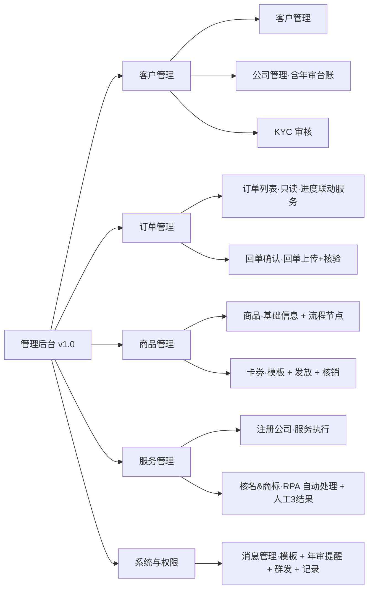
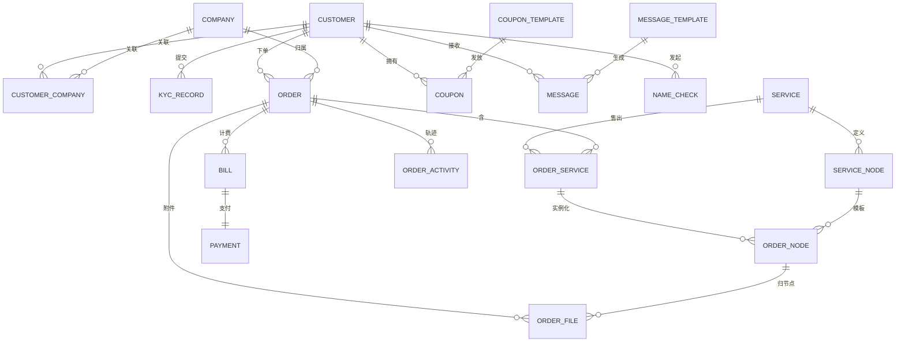

# Leapexbiz 管理后台 — 产品需求文档 PRD **v1.0（MVP 首发范围）**

> **产品**：Leapexbiz（香港持牌 TCSP 公司秘书服务）· 管理后台
> **定位**：**承接小程序产生的核心业务数据与履约服务**——客户与公司档案、KYC、核名商标、订单履约、回单核验、卡券、消息触达。
> **配套**：《PRD_小程序完整版_v1.0》；后续增量见《PRD_Leapexbiz管理后台_v1.1》。
> **更新**：2026-07-03（**按 1.0 / 1.1 拆分版本**；1.0 = 本文，覆盖下图 5 大模块组的 MVP 范围）。
> **原型**：http://124.221.97.241:8081/admin
> **作者**：产品（兼香港财务 / 合规）

---

## 〇、版本拆分说明（1.0 vs 1.1）

本后台按交付节奏拆为两版。**v1.0（本文）= MVP 首发**，范围如下（对应产品脑图 `TCSO_管理后台_1.0`）：

| 模块组 | 子模块（1.0） |
|---|---|
| **客户管理** | 客户管理 · 公司管理 · KYC 审核 |
| **订单管理** | 订单列表 · 回单确认（回单上传 + 核验） |
| **商品管理** | 商品 · 卡券 |
| **服务管理** | 注册公司 · 核名&商标（**RPA 自动处理** + 人工 3 结果） |
| **系统与权限** | 消息管理 |

**移入 v1.1 的模块**（见《PRD_Leapexbiz管理后台_v1.1》）：**概览（数据驾驶舱）**、**供应商管理**（管理/分配/结算/工作台）、**渠道商管理**（管理/佣金/工作台）、**系统与权限补齐**（员工和角色 / 菜单权限 / 合规与审计 / 系统参数）。

> **1.0 登录与权限**：先用**内部员工统一登录**（超管 + 运营 / 合规 / 财务作为逻辑角色，先以约定隔离）；**完整 RBAC + 菜单权限配置**在 1.1 落地。渠道 / 供应商外部门户不在 1.0。

---

## 一、产品目标与角色（1.0）

### 1.1 目标
- **承接小程序核心业务数据**：客户/公司档案、KYC、核名商标、订单、回单、卡券、消息。
- 满足香港 **AMLO / 公司条例 / TCSP 牌照**的合规运营与记录保存（**7 年留存**）。
- 打通**订单协同**：后台维护进度 / 备注 / 文件，小程序客户端实时可见。

### 1.2 角色（1.0 逻辑角色，完整 RBAC 见 1.1）
| 角色 | 1.0 核心职责 |
|---|---|
| Super Admin 超管 | 全量 + 商品 / 卡券 / 消息模板配置 |
| Operations 运营 | 核名&商标、订单进度维护、服务执行、卡券发放、消息群发 |
| Compliance 合规 | KYC 审核、合规通知下发 |
| Finance 财务 | 回单核验（确认付款 / 未收到付款） |

---

## 二、模块结构（1.0 · 5 大模块组）

> **★ 服务=可配置「流程节点」模型**：每个服务由一串有序**流程节点**组成，每个节点声明 **责任方 + 客户需上传资料 + 时效**；**一处配置、两处驱动**——小程序「办理步骤 / 进度」与后台「订单进度维护」。
> **★ 订单=协同枢纽**：后台维护进度 / 备注 / 文件，小程序客户端**实时可见**并按节点上传资料。

---

## 三、各模块详细设计（1.0）

### 3.1 客户管理

**① 客户管理**（个人档案）
- 列表：姓名（中/英）/ 手机 / 邮箱 / 服务地区 / 渠道归属码 / KYC 状态 / 注册来源 / 注册时间；搜索 + 筛选；**列表行支持编辑**。
- 详情：身份档案（证件类型 港证/护照/其他 + 证件号〔加密〕+ 通讯/通常住址）、关联公司列表、订单历史、优惠券、来源、**内部备注 + 标签**。
- **被拒客户 7 年留存区**（合规可查）。

**② 公司管理**（公司主数据）
- 列表：公司中英名 / CI / BR / 成立日期 / **下次年审日 NAR1** / SCR 状态 / 公司状态；筛选到期/逾期；**列表行支持编辑**。
- 详情：公司档案 + **关联人（董事/股东/秘书，多对多，含持股 % 与实益拥有人 UBO 标记）** + 历史订单 + 历史交付物 + SCR 登记册。
- **年审台账**：成立周年 + 42 天规则，驱动消息管理的 6 轮递进提醒 + 到期前 60 天生成年审账单。

**③ KYC 审核**
- 队列：待审核（提交时间 + SLA 倒计时）；**列表行支持编辑**。
- 审核台（**按节点**展示小程序 KYC 提交）：身份认证（证件类型 + OCR + **本人验证：邮箱验证**）/ 地址证明 / 业务性质·资金来源；**每节点**可**修改客户填写内容、替换客户上传资料、补充上传材料、逐节点备注**。
- 动作（按状态自适应）：**保存修改 / 通过 / 拒绝 / 标记 EDD**；点「拒绝」**下方弹出拒绝原因输入框**（必填，通知客户 + 留档 7 年）；EDD → EDD 通过；已通过 / 已拒绝为只读。
- **PEP / 制裁筛查为后台内部执行、不在审核界面展示**（命中→冻结）。
- 状态机：`未开始→填写中→审核中→通过 | 待补正 | EDD | 拒绝`；命中制裁→`冻结`。

### 3.2 订单管理（★协同枢纽）

**① 订单列表**（**只读**：进度联动「服务管理」，此处不改进度）
- 列表：订单号 / 客户 / 公司 / 服务 / 渠道 / 金额（双币）/ 状态 / 创建时间；状态筛选。
- **订单详情（只读）**：
  - **进度时间轴**：按该服务的流程节点渲染（状态 / 责任方 / 备注），**联动服务管理**，此处不可改。
  - **资料区**：客户按节点上传的资料 + 服务人员上传的文件，均可**查看 / 下载**。
  - **历史轨迹**：进度 / 备注 / 文件操作按时间留痕（不可篡改）。
  - 操作：**仅支持取消订单**（限未办理前）。
- **小程序端对应**：客户在订单详情**实时看到进度、顾问备注、顾问补充材料**（豆腐块展示所在阶段 + 办理进度；全程无需客户在中间环节确认/修改）。

**② 回单确认（回单上传 + 核验）**
- **定位**：**服务人员回单核验**——核对客户付款信息与上传的付款截图，在网银确认到账后**上传银行入账截图**并点**「确认付款」**；如未查到入账则选**「未收到付款」**通知客户。
- 列表：账单号 / 订单·服务 / 金额（双币）/ 印花税 / 客户回单 / 状态；筛选（待核验 / 待支付 / 已确认付款 / 未收到付款）。
- **仅支持核验与确认付款**；**不支持退款、作废 / 重开、手动生成账单、导出对账**（这些不在 1.0）。
- 印花税：股份转让账单按 **从价 0.2%（对价与资产净值孰高）** 自动预估并注明。
- **优惠券抵扣**在账单体现（券种 + 抵扣额，币种感知）。
- 状态机：`待支付 → 待核验 → 已确认付款（订单转服务中）`；旁支 `未收到付款`。

### 3.3 商品管理

**① 商品**（服务基础信息，可编辑）
- 字段：名称 / **副标题** / 分类（注册·年审·变更·记账·增值）/ 类型（单项·组合）/ **标准价（人民币 + 港币双币）** / 办理时效 / 适用人群 / **适用区域（香港/新加坡/迪拜/BVI）** / 主要交付物 / **富文本详情** / 上下架 / 排序。
- **编辑流程节点**（每商品一个「流程节点」按钮 → 节点编辑器）：每个节点声明 **节点名 · 顺序 seq · 责任方（客户/平台/供应商）· 该节点客户需上传资料 · 时效 · 提示文案**；下单时按此**实例化**为订单节点。
- 组合服务：可挂子服务（如"标准注册"含注册 + 首年年审 + 印章）。

**② 卡券**（承接小程序「优惠券」）
- **卡券模板**：券名 / 类型（**免费服务券** / **立减券** / **折扣券**）/ 面值 · 币种（或折扣率；免费服务券关联服务）/ 适用范围 + **满减门槛** / 有效期规则（固定截止 / 领取后 N 天）/ 发放上限 · 每人限领 / **不可叠加** / 上下架。
- **发放**：定向（客户 / 客户群）· 群发（地区 / 渠道）· 渠道自动发放；发放即生成 `COUPON` 实例 → 小程序「我的·优惠券」。
- **发放记录与核销统计**：券实例（客户 / 券种 / 状态 可用·已用·过期 / 领取时间 / 使用订单 / 使用时间）；模板维度统计**发放 / 核销 / 核销率 / 带动 GMV**。
- 规则：**不可提现、不可叠加**；核销发生在**账单确认抵扣**；过期由系统置 `过期`。

### 3.4 服务管理（★服务执行）

> 由服务节点实例化的订单，在此**维护进度（可编辑）+ 下载客户上传资料 + 上传服务人员文件**；进度回推小程序「办理进度」并**驱动订单状态**。

**① 注册公司**（服务执行台）
- 列表：订单号 / 拟注册公司 / 客户 / 当前节点 / 进度 / 状态（待支付 / 资料待完善 / 章程待确认 / 待人工预审 / 办理中·线下交 NNC1 / 已完结 / 已退回）。
- **服务执行台（按节点）**：支付 → 提交公司资料 → 成员/董事/秘书 → 组织章程 → 人工预审 → 业务办理（线下交 NNC1·约 1 周取正本）→ 完结（CI/BR + 交付物）；每节点可**改状态 + 修改客户内容 + 替换资料 + 补充上传文件 + 逐节点备注**（客户端可见）。

**② 核名&商标**（**RPA 自动处理 + 人工 3 结果**）
- **客户提交三项**：核名（繁体中文）、核名（英文）、商标（繁体 / 关键字）+ 查册方式（全名 / 起首）。
- **RPA 自动处理**：机器人流程自动化（RPA）在**公司注册处 iCRIS + 知识产权署商标库**自动检索，回填命中清单初稿（自动分配服务人员、简繁转换、并行检索三项）；**不做自动结论**。
- **人工 3 结果**（服务人员逐项判定，**无智能预检**）：
  - **核名（繁体）**：结论（🟢可用 / 🟡有近似 / 🟠近似冲突 / 🔴敏感词·商标冲突 / 🔵需牌照）+ 命中在册公司（公司名 / BR号 / 名称现况 / 状态）+ 顾问备注。
  - **核名（英文）**：同上结构。
  - **商标（繁体）**：结论（🟢可注册 / 🟠有近似 / 🔴已注册冲突）+ 命中商标（商标名 / 编号 / 类别 Class / 拥有人 / 状态）+ 顾问备注。
  - **顾问总建议**（回推小程序结果页）。
- 列表字段：客户 / 客户提交三项 / 人工核查结果三项 / **服务人员** / **维护时间** / 状态；筛选：状态 + **服务人员** + **提交时间** + 名称/客户搜索。
- **发布结果 → 回推小程序**「核名 & 商标查询结果」页并通知客户；查名**不保证 100%**，注册处以繁体注册为准；通过后名称锁定 30 天。

### 3.5 系统与权限（1.0 仅消息管理）

**消息管理**（承接小程序「消息中心」）
- **消息模板**（分类维护）：分类（**合规通知**·强制不可退订 / **流程通知** / **年审提醒** / **营销**）· 触发事件（KYC 结果 / 核名结果 / 账单生成 / 待补资料 / 交付完成 / 年审到期 / 卡券发放 / 手动公告）· 标题 + 内容（**变量占位** `{公司名}{金额}{到期日}{订单号}` 等）· 渠道（站内 / 微信服务通知 / 邮件）· 强制 · 状态。
- **年审提醒规则（6 轮递进）**：到期前 **60 / 42 / 30 / 14 / 7 / 1 天**（对齐"成立周年 + 42 天"），逐轮绑定模板 + 渠道 + 开关。
- **群发 / 公告**：标题 + 内容 → 目标人群（全部 / 地区 / 公司状态 / 渠道 / 指定客户）→ 渠道 → 立即 / 定时发送；合规类不受退订影响。
- **发送记录**：接收人 / 分类 / 触发事件 / 渠道 / 状态（已发送·已读·失败·已退订拦截）/ 时间；失败可重发。
- **触发来源**：KYC / 核名 / 账单 / 订单节点 / 年审台账 / 卡券发放等事件**自动触发**；运营亦可**手动群发**。

> **1.0 其余「系统与权限」子模块**（员工和角色 / 菜单权限 / 合规与审计 / 系统参数）见 **v1.1**。

---

## 四、数据结构（1.0 相关实体）

> 敏感字段（证件号/地址/UBO）**字段级 AES-256 加密**；金额**双币**存储（`_cny`/`_hkd`）。

### 4.1 ERD（1.0）

> `channel_code` 作为**字符串字段**存于 CUSTOMER / ORDER（渠道归属识别）；**CHANNEL / COMMISSION 实体与佣金结算在 v1.1**。

### 4.2 核心实体与关键字段（1.0）

**CUSTOMER 客户**：`id · name_zh · name_en · phone · email · wechat_openid · region(香港/新加坡/迪拜/BVI) · channel_code · id_type(港证/护照/其他) · id_no🔒 · addr_mail🔒 · addr_res🔒 · kyc_status · tags · remark · created_at`

**COMPANY 客户公司**：`id · name_zh · name_en · ci_no · br_no · incorp_date · reg_address · hsic_code · share_capital · next_nar1_date(周年+42天) · scr_status · status(注册中/正常/年审待办/年审逾期/变更中/注销中/已注销) · created_at`

**CUSTOMER_COMPANY 关联（多对多 + 身份）**：`customer_id · company_id · roles · shareholding · is_ubo · consent_director`

**KYC_RECORD**：`id · customer_id · status(未开始/填写中/审核中/待补正/EDD/冻结/通过/拒绝) · id_type · id_doc🔒 · address_proof · business_nature · fund_source · verify_method(邮箱验证) · pep_result🔒 · sanction_result🔒 · nodes · submitted_at · reviewed_by · reviewed_at · reject_reason · edd_flag · retain_until(+7年)`

**SERVICE 商品/服务**：`id · code · name · subtitle · category(注册/年审/变更/记账/增值) · type(单项/组合) · price_cny · price_hkd · sla · target_audience · regions · deliverables[] · desc_richtext · sub_services[] · status(上架/下架/面议) · sort`

**SERVICE_NODE 服务流程节点（★）**：`id · service_id · seq · parallel_group · name · owner(客户/平台/供应商) · required_docs · sla_days · hint`

**ORDER 订单**：`id · order_no · customer_id · company_id · channel_code · status(待支付/待核验/服务中/待客户确认/已完成/已取消) · total_cny · total_hkd · coupon_id · created_at`

**ORDER_SERVICE 订单子服务**：`id · order_id · service_id · price_cny · price_hkd · status`

**ORDER_NODE 订单节点进度（★协同核心）**：`id · order_service_id · service_node_id · seq · name · owner · status(未开始/待客户资料/进行中/待客户确认/已完成/已退回) · updated_by · updated_at · note`

**ORDER_FILE 订单文件/资料（★）**：`id · order_id · order_node_id · name · url · uploader_role(客户/员工) · category(客户上传/交付物/顾问补充) · visible_to_client(bool) · created_at`

**ORDER_ACTIVITY 订单轨迹/备注**：`id · order_id · actor · action · content · visible_to_client · created_at`（不可篡改）

**BILL 账单**：`id · bill_no · order_id · order_service_id · amount_cny · amount_hkd · currency · coupon_discount · stamp_duty · status(待支付/待核验/已确认付款/未收到付款) · pay_method · customer_receipt_url(客户付款截图) · bank_receipt_url(服务人员上传银行入账截图) · confirmed_by · confirmed_at`

**PAYMENT 支付**：`id · bill_id(UNIQUE 1:1) · amount · method · paid_at · confirmed_by`

**COUPON_TEMPLATE 卡券模板**：`id · name · type(免费服务券/立减券/折扣券) · value · currency · free_service_id · scope · min_amount · valid_type · valid_until · valid_days · issue_limit · per_user_limit · stackable(false) · status · created_at`

**COUPON 优惠券实例**：`id · template_id · customer_id · type · value · currency · scope · valid_until · status(可用/已用/过期) · issued_by · issued_at · used_order_id · used_at`

**NAME_CHECK 核名&商标申请**：客户提交 `name_zh(核名·繁体) · name_en(核名·英文) · tm_zh(商标·繁体/关键字) · mode(全名/起首)`；`rpa_result_json(RPA 自动检索初稿)`；人工三结果 `result_zh{结论,命中公司[]} · result_en{结论,命中公司[]} · result_tm{结论,命中商标[]}` + `advisor_note`；`assignee(服务人员) · updated_at(维护时间) · status(待核查/核查中/已出结果/待客户确认/名称锁定/已拒绝) · free_quota_used · created_at`。命中公司={公司名, BR号, 名称现况, 状态}；命中商标={商标名, 编号, 类别, 拥有人, 状态}。

**MESSAGE_TEMPLATE 消息模板**：`id · category(合规/流程/年审/营销) · trigger_event · title · body(变量占位) · channels · mandatory · annual_round(60/42/30/14/7/1天) · status`

**MESSAGE 消息实例 / 发送记录**：`id · template_id · customer_id · category · title · body · channel · ref_type · ref_id · status(已发送/已读/失败/已退订拦截) · sent_by · sent_at · read_at`

### 4.3 关键流转（1.0）
- **服务节点 → 订单节点实例化**：下单 → 对每个 `order_service` 按 `service_node[]` 生成 `order_node[]`；订单进度 = order_node 状态推进。
- **进度/文件/备注同步小程序**：`order_node.status` + `order_activity(visible_to_client=true)` + `order_file(visible_to_client=true)` 即小程序订单详情所见；客户按当前「待客户资料」节点上传 → 写 `order_file(category=客户上传)`。
- **回单核验**：`bill.status=已确认付款` 记收款（现金制，以银行入账为准）→ 订单转「服务中」。
- **卡券**：模板发放 → `coupon(可用)` → 账单核销 `bill.coupon_discount` + `coupon.status=已用`；到期置 `过期`。
- **消息触发**：业务事件命中 `message_template.trigger_event` → 渲染变量生成 `message` 按 `channels` 下发；合规类强制；年审按 6 轮 `annual_round` 递进。

---

## 五、小程序 ↔ 后台 闭环对齐（1.0）

| 小程序动作 | 后台模块（1.0） | 数据落点 | 回推小程序 |
|---|---|---|---|
| 登录（邮箱/微信）+ 服务地区 + 渠道码 | 客户管理 | CUSTOMER(region/channel_code) | — |
| 提交核名&商标（核名繁体+英文+商标繁体） | 服务管理·核名&商标 | NAME_CHECK（RPA 检索 + 人工 3 结果） | 3 项结果 + 命中清单 + 顾问建议 |
| 提交 KYC（邮箱验证 + 证件 + 地址 + 资金来源） | 客户管理·KYC 审核 | KYC_RECORD（按节点） | 通过/补正/拒绝/EDD |
| 下单 + 选优惠券 | 订单管理 + 商品(节点实例化) | ORDER / ORDER_SERVICE / ORDER_NODE / COUPON | 订单进度（豆腐块+节点） |
| 上传港币付款截图 | 订单·回单确认 | BILL(customer_receipt) → 核验 | 已确认付款 → 服务中 |
| 提交注册资料 / 按节点上传 | 服务管理·注册公司 | ORDER_NODE + ORDER_FILE | 进度推进 + 顾问备注/补充材料 |
| 查看订单进度 / 顾问补充材料 | 服务管理·服务执行台 | ORDER_NODE / ORDER_ACTIVITY / ORDER_FILE(visible) | 实时可见（豆腐块阶段+进度） |
| 年审到期 | 公司管理·年审台账 + 消息管理 | COMPANY.next_nar1_date + 6 轮提醒 | 年审提醒 + 年审账单 |
| 我的·优惠券 / 账单选券 | 商品·卡券 | COUPON_TEMPLATE → COUPON → 账单核销 | 券面 + 抵扣额 |
| 消息中心 | 系统·消息管理 | MESSAGE_TEMPLATE → MESSAGE | 合规/流程/年审/营销 |

---

## 附录 · 系统参数（1.0 必需，可配）

| 参数 | 默认 | 说明 |
|---|---|---|
| payment_deadline_days | 7 | 账单支付期限（天） |
| name_lock_days | 30 | 核名锁定天数 |
| name_check_free_quota | 3 | 免费核名重查次数 |
| kyc_audit_timeout_hours | 48 | KYC 审核超时 |
| data_retention_years | 7 | 数据保存年限（AMLO） |
| annual_review_advance_days | 60 | 年审首轮提醒提前天数 |
| stamp_duty_rate | 0.002 | 股份转让印花税率 0.2% |

> **系统参数配置 UI 与完整参数表在 v1.1**（1.0 以后台约定 / 配置文件承载）。
