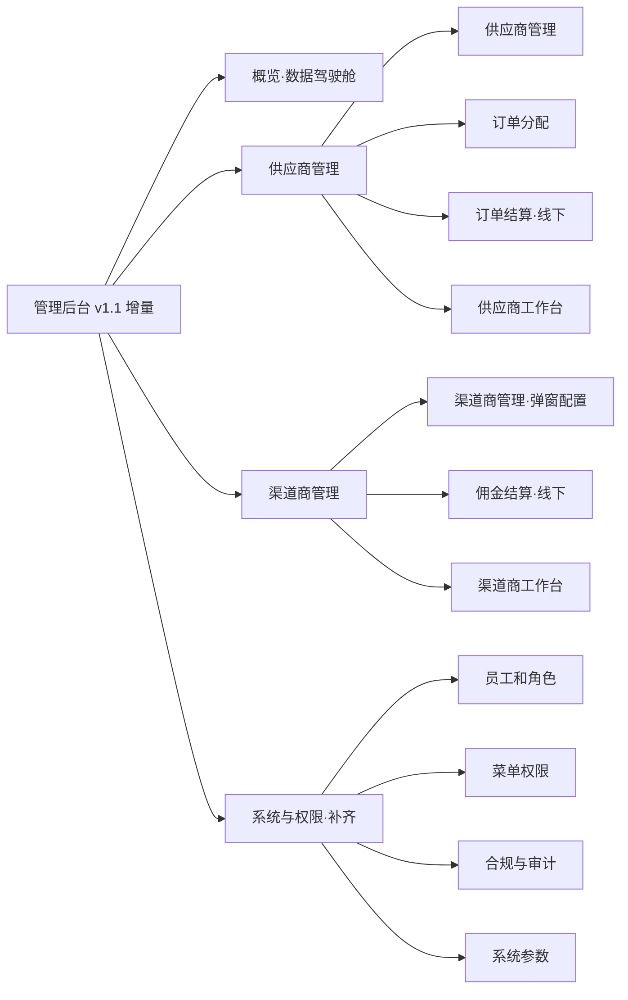
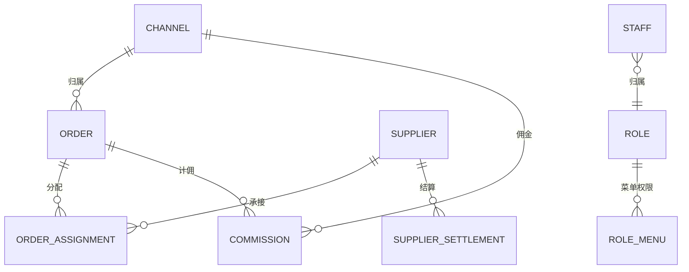

# Leapexbiz 管理后台 — 产品需求文档 PRD **v1.1（增量 · 建立在 v1.0 之上）**

> **产品**：Leapexbiz（香港持牌 TCSP 公司秘书服务）· 管理后台
> **关系**：本文是 **v1.0 的增量**，只描述 1.0 之外**新增 / 补齐**的模块；1.0 已交付的客户 / 订单 / 商品 / 服务 / 消息模块见《PRD_Leapexbiz管理后台_v1.0》，本文不重复。
> **更新**：2026-07-03（首版 1.1 拆分）。
> **原型**：http://124.221.97.241:8081/admin （原型已含 1.1 页面，随版本推进正式启用）

---

## 〇、v1.1 范围

| 模块组 | 子模块（1.1 新增 / 补齐） |
|---|---|
| **概览** | 数据驾驶舱（KPI + 趋势 + 待办） |
| **供应商管理** | 供应商管理 · 订单分配 · 订单结算 · 供应商工作台 |
| **渠道商管理** | 渠道商管理 · 佣金结算 · 渠道商工作台 |
| **系统与权限（补齐）** | 员工和角色 · 菜单权限 · 合规与审计 · 系统参数 |
| **进阶（路线图）** | 印花税精算 · STR 申报 · SCR 台账 · 退款审批 · 数据导出 / BI |

> **v1.1 设计原则（延续会议共识）**：供应商 / 渠道商**去掉「在线结算 + 提现」**——双方工作台只**查看订单与结算金额**（对账用），实际结算**线下转账**、后台标记「已结算」。

---

## 一、概览（数据驾驶舱）

- **KPI（按角色）**：今日新增订单 · 待处理 KYC/EDD · 待人工核名 · 待核验回单 · 本月营收（已到账）· **待分配订单** · **本月应付佣金** · **本月供应商应付** · 渠道转化率。
- **趋势图**：订单量（30 天折线）· 营收（12 月柱）· 服务类型分布（饼）· 渠道来源分布（饼）· KYC 时效（柱）。
- **待办（含 SLA）**：KYC/EDD 超时（>48h·🔴）· 回单待核验（🔴）· 制裁命中待复核（🔴 合规）· 人工核名待处理（🟠）· **待分配订单（🟠）** · 年审到期/逾期（🟠/🔴）。

---

## 二、供应商管理（履约乙方）

**① 供应商管理**：账号（超管新增）· 档案（公司/联系人/邮箱/负责服务类型）· 状态（启用/暂停）· **结算规则（固定额 / 实付×比例，可逐服务配）**。
**② 订单分配**：无渠道码/自然流量订单 → 运营按规则（地域/负载/优先级，兜底转直营）分配给供应商；分配状态 `待接收→进行中→已上传→已确认 | 已驳回`。
**③ 订单结算**：按结算规则生成**供应商应付**（可多订单合并/周期）· 状态（待结算/已结算）· **线下转账后后台标记"已结算"**。
**④ 供应商工作台**（供应商登录 · 外部门户）：
- **我分配到的订单**：查看履约信息（**不见付款金额**）+ 客户按节点上传的资料。
- **更新订单进度**：改节点状态、写备注、上传交付物文件（回推小程序，与 1.0 服务执行台同源）。
- **查看结算**：本人应付账单与结算状态（只读）。**无在线结算 / 提现**。
- **供应商通知**：以**大陆微信 / 海外电邮**为主（小程序不对供应商开放），短期人工兜底。

---

## 三、渠道商管理（获客方）

**① 渠道商管理**：渠道账号 + **channel code**（客户在小程序填此码下单即归属本渠道）；**配置详情采用弹窗**（渠道信息 + **渠道×服务佣金率**，可逐服务/订单不同，留空不计佣）。
**② 佣金结算**：
- 佣金基数 = 客户**实付（标准价 − 优惠券）× 佣金率**；订单**"已完成"**时生成应付佣金。
- **线下转账后后台标记"已结算"**；**无在线结算 / 提现**。
**③ 渠道商工作台**（渠道商登录 · 外部门户）：**只读**查看本渠道带来的订单状态 + 佣金结算对账。
> **818 分销**：面向 1 万家代账公司分销合作，按订单配置佣金率，渠道码识别介绍人。

---

## 四、系统与权限（补齐 · 1.0 已含消息管理）

**① 员工和角色**：员工账号（超管新增，绑角色）· 角色管理（预置 7 + 自定义）· 状态（启用/停用）· 重置密码 · **二步验证（管理端强制）**。
**② 菜单权限**：**按角色配置可见菜单 / 可用操作**（菜单树 × 角色的勾选矩阵）；外部角色（供应商/渠道商）仅开放各自工作台菜单。
**③ 合规与审计**：制裁名单管理（UN/EU/HKMA）· KYC 记录导出（含被拒，审计用）· 合规报告（AMLO 周期报告）· **STR 预留** · SCR 登记册 · **不可篡改审计日志（哈希链，7 年）**。
**④ 系统参数**：参数配置 UI（时效/额度/前缀/税率等），承载 1.0 附录参数 + 供应商/渠道/结算相关参数。

---

## 五、数据结构（1.1 增量实体）

> 在 1.0 实体基础上新增；`channel_code` 在 1.0 为字符串字段，1.1 升级为关联 **CHANNEL** 实体。

**SUPPLIER 供应商**：`id · name · contact · email · service_types[] · settlement_rule(fixed额/rate比例, 可逐服务) · status(启用/暂停)`
**ORDER_ASSIGNMENT 订单分配**：`id · order_id · supplier_id · assigned_by · assigned_at · status(待接收/进行中/已上传/已确认/已驳回)`
**SUPPLIER_SETTLEMENT 供应商结算**：`id · supplier_id · order_ids[] · amount · period · status(待结算/已结算) · settled_at`（无在线结算/提现）

**CHANNEL 渠道商**：`id · code(channel code) · name · contact · commission_rules · status`
**COMMISSION 佣金**：`id · channel_id · order_id · base_amount(实付) · rate · amount · period · status(待结算/已结算) · settled_at`（无在线结算/提现）

**STAFF 员工**：`id · name · email · phone · role_id · status`
**ROLE 角色**：`id · name · is_system`
**ROLE_MENU 菜单权限**：`role_id · menu_key · can_view · can_operate`（角色×菜单矩阵）
**AUDIT_LOG 审计日志**：`id · actor · action · target · before🔒 · after🔒 · hash · prev_hash · created_at`（哈希链不可篡改，7 年）
**SYSTEM_PARAM 系统参数**：`key · value`

---

## 六、权限矩阵（完整 · 1.1 落地）

| 模块 | Super | Admin | Ops | Compl | Fin | Channel | Supplier |
|---|:--:|:--:|:--:|:--:|:--:|:--:|:--:|
| 客户 / 公司 | ✅ | ✅ | 查看 | 查看 | 查看 | ❌ | ❌ |
| KYC 审核 | ✅ | ✅ | ✅ | ✅ | ❌ | ❌ | ❌ |
| 订单·进度维护 | ✅ | ✅ | ✅ | 查看 | 查看 | 归属只读 | 分配只读+更新进度 |
| 回单确认 | ✅ | ✅ | 核验 | ❌ | ✅ 核验 | ❌ | ❌ |
| 商品 / 服务节点 | ✅ | ✅ | ❌ | ❌ | ❌ | ❌ | ❌ |
| 核名&商标 | ✅ | ✅ | ✅ | 查看 | ❌ | ❌ | ❌ |
| 卡券·模板/发放 | ✅ | ✅ | 发放 | ❌ | 查看 | ❌ | ❌ |
| 消息·模板/群发 | ✅ | ✅ | 群发 | 合规发 | ❌ | ❌ | ❌ |
| 供应商管理/分配/结算 | ✅ | ✅ | 分配 | ❌ | 应付只读+标记 | ❌ | 自己只读 |
| 渠道商/佣金 | ✅ | ✅ | ❌ | ❌ | 汇总只读 | 本渠道只读 | ❌ |
| 概览 | ✅ | ✅ | ✅ | 合规视角 | 财务视角 | ❌ | ❌ |
| 系统与权限 | ✅ | 部分 | ❌ | 审计只读 | ❌ | ❌ | ❌ |

---

## 七、进阶路线图（1.1+ / 2.0 候选）

- **印花税精算**：股份转让从价 0.2%（对价与资产净值孰高）自动核算 + 缴付凭证归档。
- **STR 可疑交易申报**：制裁命中 / 高风险 → STR 表单与上报台账（no tipping-off）。
- **SCR 重要控制人登记册**：维护台 + 打印夹册。
- **退款审批**：Finance 发起 → 审批流 + 留痕（1.0 回单确认不含退款，此为独立审批模块）。
- **数据导出 / BI**：经营看板、渠道 ROI、KYC 时效分析、导出对账。
- **聚合支付跨境通道**：连连等持牌通道接入（替代当前港币线下转账 + 上传截图）。
- **交付物中心**：Company Kit 全清单（CI+BR+章程+绿色登记册+股票本+印章）+ IRBR1（1/3 年）+ 物流单号。
