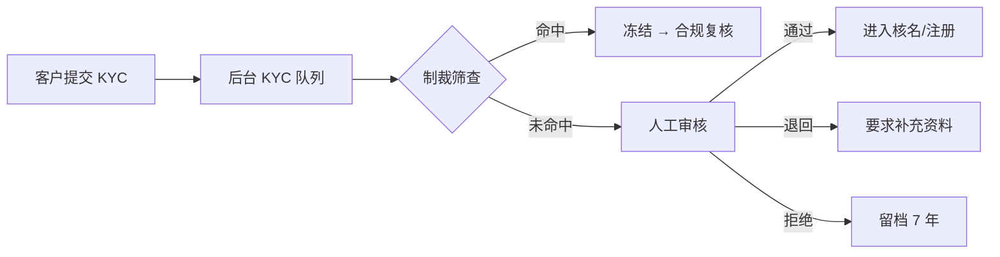
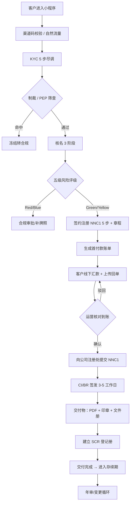

# Leapexbiz TCSP 公司秘书平台 — 完整产品需求文档 PRD v1.0

> **产品**：Leapexbiz —— 香港持牌 TCSP（信托或公司服务提供者）公司秘书服务平台
> **形态**：微信小程序（客户端）+ Web 管理后台
> **作者**：IT 软件经理（兼香港财务会计）
> **更新**：2026-06
> **覆盖**：渠道入口 / KYC / 核名 / 注册(NNC1) / 章程 / 账单支付 / 交付物 / 年审与变更 / 服务市场 / 通知 / 企微承接 / 后台管理（含定价·佣金·供应商·合规·RBAC）
> **特别说明**：本版应研发要求，对每个模块**穷举所有状态并予以说明**（见各模块「状态机」小节）；并结合香港财务/法规对原设计中不合理处做了**自省修正**（见 §8 修正清单与正文标注 ⚠️）。

---

## 1. 产品背景与目标

### 1.1 市场背景（行业洞察）

> 数据为行业公开口径与监管框架整理（截至 2026 年初）；精确数值以香港公司注册处（CR）、税务局（IRD）官方统计为准。

- **市场体量**：香港是全球主要离岸公司与区域总部设立地。公司注册处在册活跃本地公司长期维持在 **约 140 万家** 量级，每年新成立本地有限公司 **约 13–15 万家**，叠加大量非香港公司分支登记。庞大存量带来持续的**年审、变更、注销**等存续期刚需。
- **监管驱动**：自 **2018 年起**，根据《打击洗钱及恐怖分子资金筹集条例》(AMLO)，所有提供公司秘书/成立服务的机构须申领 **TCSP 牌照**（由公司注册处发牌），并对客户履行**尽职调查 (CDD/KYC)**、保存记录 **至少 7 年**。**持牌 + 合规** 成为行业准入门槛。
- **行业痛点（传统模式）**：
  - **流程割裂**：核名、KYC、注册、章程、印章、开户分散在多家代理与线下环节，客户体验差、周期长。
  - **合规成本高**：AMLO 尽调、PEP/制裁筛查、SCR 维护、7 年留存依赖人工，易出错、难审计。
  - **资源不均**：一手注册地址、上市公司资源、审计资质集中在少数持牌机构，中小代理只能层层转包。
  - **支付障碍**：内地客户无海外账户，难以直接付款至香港收款账户。
  - **状态不透明**：客户看不到办理进度，运营靠表格与微信群跟单。

### 1.2 产品定位

以**持牌 TCSP 自营履约 + 一手资源**为底座，把香港公司**全生命周期服务**（设立→存续→注销）做成**线上电商化 + 数字化合规**平台：小程序面向终端企业客户，管理后台支撑运营/合规/财务/渠道/供应商协同。

### 1.3 用户目标

| 角色 | 目标 |
|---|---|
| 终端客户 | **省心**：线上一站办妥，进度全程可见；**省时**：KYC/核名/注册自动流转，注册周期由 7–10 天压缩至 **3–5 个工作日**；**省钱**：渠道专属价 |
| 运营/合规 | **降错**：尽调/筛查/状态机系统化，人工差错率降至 **<1%**；**可审计**：全量操作哈希链留痕、7 年留存 |
| 财务 | **对得清**：账单↔支付 1:1、渠道佣金/供应商应付双台账，月结可对账 |
| 渠道伙伴 | **看得到**：归属客户/订单/佣金只读透明 |
| 平台 | **合规可持续**：满足 AMLO/CO Cap.622/PDPO，牌照可续 |

---

## 2. 功能定义和概述

### 2.1 功能模块全景图（mermaid）

```mermaid
graph TD
  Root["Leapexbiz TCSP 平台"]
  Root --> C[小程序客户端]
  Root --> A[Web 管理后台]

  C --> C1[渠道入口 Channel Code]
  C --> C2[KYC 尽职调查 5 步]
  C --> C3[核名]
  C --> C4[签约注册 NNC1 + 章程]
  C --> C5[账单与支付 回单上传]
  C --> C6[我的公司 / 交付物中心]
  C --> C7[服务市场 / 订单]
  C --> C8[消息中心]
  C --> C9[企微承接 / 预约咨询]

  A --> A1[Dashboard]
  A --> A2[客户管理]
  A --> A3[KYC/EDD 审核]
  A --> A4[核名查册 iCRIS]
  A --> A5[订单管理]
  A --> A6[账单/回单确认]
  A --> A7[交付物管理]
  A --> A8[年审与变更任务]
  A --> A9[定价矩阵]
  A --> A10[渠道与佣金台账]
  A --> A11[供应商与应付]
  A --> A12[企微线索]
  A --> A13[合规：制裁/SCR/审计]
  A --> A14[RBAC 员工与角色]
  A --> A15[系统配置]
```

### 2.2 功能点与优先级

| 功能模块 | 功能点 | 优先级 | 核心价值 |
|---|---|---|---|
| **渠道入口** | Channel Code 校验 / 自然流量 | P0 | 多渠道分销与归属 |
| | 渠道激活横幅 | P1 | 渠道权益外显 |
| **KYC 尽职调查** | AML 合规说明 + 强制确认 | P0 | AMLO 合规前置 |
| | 证件 OCR + 人工复核 | P0 | 身份核验 |
| | PEP（含家属）/ 制裁名单筛查 | P0 | 反洗钱风控 |
| | 地址证明 / 业务声明 / 资金来源 | P0 | CDD 完整 |
| | EDD 增强尽调 | P1 | 高风险客户 |
| **核名** | 前端格式 + 6 类敏感词校验 | P0 | 即时反馈 |
| | 智能预检（近似名 + IPD 商标） | P0 | 降冲突风险 |
| | iCRIS 人工查册 + 五级风险评级 | P0 | 注册可行性 |
| | 名称内部锁定 / 免费重查 3 次 | P1 | 体验与成本 |
| **签约注册** | NNC1 五步采集 | P0 | 一次采集直接报官 |
| | 章程 Sample A/B/自定义 + 智能推荐 | P0 | 治理合规 |
| **账单支付** | 账单 ↔ 服务 1:1 + 首尾款 | P0 | 财务清晰 |
| | 回单上传 + 人工确认 | P0 | MVP 收款 |
| | 海外聚合收款（连连/支付宝） | P1 | 内地客户付款 |
| **交付物** | 19 项（PDF/人工/实物）状态流转 | P0 | 交付标准化 |
| | 快递追踪 / PDF 预览下载 | P1 | 交付体验 |
| **年审与变更** | 年审 NAR1 + 6 轮递进提醒 | P0 | 存续合规 |
| | 8 类变更服务交付物 | P1 | 全生命周期 |
| | SCR 重要控制人登记册维护 | P0 | 法定文件 |
| **服务市场/订单** | 套餐与服务报价 + 下单 | P0 | 电商转化 |
| | 订单 > 服务 > 账单 三级 | P0 | 业务结构 |
| **后台** | 定价矩阵 / 渠道佣金 / 供应商应付 | P0 | 商业财务 |
| | 制裁名单 / 合规报告 / 审计日志 | P0 | 牌照合规 |
| | RBAC 7 角色 + 系统参数 | P0 | 权限与配置 |
| **企微承接** | 线索池 + 来源埋点 + 工单 | P1 | B 端转化兜底 |

---

## 3. 用户角色和使用场景

### 3.1 用户角色

| 角色 | 职责 |
|---|---|
| 终端客户（企业主/创办人） | 提交 KYC、核名、下单、付款、查看公司与交付物、办理年审/变更 |
| 渠道合作伙伴（Channel Admin） | 只读归属渠道客户/订单/收入/本渠道佣金 |
| 运营 Operations | KYC 初审、核名 iCRIS 查册、交付物上传、订单跟单 |
| 合规 Compliance | KYC/EDD 终审、制裁名单维护、SCR、合规报告 |
| 财务 Finance | 回单确认、退款/作废审批、佣金与供应商应付、对账 |
| 供应商 Supplier（外部） | 仅接收交付任务、上传交付物、查看自己的应付账单 |
| 管理员 Admin / Super Admin | 客户/订单/定价/渠道/通知配置、角色与系统配置 |

### 3.2 核心场景

**场景一：新用户线上注册香港公司**
- **痛点**：传统找代理，跑多个环节，看不到进度，付款还要海外账户。
- **用户故事**：作为内地创业者，我希望在小程序内输入渠道码 → 完成 KYC → 核名 → 确认章程 → 付款 → 全程看进度，最终拿到 CI/BR 与印章，无需到处奔波。

**场景二：运营审核 KYC 与回单**
- **痛点**：尽调资料散在微信，制裁筛查靠人工查，回单与到账靠肉眼比对。
- **用户故事**：作为合规/财务，我希望在后台队列里看到待审 KYC 与待确认回单，一键看证件 OCR、制裁筛查结果、回单截图，处理后状态自动回推客户。

**场景三：存续期年审提醒与办理**
- **痛点**：客户常忘记年审，逾期被罚。
- **用户故事**：作为公司董事，我希望系统在到期前自动多轮提醒，并一键下单办理年审（NAR1），避免逾期罚款。

---

## 4. 核心业务流程

### 4.1 端到端主流程（新注册）

---

## 5. 功能详细说明（含穷举状态机）

> 体例：每模块给出「页面/字段内容」+「状态机（穷举）」+「关键规则」。状态命名统一，前后端共用枚举值。

### 5.1 渠道入口（Channel Code）

**页面内容（全屏渠道入口页）**
- 品牌区：纯文字 `Leapexbiz`（香槟金 #D4A853）+ 副标题 `Licensed Trust & Company Service Provider ("TCSP") in Hong Kong`；不使用 Logo 图片。
- 渠道码输入框：必填（除非跳过）；6 位字母数字，自动大写，实时校验。
- 主按钮「立即开始」：有效码时高亮可点。
- 「跳过，以自然流量进入」链接。
- 校验提示：有效→绿色显示渠道名称；无效→红色「请确认渠道码」。

**渠道码状态（穷举）**

| 状态 | 含义 | 触发 | 后续 |
|---|---|---|---|
| `empty` 未输入 | 输入框为空 | 初始 | 主按钮禁用 |
| `checking` 校验中 | 实时请求校验 | 输入满 6 位 | 显示 loading |
| `valid` 有效 | 命中启用渠道 | 校验返回有效 | 绑定该渠道，主按钮可点 |
| `invalid` 无效 | 未命中/格式错 | 校验失败 | 红字提示，主按钮禁用 |
| `disabled` 渠道停用 | 渠道存在但被停用 | 校验返回停用 | 提示「该渠道暂不可用」，可跳过 |
| `skipped` 自然流量 | 用户点跳过 | 跳过 | 标记 source=organic，归直营 |
| `bound` 已绑定 | 注册后固化 | 进入后 | 全流程标记，本地持久化 |

**关键规则**：渠道码一旦绑定即固化到客户与后续订单（归属不可改）；已登录用户跳过此页。

---

### 5.2 KYC 尽职调查（5 步）

**入口强制**：进入即展示 AML 合规说明，必须勾选「我已阅读并同意」方可继续（AMLO 要求）。

**五步页面内容**

| 步骤 | 页面内容 | 字段规则 |
|---|---|---|
| 1 AML 合规说明 | AMLO 摘要、客户义务声明、数据用途 | 勾选框（必）；记录勾选时间戳入审计 |
| 2 身份认证 | 证件类型单选；证件照上传（OCR）；姓名/证件号（OCR 回填可改）；邮箱 + 验证码 | 证件类型：香港身份证/内地身份证/护照；证件照≤2 张≤10MB；邮箱必填且验证；PEP 自评（本人+家属）|
| 3 地址证明 | 上传地址证明（3 个月内）；地址文本 | 接受水/电/煤/银行对账单截图；≤2 张 |
| 4 业务声明 | 业务性质（下拉）、预期交易类型（下拉）、资金来源（下拉+自由填）| 资金来源用于 EDD 判断 |
| 5 提交审核 | 汇总确认；制裁/PEP 筛查结果展示 | 提交按钮；提交后进入审核 |

**⚠️ 自省修正**：原文「提交后不可修改」过于刚性——若运营「要求补充」，客户需能补正对应字段。**修正为**：提交后整体锁定为只读；仅当后台置为 `more_required` 时，解锁被标记的字段供补充，其余仍只读。

**KYC 客户侧状态（穷举）**

| 状态 | 含义 | 触发 | 客户可见 |
|---|---|---|---|
| `not_started` 未开始 | 尚未进入 | 初始 | — |
| `draft` 草稿 | 填写中（每步自动存草稿）| 进入向导 | 「继续填写」|
| `submitted` 已提交 | 提交待审 | 第 5 步提交 | 「审核中」|
| `reviewing` 审核中 | 运营/合规处理中 | 后台领取 | 「审核中」|
| `more_required` 要求补充 | 退回补资料 | 运营退回 | 「需补充 X」+ 可改对应字段 |
| `edd_required` EDD 增强尽调 | PEP/高风险 | 触发 EDD | 「需补充资金来源证明」|
| `approved` 已通过 | 尽调通过 | 终审通过 | 「已通过」→ 解锁后续 |
| `rejected` 已拒绝 | 不予通过 | 终审拒绝 | 「已拒绝」+ 原因；资料留档 7 年 |
| `frozen` 已冻结 | 制裁命中 | 筛查命中 | 「审核中」（不暴露命中），转合规 |

**制裁/PEP 筛查子状态（穷举）**：`not_screened` 未筛查 → `screening` 筛查中 → `clear` 未命中 / `hit_pending` 命中待复核 → `cleared` 复核解除 / `reported` 已上报（STR 可疑交易报告，预留）。

**关键规则**：被拒资料保存 7 年（AMLO 第 4 部）；敏感字段 AES-256 加密；UBO 穿透至 ≥25% 持股自然人（公司客户）。

---

### 5.3 核名

**页面内容**
- 英文名输入：≤32 字符，须以 `Limited` 结尾，仅字母/空格/特定符号。
- 中文名输入：≤8 个常用汉字，须以 `有限公司` 结尾。
- 实时校验结果区：格式校验 ✓/✗、6 类敏感词命中提示。
- 「开始智能预检 + 查册」按钮；免费重查剩余次数显示。
- 结果页：五级风险色卡 + 各阶段结论 + 操作（确认使用 / 更换名称）。

**6 类敏感词处理**：政府相关（禁用）、专业资质如银行/保险/信托（需牌照）、误导性如国际/全球（需证明）、违法词汇（禁用）、宗族/歧视（禁用）、其他如皇家/特许（需特批）。

**核名状态（穷举）**

| 状态 | 含义 | 触发 |
|---|---|---|
| `input` 待校验 | 输入中 | 初始 |
| `format_fail` 格式不通过 | 后缀/长度/字符错 | 前端实时 |
| `sensitive_hit` 敏感词命中 | 命中 6 类之一 | 前端实时 |
| `prechecking` 智能预检中 | 近似名 + IPD 商标 | 提交预检 |
| `precheck_pass` 预检通过（待查册）| 进队列待 iCRIS | 预检完成 |
| `icris_checking` 人工查册中 | 运营 iCRIS 查册 | 后台领取 |
| `rated_green` / `rated_yellow` / `rated_orange` / `rated_red` / `rated_blue` | 五级风险评级 | 查册定级 |
| `locked` 已锁定 | 客户确认使用 | 客户接受 |
| `released` 锁定释放 | 30 天未注册/主动放弃 | 超时/操作 |
| `used` 已用于注册 | 进入 NNC1 | 注册引用 |
| `recheck_exhausted` 重查超限 | 超 3 次免费 | 第 4 次起 |

**⚠️ 自省修正（重要）**：香港**没有**注册前的官方「名称保留」制度——名称是否可用，最终以注册处批核成立时为准。本平台所谓「锁定 30 天」是**平台内部软占用**（防止本平台其他客户重复提交同名），**并非公司注册处的法定保留**。文案需向客户说明此点，避免误解为"官方已锁定"。

**五级风险处理**：🟢Green 可用；🟡Yellow 客户确认后可继续；🟠Orange 需不混淆声明；🔴Red 商标冲突/敏感词→合规审批；🔵Blue 需补牌照证明。

---

### 5.4 签约注册（NNC1 五步）与章程

**NNC1 五步页面**

| Step | 字段内容 | 规则 |
|---|---|---|
| 1 公司名称 | 英文名 + 中文名（核名结果自动填充，只读）| 来自核名 |
| 2 地址与股本 | 注册地址（Leapexbiz 提供地址/自选）、股份总数、每股面值（默认 HKD 1.00）、总股本（自动算）| 注册地址必须在香港 |
| 3 确认章程 | 章程类型选择 + PDF 预览 + 签署确认 | 见下 |
| 4 董事与秘书 | 董事（≥1 名自然人）身份/地址；法定秘书 = Leapexbiz（内嵌，只读）| 董事 KYC 复用 |
| 5 创办成员 | 股东 ≥1 名、股份分配 | 身份复用 KYC |

**章程页面**：三选一（标准 Sample A / 增强 Sample B / 自定义）；按 Step2 股本智能推荐；在线预览 PDF 全文；签署声明「本人确认已阅读并同意以上章程细则」。

**⚠️ 自省修正**：法定秘书须为**香港居民个人**或**在港注册公司**（持牌 TCSP）。Leapexbiz 作为持牌 TCSP 担任法定秘书符合 CO Cap.622 要求；文档应注明"内嵌秘书"=Leapexbiz 持牌主体担任，而非任意第三方。

**注册申请状态（穷举）**

| 状态 | 含义 |
|---|---|
| `drafting` 信息填写中 | NNC1 五步未完成 |
| `articles_pending` 待确认章程 | 卡在 Step3 |
| `info_complete` 信息完整待支付 | 五步完成、等账单 |
| `paid_pending_submit` 已付待提交 | 到账、待运营报官 |
| `submitted_cr` 已提交注册处 | NNC1 已递交 |
| `cr_query` 注册处补正 | 官方退回需补 |
| `ci_issued` CI 已签发 | 注册成功 |
| `delivering` 交付中 | 生成/上传/制章 |
| `completed` 已完成 | 全部交付 |
| `withdrawn` 已撤回 | 客户放弃/退款 |

---

### 5.5 账单与支付

**核心概念**：订单（服务申请单元）> 服务 > 账单（支付单元）。**每个账单 ↔ 一笔付款 1:1**（`payment.bill_id` UNIQUE）。一个订单可含多笔账单（首付款 + 尾款）。

**账单页内容**：账单号、金额、印花税（如适用）、收款账户（户名/银行/账号/FPS ID/附言=账单号）、有效期提示；「上传回单」按钮。
**回单上传页内容**：回单截图（≤1 张）、实付金额、转账日期、付款银行、参考号/附言；提交。

**账单状态（穷举）**

| 状态 | 含义 | 触发 |
|---|---|---|
| `pending` 待支付 | 账单已生成 | 生成 |
| `proof_uploaded` 待确认 | 客户已上传回单 | 上传 |
| `paid` 已到账 | 运营确认收款 | 财务确认 |
| `rejected` 已驳回 | 回单不符 | 财务驳回 → 退回待支付 |
| `voided` 已作废 | 超期未付 | 系统/手动 |
| `reopened` 已重开 | 作废后重开（新 bill_id）| 运营重开（≤2 次/订单）|
| `refunding` 退款中 | 发起退款 | 财务审批中 |
| `refunded` 已退款 | 退款完成 | 审批通过 |

**支付记录状态（穷举）**：`none` 未支付 → `proof_submitted` 回单已上传 → `confirmed` 已确认 / `rejected` 已驳回。

**首付款 + 尾款（新注册）**：首付款（核名通过后，默认 50%）、尾款（注册提交后/CI 签发前，默认 50%）；各自独立账单、独立 1:1 确认。

**⚠️ 自省修正**：
1. 原「账单 7 天未付自动作废」对**年审**类不应一刀切——年审有 **42 天法定时限**（成立周年日后），若账单作废导致客户错过法定期限将造成罚款。**修正**：作废规则按服务类型可配；年审类账单临近法定期限不自动作废，改为升级提醒并保留。
2. **印花税算法明确**（股份转让）：香港股票转让从价印花税 **0.2%**（买卖双方各 0.1%），按**代价或资产净值（NAV）孰高**计征，另加转让文书固定 **HK$5**；系统应据此预估并在账单注明，而非笼统"含印花税"。

---

### 5.6 交付物中心

**新注册 19 项**（客户端可见 17）：12 项 PDF 自动生成（Puppeteer HTML 模板）、3 项人工上传政府扫描件、2 项实物印章（圆章+签字章）、1 项 KYC 内部存档（不可见）、1 项文件册组装快递。

**页面内容**：交付进度条；分组列表（政府文件 / PDF / 实物）；每项：名称、生成方式、状态标签、操作（预览/下载/快递追踪）。

**单项交付物状态（穷举）**

| 状态 | 含义 | 适用 |
|---|---|---|
| `pending` 待生成 | 未开始 | 全部 |
| `generating` 生成中 | PDF 渲染中 | PDF 类 |
| `generated` 已生成 | PDF 就绪 | PDF 类 |
| `awaiting_gov` 待政府签发 | 等 CI/BR | 政府类 |
| `awaiting_upload` 待人工上传 | 政府件待扫描 | 人工类 |
| `uploaded` 已上传 | 扫描件就绪 | 人工类 |
| `making` 实物制作中 | 印章制作 | 实物类 |
| `shipping` 快递中 | 已发货 | 实物/文件册 |
| `delivered` 已签收 | 客户收货 | 实物/文件册 |
| `ready` 已就绪 | 可下载/已交付 | 全部终态 |
| `void` 已作废 | 重做/撤销 | 全部 |

**关键规则**：KYC 存档(D3) 客户端不可见；快递对接快递 100；PDF 在线预览 + 下载。

---

### 5.7 年审与变更服务

**年审 NAR1**：私人公司须在**成立周年日后 42 天内**提交周年申报表（NAR1）；逾期递增罚款。BR 商业登记证按年/三年续。

**6 轮递进提醒**：到期前 60/30/14/7 天 + 当天 + 逾期 7 天，三渠道（订阅消息+站内信+邮件）。

**8 类变更服务**：年审/董事变更(ND2A)/秘书变更(ND2B)/地址变更(NR1)/股份转让(含印花税)/名称变更(NNC2，需重核名)/股份配发(AR2)/注销(DR1)。各服务交付物见 V2.4 §10。

**公司主体状态（穷举）**

| 状态 | 含义 |
|---|---|
| `registering` 注册中 | KYC/核名/注册进行 |
| `active` 正常运营 | 年审无异常 |
| `ar_due` 年审待处理 | 到期前 60 天内 |
| `ar_overdue` 年审已逾期 | 超期未办 |
| `changing` 变更中 | 某项变更办理中 |
| `deregistering` 注销中 | DR1 流程 |
| `deregistered` 已注销 | 注销完成 |
| `suspended` 异常/暂停 | 合规异常冻结 |

**SCR（重要控制人登记册）**：自 2018-03-01 强制；记录 ≥25% 持股/表决权或具重大影响力的控制人；须存于注册办事处/指定地点供执法查阅；董事/股东/股份变更后同步更新（状态：`active` 现行 / `updating` 更新中 / `archived` 历史版本）。

---

### 5.8 服务市场与订单

**服务市场页**：搜索；新注册套餐卡（基础 3,800 / 标准 5,800 / 高级 8,800）；其他服务行报价；渠道用户显示渠道专属价。

**下单流程**：服务详情 → 立即办理 → 信息填写 → 订单确认（原价/渠道优惠/应付）→ 生成账单 → 支付 → 订单跟踪。

**订单状态（穷举）**

| 状态 | 含义 | 触发 |
|---|---|---|
| `pending_pay` 待支付 | 已下单未付 | 下单 |
| `in_service` 服务中 | 已到账办理中 | 到账 |
| `completed` 已完成 | 全部服务交付 | 交付完成 |
| `cancelled` 已取消 | 用户/超期取消 | 取消 |
| `refunded` 已退款 | 退款完成 | 退款 |

**服务行（订单内单项服务）状态（穷举）**：`pending` 待启动 → `processing` 办理中 → `gov_review` 政府审批中 → `delivered` 已交付 / `withdrawn` 已撤回 / `included` 已含（内嵌服务，如法定秘书）。

---

### 5.9 通知机制

三渠道（订阅消息 + 站内信 + 邮件）；合规通知不可退订（KYC 结果/核名结果/年审逾期/制裁命中/AML-EDD）。

**通知状态（穷举）**：`queued` 待发送 → `sending` 发送中 → `delivered` 已送达 → `read` 已读 / `failed` 发送失败（重试 N 次）→ `unsubscribed` 已退订（仅营销类）。

---

### 5.10 企微承接 / 线索

**入口**：小程序「问顾问/预约咨询」（来源埋点：服务详情/下单确认/悬浮/合作方）。

**线索状态（穷举）**：`new` 待跟进 → `following` 跟进中 → `converted` 已转化 / `closed` 已关闭 / `lost` 已流失。

---

### 5.11 后台管理（要点 + 状态）

- **Dashboard**：8 KPI + 趋势图 + 待办（含 SLA 优先级）。
- **客户/订单/核名/账单/交付物管理**：列表+详情+操作，状态同上各模块。
- **定价矩阵**：渠道 × 服务，单元格固定价/折扣率，留空继承标准价，含生效起止。
- **渠道与佣金**：佣金=客户实付（渠道专属价）× 佣金率，订单到账时入应付台账。
  - 佣金记录状态（穷举）：`accrued` 待结算 → `settled` 已结算 / `void` 已作废（订单退款冲销）。
- **供应商**：账号（`active`/`suspended`）；任务（`待接收`/`进行中`/`已上传`/`已确认`/`已驳回`/`已逾期`）；应付账单（`待对账`/`已确认`/`待结算`/`已结算`）。
- **合规**：制裁名单（UN/EU/HKMA）维护、KYC 记录导出、合规报告、审计日志（哈希链不可篡改、7 年）。
- **RBAC**：7 角色 + 自定义；管理端强制 2FA。
- **系统配置参数**：`payment_deadline_days=7`、`name_lock_days=30`、`name_check_free_quota=3`、`kyc_audit_timeout_hours=48`、`data_retention_years=7`、`annual_review_advance_days=60`、`max_bill_reopen_count=2`、`stamp_duty_rate=0.002`。

---

## 6. 异常处理

| 异常场景 | 处理 |
|---|---|
| 渠道码无效/停用 | 红字「请确认渠道码」；停用可改跳过 |
| OCR 识别失败/低置信度 | 提示手动填写，标记待人工复核 |
| 邮箱验证码错误/超时 | 提示重发，限流（60s/次，5 次/小时） |
| 地址证明过期（>3 个月）| 拦截并提示重新上传 |
| 核名格式/敏感词不通过 | 即时拦截并定位错误项 |
| 制裁名单命中 | 自动冻结、不向客户暴露命中详情、转合规 |
| 回单与应收金额不符 | 财务驳回，注明原因，退回待支付 |
| 账单超期未付 | 作废（年审类除外，升级提醒保留）|
| 重查/重开超限 | 提示收费或联系运营 |
| 支付到账延迟 | 提示「核对中」，提供企微人工通道 |
| 文件上传超限（大小/数量/格式）| 前端拦截并提示 |
| 网络/接口失败 | 友好提示 + 重试；关键操作幂等（防重复下单/重复确认）|
| 并发改价/改佣金 | 以生效时间为准，记变更日志 |
| 跨境支付失败 | 引导改用聚合收款/回单上传，企微跟进 |

---

## 7. 数据埋点方案

| 触发时机 | 业务意义 |
|---|---|
| 进入渠道入口页 | 渠道曝光与入口转化 |
| 输入渠道码（成功/失败）| 渠道有效性、码质量 |
| 点击跳过自然流量 | 自然流量占比 |
| 进入 KYC / 完成每一步 | KYC 漏斗与流失步定位 |
| KYC 提交 / 被退回 / 通过 / 拒绝 | 尽调效率与通过率 |
| 制裁/PEP 命中 | 风险分布监控 |
| 发起核名 / 各风险等级结果 | 名称冲突率、重查率 |
| 进入服务详情 / 点击立即办理 | 服务转化漏斗 |
| 提交订单 / 生成账单 | 下单转化 |
| 上传回单 / 到账确认 | 支付转化与到账时效 |
| 点击「问顾问/预约咨询」（按来源）| 承接时点与转化（呼应商业策划"承接缺口"）|
| 查看交付物 / 下载 PDF | 交付满意与活跃 |
| 年审提醒触达 / 点击办理 | 提醒有效性、存续复购 |
| 切换深浅色 / 语言 | 体验偏好 |

---

## 8. 香港合规自省修正清单（汇总）

| # | 原设计 | 问题 | 修正 |
|---|---|---|---|
| 1 | 核名「锁定 30 天」 | 香港无注册前法定名称保留制度，易误导 | 明确为平台内部软占用，最终以注册处批核为准；文案说明 |
| 2 | KYC「提交后不可修改」 | 被退回后客户无法补正 | 提交锁定只读；`more_required` 时解锁对应字段 |
| 3 | 账单「7 天未付作废」 | 年审有 42 天法定期限，作废致逾期罚款 | 作废规则按服务类型可配；年审临期不作废，升级提醒 |
| 4 | 股份转让「含印花税」 | 算法不明 | 0.2%（双方各 0.1%）按代价/NAV 孰高 + HK$5 固定 |
| 5 | 「法定秘书内嵌」 | 资格未限定 | 明确为持牌 TCSP（Leapexbiz）担任，符合 CO Cap.622 |
| 6 | 制裁命中向客户提示 | 可能违反不得 tipping-off | 不向客户暴露命中详情，仅显示「审核中」转合规 |
| 7 | 状态分类不全 | 研发反馈 | 各模块补穷举状态机（见 §5） |

---

*PRD v1.0 · 2026-06 · Leapexbiz TCSP · 配套 V2.4 客户需求文档与既有原型（/tcsp、/admin）*
