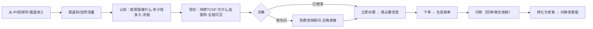
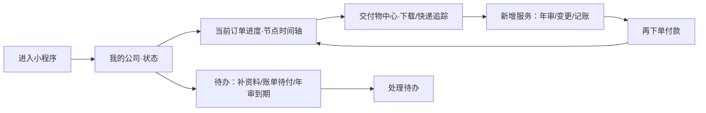

# Leapexbiz 小程序 — 双版本（新客 / 老客）需求文档 v1.0

> **来源**：2026-06-22 会议 R1（新/老用户两套首页）+ 定位重塑（顺丰式交付平台）
> **更新**：2026-06
> **核心**：同一小程序，按"是否完成注册并付款"分流为**两套体验**——新客版做**咨询接待与转化**，老客版做**履约交付与复购**。

---

## 一、为什么拆两个版本

| 维度 | 新客（未注册）| 老客（已注册 + 已付款）|
|---|---|---|
| 信任 | 弱信任，刚从 IP/视频号/渠道来 | 已建立信任、已付费、服务进行中 |
| 诉求 | 它能帮我做什么？多少钱？多久？流程难不难？要不要在这办？ | 我的公司怎么样了？进度到哪？交付物拿到没？该年审了吗？ |
| 首页角色 | **咨询接待台**（先建立认知与信任，再引导咨询/下单）| **我的公司 / 交付管理台**（顺丰式：进度可见、交付物沉淀）|
| 商业目标 | 转化下单（顾问承接 + 自助下单）| 履约交付 + 续费复购 |
| 风险点 | 信息密度过高、裸上身份证 → 流失 | 进度不透明、交付零散 → 体验差不复购 |

> 实现方式：**一个小程序、两套首页与导航重心**，按用户状态自动分流（非两个独立小程序——微信不支持）。原型用「演示身份切换」让评审在两版间切换，并在**付款成功后自动由新客转老客**，闭环可演示。

---

## 二、用户业务闭环

### 2.1 新客版闭环（咨询接待 → 转化）



**关键**：把"信任建立"前置在下单之前；下单前不强迫上身份证（先看流程/报价/顾问）。

### 2.2 老客版闭环（履约交付 → 复购）



**关键**：顺丰式"进度全程可见 + 交付物长期沉淀 + 待办驱动复购"。

---

## 三、信息架构（两套）

### 3.1 新客版 IA

```
TabBar（新客）：首页 · 服务 · 资讯 · 咨询/我的
首页（咨询接待台）
├── 信任头图（持牌 TCSP · 牌照号 · 一句话价值）
├── 「它能帮你做什么」3–4 卡（注册/年审/变更/记账）+ 多少钱·多久·难不难
├── 核心服务（突出 新公司注册 / 公司年审）+ 全部服务 ›
├── 为什么选 Leapexbiz（持牌·一手地址·全程自营·进度可见）
├── 办理流程预览（尽调→核名→注册→交付 · 3–5 个工作日）
├── 套餐报价（三档 + 为什么选这档 + 对比）
└── 常驻底栏：免费咨询顾问（企微） · 立即办理
```

### 3.2 老客版 IA

```
TabBar（老客）：首页(我的公司) · 交付物 · 订单 · 消息 · 我的
首页（我的公司 / 交付管理台）
├── 我的公司卡（名称 · 状态：注册中/正常/年审待办）
├── 当前办理进度（节点时间轴，顺丰式）→ 查看详情
├── 交付物中心入口（N 项已就绪 / 制作中 / 快递中）
├── 待办（补资料 · 账单待付 · 年审到期 6 轮提醒）
├── 新增服务（年审 / 变更 / 记账）→ 复购
└── 香港出海资讯（可选）
```

---

## 四、功能详细说明

### 4.1 新客版首页（咨询接待台）

| 区块 | 内容 | 规则 |
|---|---|---|
| 信任头图 | 「Leapexbiz · 香港持牌 TCSP」+ 价值口号 + 牌照号 | 香槟金品牌；不裸上身份证 |
| 能帮你做什么 | 4 张卡：新公司注册/公司年审/董事秘书变更/记账报税；每卡含"价格区间·时效·难度" | 降低决策门槛 |
| 核心服务 | 大图标突出 注册 / 年审；其余收"全部服务" | 弱化目录、聚焦核心（会议 R1）|
| 为什么选我们 | 持牌·上市公司一手地址·全链路自营·进度全程可见 4 点 | 建立信任 |
| 办理流程预览 | 节点：尽调 → 核名 → 注册 → 交付，标注 3–5 工作日 | 让客户知道"难不难" |
| 套餐报价 | 三档卡 + 「为什么选这档/适用人群/对比」 | 会议 R7；价格待业务定 |
| 底部常驻 | 「免费咨询顾问」（企微承接）+「立即办理」 | 顾问兜底 + 自助双通道 |

**异常/边界**：未输渠道码可自然流量进入；点「立即办理」先过"流程与所需材料 + 是否先咨询顾问"一屏，再进 KYC。

### 4.2 老客版首页（我的公司 / 交付管理台）

| 区块 | 内容 | 规则 |
|---|---|---|
| 我的公司卡 | 公司名(中英)、CI/BR、状态标签 | 多公司列表 |
| 办理进度 | 节点时间轴（尽调→核名→签约→支付→注册→交付），高亮当前 | 复用 s-kycprogress 风格 |
| 交付物中心 | 进度条 + 已就绪/制作中/快递中分组 | 跨服务聚合 + 可查询（会议 R8）|
| 待办中心 | 补资料 / 账单待付 / 年审到期（6 轮递进） | 待办驱动复购 |
| 新增服务 | 年审/变更/记账 快捷入口 → 再下单 | 复购闭环 |

**异常/边界**：无公司时回退新客版引导；账单待付高亮置顶；年审逾期红色强提醒。

---

## 五、状态分流逻辑（穷举）

| 用户状态 | 判定 | 进入版本 |
|---|---|---|
| `guest` 未进入 | 无本地标记 | 全屏渠道入口页 → 新客版 |
| `new_entered` 已进入未付款 | 过了渠道页、未付款 | **新客版** |
| `ordered_unpaid` 已下单未付 | 有订单、账单待支付/待确认 | 新客版（带"待付款"提醒）|
| `paid_user` 已付款 | 至少一笔账单已到账/服务中 | **老客版** |
| `multi_company` 多公司老客 | 已有≥1 家公司 | 老客版（公司列表）|

> 切换时机：**付款到账（账单→已到账）即由新客版切老客版**；演示原型提供手动「身份切换」便于评审。

---

## 六、数据埋点（双版本差异）

| 触发时机 | 业务意义 | 版本 |
|---|---|---|
| 新客首页"能帮你做什么"卡点击 | 新客认知/兴趣点 | 新客 |
| 点"为什么选我们"/"流程预览" | 信任建立路径 | 新客 |
| 点"免费咨询顾问"（按来源） | 顾问承接转化 | 新客 |
| 立即办理 → 下单 → 付款 | 转化漏斗 | 新客 |
| 付款到账 → 切老客版 | 新→老转化时点 | 切换 |
| 老客查看进度/交付物/下载 | 履约满意度、活跃 | 老客 |
| 年审提醒点击 → 新增服务下单 | 复购转化 | 老客 |

---

## 七、原型交付

- 新客版首页 `s-home-new`（咨询接待台）
- 老客版首页 `s-home`（我的公司/交付/待办/进度）
- 「演示身份切换」：新客 ⇄ 老客，便于评审；**付款成功自动转老客**
- 复用既有流程：服务详情/下单/支付、KYC、核名、注册、交付物中心、KYC 进度时间轴

---

*双版本 PRD v1.0 · 2026-06 · 配套 TCSP 完整版 PRD 与会议需求提炼*
