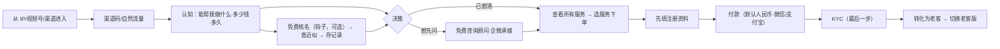
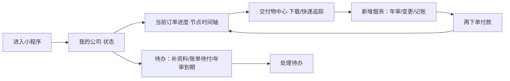

# Leapexbiz 小程序 — 双版本（新客 / 老客）需求文档 v1.1

> **来源**：2026-06-22 会议 R1（新/老两套首页）+ 2026-06-25 会议（流程重排 / 老客去推荐 / 支付）
> **更新**：2026-06-25
> **核心**：同一小程序，按"是否完成注册并付款"分流为**两套体验**——新客版做**咨询接待与转化**，老客版做**履约交付与复购**。

---

## 〇、v1.1 修订要点（2026-06-25 会议，覆盖 v1.0）

| # | 修订 | 说明 |
|---|---|---|
| M1 | **办理流程顺序重排** | 核名（免费钩子，可前置）→ 看服务下单 → **先填注册资料** → **付款** → **KYC 放最后**。每步加"提交成功 + 引导"页。详见 §四之 4.3。 |
| M2 | **核名 = 免费独立入口（钩子）** | 做成"免费核名"商品：输入名称关键词 → 查香港注册处近似公司 → 返回结果并**保存记录**，下单可复用。**异步人工预审**（预检/建议，非 AI 终审、非审批准驳）；提交后**不阻塞**，可继续下一步。 |
| M3 | **核名取消"锁定 30 天"** | 香港无此机制（名称非法定保留）。仅"查近似 + 给建议"，去掉锁定文案。 |
| M4 | **老客首页去掉"推荐服务"** | 老客进来要**干净/简洁**（参考顺丰小程序）：我的公司 + 订单待办（每单走到哪步、缺什么资料）。推荐只保留在**新客版**与服务市场。 |
| M5 | **支付/收款** | 双币种**港币+人民币**，但**不并列展示**，用切换按钮、**默认人民币**；初期用**国内（上海）公司**收款 + 微信/支付宝；退款一期人工线下，页面加退款承诺话术。 |
| M6 | **商品字段统一** | 注册=一个服务（非"套餐"），分**单项/组合服务**，统一 schema（类型/单价/包含明细/适用人群/前置流程）；"适用人群"供新客画像推荐。 |
| M7 | **办公租赁（生态合作）= 留资工单** | 富文本/长图介绍 + 留资入口 → 以工单转生态伙伴后台跟进/结算，可先收定金防跳单。 |

---

## 一、为什么拆两个版本

| 维度 | 新客（未注册）| 老客（已注册 + 已付款）|
|---|---|---|
| 信任 | 弱信任，刚从 IP/视频号/渠道来 | 已建立信任、已付费、服务进行中 |
| 诉求 | 它能帮我做什么？多少钱？多久？流程难不难？要不要在这办？ | 我的公司怎么样了？进度到哪？交付物拿到没？该年审了吗？ |
| 首页角色 | **咨询接待台**（先建立认知与信任，再引导咨询/下单）| **我的公司 / 交付管理台**（顺丰式：进度可见、交付物沉淀）|
| 商业目标 | 转化下单（顾问承接 + 自助下单）| 履约交付 + 续费复购 |
| 风险点 | 信息密度过高、裸上身份证 → 流失 | 进度不透明、交付零散 → 体验差不复购 |

> 实现方式：**一个小程序、两套首页与导航重心**，按用户状态自动分流（非两个独立小程序——微信不支持）。原型用「演示身份切换」让评审在两版间切换，并在**付款成功后自动由新客转老客**，闭环可演示。

---

## 二、用户业务闭环

### 2.1 新客版闭环（咨询接待 → 转化）



**关键**：① **核名是免费钩子**，可在下单前体验、结果存档复用；② 下单后**先填资料、再付款**（先填信息显专业、转化更高），**KYC 放最后**（避免一上来填身份证劝退）；③ 不强迫先上身份证。

### 2.2 老客版闭环（履约交付 → 复购）



**关键**：顺丰式"进度全程可见 + 交付物长期沉淀 + 待办驱动复购"。

---

## 三、信息架构（两套）

### 3.1 新客版 IA

```
TabBar（新客）：首页 · 服务 · 资讯 · 咨询/我的
首页（咨询接待台）
├── 信任头图（持牌 TCSP · 牌照号 · 一句话价值）
├── 「它能帮你做什么」3–4 卡（注册/年审/变更/记账）+ 多少钱·多久·难不难
├── 核心服务（突出 新公司注册 / 公司年审）+ 全部服务 ›
├── 为什么选 Leapexbiz（持牌·一手地址·全程自营·进度可见）
├── 办理流程预览（尽调→核名→注册→交付 · 3–5 个工作日）
├── 套餐报价（三档 + 为什么选这档 + 对比）
└── 常驻底栏：免费咨询顾问（企微） · 立即办理
```

### 3.2 老客版 IA

```
TabBar（老客）：首页(我的公司) · 订单 · 消息 · 我的
首页（我的公司 / 交付管理台）— 简洁优先（参考顺丰小程序）
├── 我的公司卡（名称 · 状态：注册中/正常/年审待办）
├── 进行中订单 · 待办（每单走到哪步 + 缺什么资料 → 点进去继续）   ★核心
├── 交付物中心入口（N 项已就绪 / 制作中 / 快递中）
└── （不放"推荐服务"——保持干净；想看去服务市场）
```
> M4：老客首页**不放推荐**，以"订单待办"为唯一主线；新增服务走底部「服务」Tab。

---

## 四、功能详细说明

### 4.1 新客版首页（咨询接待台）

| 区块 | 内容 | 规则 |
|---|---|---|
| 信任头图 | 「Leapexbiz · 香港持牌 TCSP」+ 价值口号 + 牌照号 | 香槟金品牌；不裸上身份证 |
| 能帮你做什么 | 4 张卡：新公司注册/公司年审/董事秘书变更/记账报税；每卡含"价格区间·时效·难度" | 降低决策门槛 |
| 核心服务 | 大图标突出 注册 / 年审；其余收"全部服务" | 弱化目录、聚焦核心（会议 R1）|
| 为什么选我们 | 持牌·上市公司一手地址·全链路自营·进度全程可见 4 点 | 建立信任 |
| 办理流程预览 | 节点：尽调 → 核名 → 注册 → 交付，标注 3–5 工作日 | 让客户知道"难不难" |
| 推荐服务 | 基于画像（适用人群字段）推荐；无画像则展示基础服务 | 仅新客/服务页有推荐（M4/M6）|
| 免费核名入口 | 「免费核名」钩子卡：输入名称 → 查近似 → 存记录 | M2：引流钩子，结果下单复用 |
| 顶部双通道 | 「查看所有服务」（跳服务页）+「免费咨询顾问」（企微） | 优先级前置（0625 调整）|

**异常/边界**：未输渠道码可自然流量进入；点服务「办理」时若未做尽调，强制先过合规调查一屏；核名可前置免费做、也可在下单后补做。

### 4.2 老客版首页（我的公司 / 交付管理台）

| 区块 | 内容 | 规则 |
|---|---|---|
| 我的公司卡 | 公司名(中英)、CI/BR、状态标签 | 多公司列表 |
| **进行中订单 · 待办**（核心） | 每个进行中订单一块：当前阶段（核名→资料→付款→KYC→注册→交付）+ "缺什么资料/在哪中断" + 「继续办理」 | M4：简洁待办，点进去继续；订单=有序子任务流 |
| 交付物中心 | 进度条 + 已就绪/制作中/快递中分组 | 跨服务聚合 + 可查询（会议 R8）|
| ~~推荐服务~~ | **去掉** | M4：保持干净；新增服务走「服务」Tab |

**异常/边界**：无公司时回退新客版引导；账单待付/缺资料置顶；年审逾期红色强提醒。订单待办的步骤顺序需后台定义并与小程序一致。

### 4.3 办理流程顺序（M1 · 以"新公司注册"为例）

```
（可选）免费核名  →  选服务下单  →  ① 先填注册资料  →  ② 付款  →  ③ KYC（最后）  →  注册办理  →  交付
       │ 异步人工预审，不阻塞                                    │ 合规必做，不通过可退
       └ 结果存档，下单可复用                                    └ 提交后进"提交成功+引导"页
```

- **核名**：免费、可前置；提交后台**人工预审**（给"有无近似 + 建议"，非准驳）；用户可不等结果直接下单。下单时若未核名 → 在待办中补做。
- **先填资料再付款**：下单后先收集公司信息（股东/董事/经营范围等），再到付款页——填了信息付款意愿更高、更显专业。
- **KYC 放最后**：身份证/资金来源等录入较烦，放付款后，避免一上来劝退；KYC 合规必做，页面写明"KYC 不通过可退款"。
- **每步"提交成功 + 引导"页**：如核名提交后提示"约 1–2 小时出结果，你可先填资料 / 先付款，我们一起帮你推进"。
- 不同产品前置不同（有的需核名、有的需 KYC、有的需前置上传资料），由商品的"前置流程"字段驱动（M6）。

### 4.4 支付与收款（M5）

| 项 | 方案 |
|---|---|
| 币种 | 港币 + 人民币；**不并列展示**，用切换按钮，**默认人民币** |
| 渠道 | 微信支付 / 支付宝（5,800 量级无需银行转账）；可接持牌**聚合码**收款 |
| 收款主体 | 初期**国内（上海）公司**收款，香港履约；未来可选付香港主体（可能独立小程序）|
| 退款 | 一期**不做系统退款**，人工线下退；页面加退款承诺话术（安排会计师前随时退 / KYC 不通过退款）|

> 合规：平台不宜沉淀资金，宜走持牌聚合通道；国内收款—香港履约的跨境资金须法务评估。

### 4.5 商品与服务（M6）

- 注册=**一个服务**（非"套餐"）；商品分**单项服务 / 组合服务**两类。
- **统一字段（schema）**：类型、单价（双币）、包含明细、服务内容、**适用人群**、交付门槛、**前置流程**（是否需核名 / KYC / 前置资料）。
- 价格/描述/币种/层级**后台可配**；"适用人群"供新客/服务页画像推荐。

---

## 五、状态分流逻辑（穷举）

| 用户状态 | 判定 | 进入版本 |
|---|---|---|
| `guest` 未进入 | 无本地标记 | 全屏渠道入口页 → 新客版 |
| `new_entered` 已进入未付款 | 过了渠道页、未付款 | **新客版** |
| `ordered_unpaid` 已下单未付 | 有订单、账单待支付/待确认 | 新客版（带"待付款"提醒）|
| `paid_user` 已付款 | 至少一笔账单已到账/服务中 | **老客版** |
| `multi_company` 多公司老客 | 已有≥1 家公司 | 老客版（公司列表）|

> 切换时机：**付款到账（账单→已到账）即由新客版切老客版**；演示原型提供手动「身份切换」便于评审。

---

## 六、数据埋点（双版本差异）

| 触发时机 | 业务意义 | 版本 |
|---|---|---|
| 新客首页"能帮你做什么"卡点击 | 新客认知/兴趣点 | 新客 |
| 点"为什么选我们"/"流程预览" | 信任建立路径 | 新客 |
| 点"免费咨询顾问"（按来源） | 顾问承接转化 | 新客 |
| 立即办理 → 下单 → 付款 | 转化漏斗 | 新客 |
| 付款到账 → 切老客版 | 新→老转化时点 | 切换 |
| 老客查看进度/交付物/下载 | 履约满意度、活跃 | 老客 |
| 年审提醒点击 → 新增服务下单 | 复购转化 | 老客 |

---

## 七、原型交付

- 新客版首页 `s-home-new`（咨询接待台 + 免费核名钩子 + 推荐）
- 老客版首页 `s-home`（我的公司 + 订单待办，简洁；**已去推荐**）
- 「演示身份切换」：新客 ⇄ 老客，便于评审；**付款成功自动转老客**
- 流程顺序：核名（免费/可前置）→ 下单 → 先填资料 → 付款 → KYC（最后）
- 复用既有流程：服务详情/下单/支付、KYC、核名（去 30 天锁定）、注册、交付物中心

---

*双版本 PRD v1.1 · 2026-06-25 · 配套 0625 会议需求提炼、推荐服务规则（仅新客）、后台重构 v3.0*
