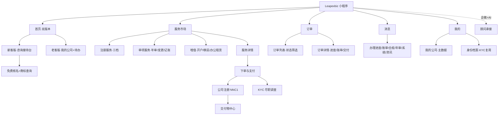
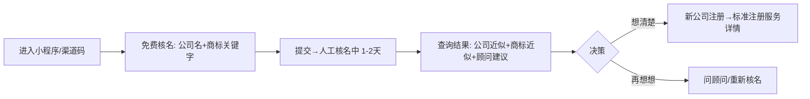
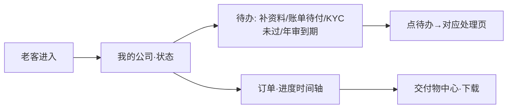
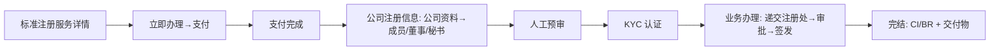
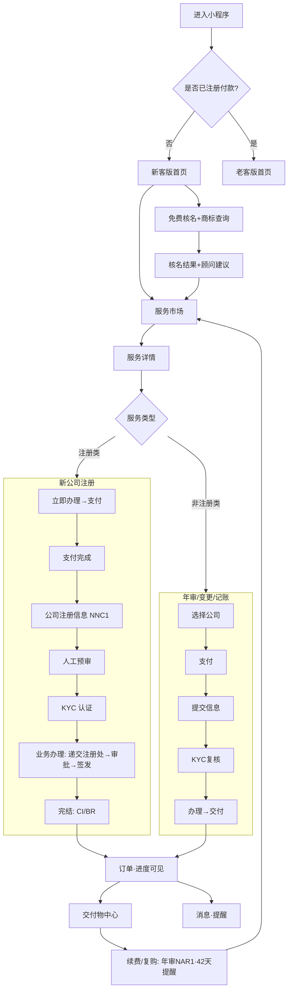
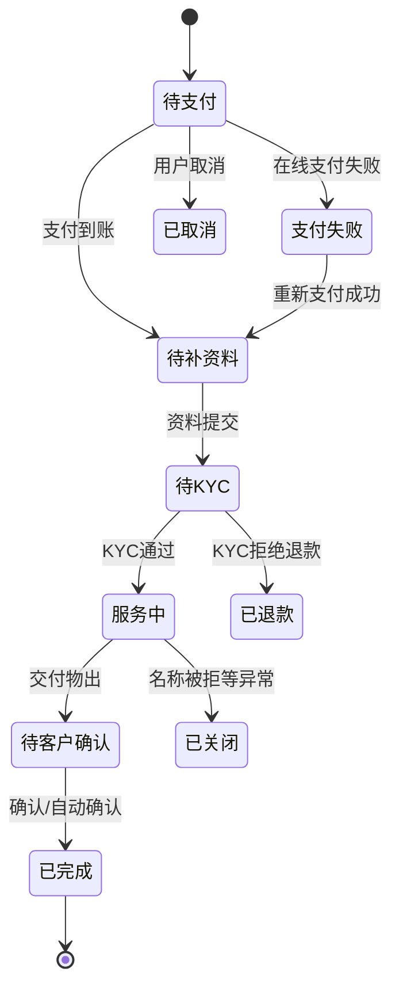

# Leapexbiz 小程序 — 完整需求文档 PRD v1.0

> **文档定位**：覆盖 TCSP 小程序（客户端）**全部已实现功能** + **补全订单 / 消息模块**的完整 PRD。
> **作者**：财税公司 IT 软件经理（兼香港财务会计）
> **配套**：管理后台重构 v3.0、双版本 PRD v1.1、0625/0626 会议提炼。
> **原型**：http://124.221.97.241:8081/tcsp
> **重要约定**：① 小程序 = 顺丰式「交付物管理 / 履约平台」，非纯电商；② 核名 = 近似度预检（非官方核准）；③ 身份信息为跨模块**公共模块**；④ 凡涉及香港财务/合规处均做了自省修正（见 §九）。

---

## 一、产品背景与目标〔技能1〕

### 1.1 市场背景与洞察

> 数据为行业研究综合估算，**精确数值以香港公司注册处（CR）、税务局（IRD）、投资推广署官方统计为准**。

- **香港公司活跃增长**：香港作为内地企业出海的首选离岸枢纽，每年新成立本地有限公司约 **13–15 万家**，活跃注册公司**超 140 万家**；2023 年起内地"出海潮"推动新设公司与跨境结构需求显著回升。
- **TCSP 持牌强监管**：自 2018 年《打击洗钱及恐怖分子资金筹集条例》(AMLO) 修订，提供公司服务须持 **TCSP 牌照**并履行 **KYC / 客户尽职调查（CDD）**、**7 年留存**、**制裁/PEP 筛查**义务，行业从"低门槛代办"转向"持牌合规"。
- **法定刚需高频**：每家公司每年须办 **周年申报（NAR1，成立周年后 42 天内）**、**商业登记证（BR）续期**、**做账报税（利得税）**，叠加董事/股东/地址/股本变更，形成**长期复购**。
- **数字化缺口**：传统秘书公司**单向邮件交付、微信发文件、进度不透明**（老板痛点："只能三天问一次好了没"），缺乏客户自助查询与进度可视化。

### 1.2 行业挑战

| 挑战 | 说明 |
|---|---|
| **进度黑盒** | 客户看不到办理到哪一步、交付物散落微信，体验差、复购弱 |
| **信任前置难** | 新客刚从 IP/视频号来，未建立信任就被要求上传身份证 → 流失 |
| **合规成本高** | KYC/制裁筛查/7 年留存须持牌人工完成，雇香港人贵 |
| **核名/注册门槛** | 香港核名、NNC1 表格、章程对内地客户陌生，易填错 |
| **跨境支付/收款** | 内地客户付款、港币收款、平台不可沉淀资金，须走持牌通道 |

### 1.3 产品定位

**Leapexbiz 小程序 = 香港持牌 TCSP 的「线上交付与履约平台」**：新客版做**咨询接待与转化**，老客版做**进度可见 + 交付物沉淀 + 待办驱动复购**；核名做**免费引流钩子**；企微 + AI 双层承接。

### 1.4 用户目标

- **省心**：注册/年审/变更全线上托办，进度全程可见，不必追问"好了没"。
- **可信**：持牌 TCSP、资料加密、隐私保护；先看流程/报价/顾问，再决定。
- **高效**：免费核名 + 商标查询 1–2 日出结果；身份信息一次填、多处带。
- **合规**：KYC/制裁筛查依 AMLO 完成；交付物（CI/BR/章程）长期可查。

---

## 二、功能定义与概述〔技能2〕

### 2.1 功能架构图

### 2.2 功能模块清单

| 功能模块 | 功能点 | 优先级 | 核心价值 |
|---|---|---|---|
| **首页·双版本** | 新客咨询接待台 | P0 | 建立认知与信任 |
| | 老客我的公司 + 待办 | P0 | 进度可见、复购驱动 |
| | 免费核名钩子 | P0 | 引流转化 |
| **核名 + 商标** | 公司名称查册（全名/起首） | P0 | 近似度预检 |
| | 商标关键字查询 | P0 | 规避商标冲突 |
| | 查询结果 + 顾问建议 | P0 | 一站给结果 |
| **服务市场** | 注册/年审/变更/记账/增值 | P0 | 全生命周期目录 |
| | 服务详情（含明细/流程/富文本） | P0 | 降决策门槛 |
| **下单与支付** | 账单 + 双币（默认人民币） | P0 | 内地客户友好 |
| | 微信/支付宝/聚合码 + 港币转账 | P0 | 合规收款 |
| | 上传回单 / 取消订单 | P1 | 对账闭环 |
| **公司注册 NNC1** | 公司资料 | P0 | 复刻官方表格 |
| | 成员/董事/秘书管理 | P0 | 多人 + 身份 |
| | 人工预审→业务办理→完结 | P0 | 履约可见 |
| **KYC 尽调** | 身份/地址/业务证明 | P0 | AMLO 合规 |
| | 资料修改重审 | P1 | 补正闭环 |
| **订单** ★ | 订单列表 + 状态筛选 | P0 | 全量可查 |
| | 订单详情 + 进度时间轴 | P0 | 顺丰式可见 |
| | 续费/再下单 | P1 | 复购 |
| **交付物中心** | 跨服务交付物聚合 + 检索 | P0 | 长期沉淀 |
| **消息** ★ | 进度/账单/合规/年审/系统/资讯 | P0 | 触达与提醒 |
| | 微信订阅消息 + 6 轮年审提醒 | P0 | 法定时效不漏 |
| **我的** | 我的公司主数据 | P0 | 续费提醒基础 |
| | 身份档案（KYC 复用） | P1 | 一次填多处带 |
| **顾问承接** | 企微 + AI 双层 | P0 | 售前信任、售后兜底 |

---

## 三、用户角色与使用场景〔技能3〕

### 3.1 用户角色

| 角色 | 说明 | 主要诉求 |
|---|---|---|
| **新客（未注册）** | 从 IP/视频号/渠道码进入，未付款 | 能帮我做什么·多少钱·多久·难不难·要不要在这办 |
| **老客（已付款）** | 已下单付款、服务进行中或已有公司 | 我的公司怎样了·进度到哪·交付物拿到没·该年审了吗 |
| **公司董事 / 股东（实益拥有人）** | KYC 对象 | 一次实名、安全合规、隐私保护 |
| **渠道商** | 持渠道码引流（前端只体现"已绑定"，佣金不可见） | 专属价格 |
| **顾问（企微/后台）** | 承接、核名人工查册、KYC 审核 | 高效承接、合规留痕 |

### 3.2 核心使用场景

**场景一：新客免费核名 → 转化**
- **痛点**：新客想取个名，但不懂香港核名、怕重名/撞商标，更怕一上来填身份证。
- **用户故事**：作为出海创业者，我希望免费查一下心仪公司名有没有人用、商标会不会冲突，并顺手了解注册要花多少钱多久，再决定办不办。

**场景二：老客查进度 + 处理待办**
- **痛点**：传统秘书公司进度黑盒，客户被动等。
- **用户故事**：作为已下单的客户，我希望进小程序就看到我的公司状态、当前办到哪步、有什么待办（补资料/账单/年审），一键处理。

**场景三：公司注册全流程办理**
- **痛点**：NNC1/章程/董事股东信息复杂，易错。
- **用户故事**：作为注册客户，我希望按引导分步填公司资料、添加董事/股东，系统帮我汇总成 NNC1，由顾问预审后递交注册处，全程可见。

---

## 四、核心业务流程〔技能4〕

---

## 五、功能详细说明〔技能5〕（含状态穷举）

> 体例：每模块先列**页面内容**，再列**状态枚举**（穷举），最后列**关键规则**。

### 5.1 首页（双版本）

**新客版（咨询接待台）页面内容**
- 信任头图：Leapexbiz·香港持牌 TCSP·牌照号；价值口号（不裸上身份证）。
- 顶部双通道：「查看所有服务」（跳服务页）、「免费咨询顾问」（企微）。
- **免费核名卡（钩子）**：副标题三步「① 公司核名查册；② 商标查询；③ 1–2 日出结果」+「立即免费核名 ›」。
- 能帮你做什么：4 卡（注册/年审/变更/记账），每卡价格区间·时效·难度。
- 为什么选 Leapexbiz：深色品牌信任面板（持牌 TCSP·一手注册地址·全链路自营·进度全程可见）。
- 推荐服务：三档注册服务卡（基础/标准/高级，标准为推荐）。

**老客版（我的公司/交付管理台）页面内容**
- 我的公司卡：公司名（中英）、CI/BR、状态标签（注册中/正常/年审待办）。
- **待办事项**：核名未通过/支付失败/KYC 未通过（红，强提醒）+ 补充资料/账单待付/年审到期。
- （不放推荐，保持干净；新增服务走「服务」Tab）。

**状态枚举 — 用户态（分流依据）**
| 状态 | 判定 | 进入版本 |
|---|---|---|
| guest 未授权 | 无登录态 | 渠道码入口页 → 新客版 |
| new_entered 已进未付 | 已授权登录、无付款 | 新客版 |
| ordered_unpaid 已下单未付 | 有账单待支付 | 新客版（带待付提醒）|
| paid_user 已付款 | ≥1 笔已到账/服务中 | 老客版 |
| multi_company 多公司 | 已有 ≥1 家公司 | 老客版（公司列表）|

**关键规则**：付款到账即由新客版切老客版；演示原型提供手动「新/老视角」切换。

### 5.2 免费核名 + 商标查询（近似度预检）

**页面内容**
- 提示：免费核名 = 公司名称查册 + 商标查询，提交后顾问**人工查册**（约 1–2 天）；查册语言**仅英文或繁体中文**。
- ① 公司核名查册：查册方式（**以全名查册** / **以名称起首查册**）+ 拟用公司名称（英文/繁体）。
- ② 商标查询：商标关键字（英文/繁体）。
- 底部：「剩余 3 次免费」+「提交人工核名」。
- 提交后 →「人工核名中（1–2 天）」状态页（回显方式/名称/商标关键字）→ 底部主按钮「**新公司注册**」（进标准注册详情）+「返回首页」（文字超链，按钮下方）+「测试下一步」（文字超链·右下角，跳核名结果页，仅供演示）。
- **结果页**：公司名称查册结果（多条，每条 公司名/BR 号/名称现况/公司现况，可「查看全部」底部浮窗）+ 商标查询结果（商标/编号/Status/Class/拥有人，可「查看全部」浮窗）+ **顾问建议**（一条）+ 底部「**新公司注册**」（进标准注册详情）/「返回首页」（文字超链）。

**状态枚举 — 核名申请**
| 状态 | 含义 | 后续 |
|---|---|---|
| 草稿 | 用户填写中 | 可提交 |
| 已提交·人工核名中 | 顾问在 ICRIS/IPD 查册 | 1–2 天出结果 |
| 已出结果·建议可用 | 无相同/近似冲突 | 可下单复用 |
| 已出结果·有近似 | 名称/商标存在近似 | 给建议，可改名重查 |
| 已出结果·敏感词/需牌照 | 含 Bank/Trust 等受限词 | 需合规审批/不可用 |
| 已过期/作废 | 超免费额度或久未使用 | 重新发起 |

**关键规则（HK 修正）**：香港**不出"核名通知书"**，预检通过 ≠ 注册处最终核准；不做准驳判断，仅"查近似 + 一条建议"；免费 3 次，超额按次收费。

### 5.3 服务市场 + 服务详情

**服务市场页面内容**
- 注册服务（三档：基础/标准/高级，标准推荐）。
- 单项服务：公司年审、董事/秘书变更、注册地址变更、股份转让、公司名称变更、股份配发、公司注销。
- 增值服务：银行开户协助、香港移民/身份规划、办公租赁（生态合作·留资）。
- （已去除"渠道码享专属价"提示）。

**服务详情页面内容**
- 头图：服务名 + 价格（标准价/渠道价，双币）。
- 服务包含（明细清单）。
- **办理流程**（详情页步骤条）：注册类 = 支付 → KYC 认证 → 提交注册信息；非注册类 = 选择公司 → 支付 → 提交信息 → KYC。
- 办理时效 / 所需材料 / 交付物。
- 富文本详细描述（后台维护）。
- 底部：问顾问 + **立即办理**（注册类 → 支付页；非注册类 → 选择公司）。

**状态枚举 — 商品（前端可见）**
| 状态 | 前端表现 |
|---|---|
| 上架 | 正常展示、可下单 |
| 下架 | 不展示 / 灰显"暂不可办" |
| 顾问报价 | 显示"面议"，主按钮→问顾问 |
| 增值/合作 | 留资工单（不直接下单）|

### 5.4 下单与支付

**账单支付页面内容**
- 币种切换（人民币 ¥ / 港币 HK$，**默认人民币**，不并列展示金额）。
- 金额（随服务标准价）+ 状态标签。
- 费用明细（服务名 + 应付合计）。
- 支付方式：默认在线 = **微信支付 / 支付宝**（国内主体收款 + 聚合码）；切港币 = **线下转账**（户名 TimeLeap Technology (HK) Limited·招商永隆銀行 CMB Wing Lung·账号 60100807956·SWIFT WUBAHKHH）+「上传回单」。
- 底部弱化「取消订单」文字超链。
- **支付完成页（注册类专属）**：仅「✓ 支付完成」成功标识（**已去除顶部流程条 支付→KYC→提交注册信息、去除「还需完成以下两步…」引导语**，减少视觉拥挤）；下方两豆腐块为**并行待办**（① 完成 KYC 实名认证 + AMLO 必要性说明，**不再写「如审核不通过全额退款」字样**；② 提交公司注册信息 + **5 步骤**：公司资料 / 成员·董事·秘书 / **组织章程** / 人工预审 / 业务办理）。两块分别进入 §5.6 KYC 与 §5.5 注册表单。

**状态枚举 — 账单 / 支付**
| 状态 | 含义 | 触发/后续 |
|---|---|---|
| 待支付 | 账单生成、未付 | 在线支付/线下转账 |
| 支付中 | 在线支付发起 | 成功→已支付，失败→支付失败 |
| 支付失败 | 在线支付未完成 | 待办提示，可重新支付 |
| 待确认（回单待核） | 线下转账已上传回单 | 运营核对到账 |
| 已到账 | 运营确认收款 | 订单进入服务中 |
| 已驳回 | 回单不符 | 通知客户重传 |
| 已作废 | 超期/取消 | 不再有效 |
| 已退款 | KYC 不通过/协商退款（人工线下） | 订单关闭 |

**关键规则（HK 修正）**：平台**不沉淀资金**，宜走**持牌聚合收款**（连连等）；港币用香港主体账户；退款一期人工线下、按个案处理（**支付完成页已移除"KYC 不通过全额退款"硬承诺文案**，避免对尽调结果做绝对化承诺，退款口径改由服务条款与客服统一说明）。

### 5.5 公司注册 NNC1

**步骤与页面内容（表单 4 步 + 办理 2 阶段）**
1. **公司资料**：建议采用的公司名称（英文 + 中文，**可只填其一**）；**拟经营业务性质**（香港标准行业分类 HSIC 下拉）；注册办事处地址（**地区默认香港、锁定不可改**；室/楼/座、大厦、街道、区；默认可用法定秘书地址）；公司联络资料（电邮 + 香港电话 +852）；股本（**普通股 Ordinary**/货币 HKD/发行总数/认购股本）。
2. **成员/董事/公司秘书**：人员列表（卡片含身分标签 + 证件 + 持股 + 删除）+「添加」→ 人员表单（**类型** 自然人/法人；**身分多选** 创办成员/董事/公司秘书；中英姓名；**通讯地址 + 通常住址**（通常住址不公开）；身分识别 身份证/护照/签发国/电邮；出任董事同意书）。法定秘书由 Leapexbiz 内嵌担任。
3. **组织章程（公司章程）**：样本选择 —「**样本 A（简化格式）**」（推荐）/「样本 B」/「自订（英文）」/「自订（中文）」，可预览全文。依《公司条例》(Cap. 622)，样本 A/B 为注册处标准章程范本；单一 / 简单股权结构建议用**样本 A**。
4. **人工预审**：资料汇总 + NNC1 + 章程预览 + 确认勾选 →「提交人工预审」。
— 提交人工预审后进入办理阶段 —
5. **业务办理**（约 3–5 个工作日）：进度时间轴（人工预审通过 → 递交香港公司注册处「e-Registry 已提交，等待政府审批，约 1–2 个工作日」→ 签发 CI + BR）；**政府审批已并入"递交注册处"子说明，不再单列节点**；底部「返回首页」+ 右下角「测试下一步」文字超链跳完结页（演示用）。
6. **完结**：注册完成（CI/BR 号、成立日期）+「查看交付物」（CI / BR / 章程 / 法定文件册）。

**状态枚举 — 公司注册办理**
| 状态 | 含义 |
|---|---|
| 资料填写中 | 公司资料/成员未提交 |
| 待人工预审 | 已提交、顾问未审 |
| 预审退回 | 资料有误，需修改 |
| 预审通过·待 KYC | 等待董事/股东 KYC |
| 已递交注册处 | e-Registry 已提交 |
| 政府审批中 | 注册处处理（约 1–2 工作日）|
| 已签发 CI/BR | 出证 |
| 完结 | 交付物送达 |
| 已退回/失败 | 名称被拒/资料不符（极少，需改名重办）|

**关键规则（HK 修正）**：中/英文名二选一；股份默认普通股；**组织章程默认样本 A**（依 Cap. 622 标准范本）；注册地址默认法定秘书地址；**法定秘书须香港居民或持牌 TCSP**（Leapexbiz 担任）；身份字段与 KYC **公共模块**复用，不重复填。

### 5.6 KYC 尽职调查

**页面内容**
- 向导：合规说明（AMLO 摘要 + 同意）→ 身份认证（证件 OCR + 人工复核）→ 地址证明（近 3 个月、显示完整姓名地址）→ 业务性质/资金来源 → 提交审核。
- **提交后·人工审核中页（注册流程）**：标题「KYC 认证」、状态「**人工审核中**」，文案「审核通过后，会将 **NNC1 表格递交香港公司注册处**，政府审批通常约 1–2 个工作日」；底部「**查看剩余待办**」→ 老客首页（与"提交注册信息"待办**并行**，互不阻塞）。
- **资料修改页（审核未通过）**：已提交资料列表，标记**未通过项 + 原因**（如地址证明超期、资金来源描述不足），支持**重新上传/修改** → 重新提交 → 待办转「KYC 审核中」。

**状态枚举 — KYC**
| 状态 | 含义 |
|---|---|
| 未开始 | 尚未发起 |
| 填写中 | 用户录入 |
| 已提交·审核中 | 顾问/合规审核（约 1 工作日）|
| 待补正 | 部分资料未通过，需修改重传 |
| EDD 增强尽调 | PEP/高风险，需补充材料 |
| 制裁命中·冻结 | UN/EU/HKMA 命中，合规复核、不 tipping-off |
| 已通过 | 尽调完成 |
| 已拒绝 | 不予服务，**留档 7 年** |

**关键规则（HK 修正）**：依 AMLO 须查**实益拥有人（股东）+ 董事**；含 **PEP（含家属）+ 制裁筛查**；**7 年留存**；**转入客户**（已有公司）同样须 KYC；制裁命中不可向客户泄露（no tipping-off）。

### 5.7 订单模块 ★（补全）

**订单列表页面内容**
- 顶部状态筛选 Tab：全部 / 待支付 / 服务中 / 已完成 / 已取消。
- 订单卡：订单号、公司名、服务（可多项 = 子服务）、渠道、金额（双币）、状态标签、创建时间；快捷操作（去支付/查看进度/查看交付物/续费）。
- 空态：暂无订单 + 去服务市场。

**订单详情页面内容**
- 概要：订单号、公司、下单时间、渠道、金额、状态。
- **进度时间轴**（顺丰式）：按服务类型展示节点（注册：支付→公司注册信息→KYC→递交→审批→签发→完结）。
- **子服务列表**：一个订单可含多服务（如注册 + 首年年审 + 印章），每项独立状态。
- **账单区**：关联账单（金额/状态/回单/印花税如适用）。
- **交付物区**：该订单交付物入口。
- **办理方**：直营 / 供应商（履约方，进度由其更新）。
- 操作：去支付、上传回单、补充资料、催办、取消订单（限未办理前）、续费、联系顾问。

**状态枚举 — 订单（穷举）**
| 主状态 | 子状态/说明 |
|---|---|
| 待支付 | 账单已生成未付；可取消 |
| 待补资料 | 已付款，缺公司资料/证件 |
| 待 KYC | 已付款，董事/股东未完成 KYC |
| 服务中 | 资料齐全，履约进行中（含"政府审批中"子态）|
| 待客户确认 | 交付物已出，待客户确认收货 |
| 已完成 | 已交付且确认（或 N 天自动确认）|
| 已取消 | 用户/运营取消（未办理前）|
| 已退款 | KYC 不通过/协商退款 |
| 已关闭 | 异常终止（如名称被拒未改名）|
| 部分完成 | 多子服务，部分已交付（聚合态）|

**关键规则**：订单可含多子服务，主状态由子服务聚合（取最不利/最阻塞态展示）；订单**状态变更为"已完成"**才触发供应商/渠道结算（后台）；续费基于公司主数据生成新订单。

**埋点**：见 §八。

### 5.8 交付物中心

**页面内容**
- 进度条 + 分组：已就绪 / 制作中 / 政府文件待签发 / 快递中。
- 跨服务聚合（注册/年审/各类变更的交付物归集）。
- **检索**：按公司/服务/时间筛选。
- 单项：名称、生成方式（系统 PDF / 政府签发 / 实物供应商）、下载/预览/快递追踪。

**状态枚举 — 交付物**
| 状态 | 含义 |
|---|---|
| 待生成 | 依赖前置（如政府出证）|
| 制作中 | 系统渲染 / 供应商制作（印章等）|
| 待政府签发 | CI/BR 等待官方 |
| 已就绪 | 可下载/预览 |
| 快递中 | 实物寄送（含单号）|
| 已签收 | 客户确认收货 |
| 已作废/重制 | 信息变更需重出 |

### 5.9 消息模块 ★（补全）

**页面内容**
- 消息分类（顶部 Tab 或分组）：**办理进度** / **账单与支付** / **合规与 KYC** / **年审与续费** / **系统通知** / **香港出海资讯**。
- 消息列表：图标 + 标题 + 摘要 + 时间 + 已读/未读圆点；未读数角标（Tab 红点）。
- 消息详情：正文 + 关联跳转（如"去支付""去补资料""查看交付物""去年审"）。
- **微信订阅消息**：关键节点推送（核名结果出、账单待付、KYC 结果、出证完成、年审到期）。
- **年审 6 轮递进提醒**：到期前 60/30/14/7 天 + 当天 + 逾期 7 天，三渠道（订阅消息 + 站内信 + 顾问跟进）。

**消息类型 × 触发**
| 类型 | 触发节点 | 跳转动作 |
|---|---|---|
| 办理进度 | 核名出结果 / 预审通过 / 递交注册处 / 出证 | 查看订单/结果 |
| 账单与支付 | 账单生成 / 支付失败 / 到账确认 / 退款 | 去支付/查看账单 |
| 合规与 KYC | KYC 提交/通过/待补正/拒绝 | 去补资料/查看 |
| 年审与续费 | NAR1 到期 6 轮提醒 / BR 续期 | 去年审/续费 |
| 系统通知 | 账号/政策/服务变更 | — |
| 香港出海资讯 | 政策解读/合规资讯（与视频号联动） | 查看资讯 |

**状态枚举 — 消息**
| 状态 | 含义 |
|---|---|
| 未读 | 新消息，红点/角标 |
| 已读 | 用户已查看 |
| 已处理 | 关联待办已完成（如已支付）|
| 已过期 | 时效性消息（如账单已作废）|
| 订阅消息·已授权/未授权 | 微信订阅授权态 |

**关键规则**：进度/账单/年审类消息与**订单/待办**联动（点击直达处理页）；年审提醒基于**公司主数据周年申报日（成立周年 + 42 天）**生成。

### 5.10 我的公司（客户主数据）

**页面内容**
- 公司列表（多公司）+ 公司详情：
  - **公司档案**：中英名、CI、BR、注册日期、注册地址、**下次年审日（NAR1）**、SCR 状态、公司状态。
  - **关联人**：董事/股东/秘书（与个人身份档案关联，多对多）。
  - **历史交付物 / 历史订单**。
- 个人身份档案：身份证/护照、通讯地址、通常住址、手机、邮箱（**KYC 复用源**）。

**状态枚举 — 公司**
| 状态 | 含义 |
|---|---|
| 注册中 | 办理未出证 |
| 正常 | 已注册、合规在册 |
| 年审待办 | 临近/到期未办 NAR1 |
| 年审逾期 | 超期未办（罚款风险）|
| 变更中 | 董事/股东/地址等变更办理中 |
| 注销中 | 办理 DR1 注销 |
| 已注销/已告解散 | 终止 |

**关键规则（HK 修正）**：客户（人）与公司是**多对多**；交付/KYC 核心信息**回流**为档案字段；身份证/地址**定期维护**；**防欺诈**：登录人与董事/股东一致性校验（防盗用身份开公司）。

### 5.11 个人中心（我的）

**页面内容**：头像/昵称、绑定渠道（仅显示"已绑定"，佣金不可见）、我的公司、身份档案、订单、交付物、消息、联系顾问、设置（隐私/协议/语言）、退出登录。

### 5.12 企微 + AI 顾问承接

**页面内容**：企微二维码 + 微信号 + 在线时段；「加顾问企微」「复制微信号」；按来源（服务详情/下单/核名/悬浮）埋点。AI 客服兜底常规/售后问答。

---

## 六、状态机汇总（穷举，供开发对齐）

> 应技术要求，统一汇总各对象状态机，**穷举**并标注流转。

| 对象 | 状态全集 |
|---|---|
| 用户态 | guest / new_entered / ordered_unpaid / paid_user / multi_company |
| 核名 | 草稿 / 人工核名中 / 建议可用 / 有近似 / 敏感词需牌照 / 过期作废 |
| 商品 | 上架 / 下架 / 顾问报价 / 增值合作 |
| 账单 | 待支付 / 支付中 / 支付失败 / 待确认 / 已到账 / 已驳回 / 已作废 / 已退款 |
| 订单 | 待支付 / 待补资料 / 待KYC / 服务中 / 待客户确认 / 已完成 / 已取消 / 已退款 / 已关闭 / 部分完成 |
| 注册办理 | 资料填写中 / 待人工预审 / 预审退回 / 预审通过待KYC / 已递交注册处 / 政府审批中 / 已签发CI·BR / 完结 / 已退回失败 |
| KYC | 未开始 / 填写中 / 审核中 / 待补正 / EDD / 制裁命中冻结 / 已通过 / 已拒绝 |
| 交付物 | 待生成 / 制作中 / 待政府签发 / 已就绪 / 快递中 / 已签收 / 已作废重制 |
| 消息 | 未读 / 已读 / 已处理 / 已过期 / 订阅已授权·未授权 |
| 公司 | 注册中 / 正常 / 年审待办 / 年审逾期 / 变更中 / 注销中 / 已注销 |

---

## 七、异常处理

| 场景 | 处理 |
|---|---|
| 核名提交超免费 3 次 | 提示按次收费 / 引导下单（注册含核名）|
| 核名敏感词/需牌照（Bank/Trust） | 标记不可用，引导改名/合规审批 |
| 支付失败 | 待办+消息提示，可重新支付；订单保留不作废 |
| 回单与应收不符 | 运营驳回，消息通知重传 |
| KYC 资料不清/超期 | 资料修改页标红原因，重传重审 |
| KYC 制裁命中 | 冻结+合规复核，**不向客户披露原因**（no tipping-off）|
| 注册名称被注册处拒 | 订单转"已关闭/需改名重办"，退款或改名继续 |
| 登录人 ≠ 董事/股东 | 风控校验告警（防身份盗用）|
| 多公司/多订单 | 列表区分，订单聚合态展示 |
| 跨境支付受限 | 切聚合码/港币转账，提示合规 |
| 网络/政府站点错误 | 保存草稿、可重试，不丢已填 |
| 必填未填 | 行内红字"xx 未填，请填写"，阻断下一步 |

---

## 八、数据埋点方案〔技能6〕

| 触发时机 | 业务意义 |
|---|---|
| 进入新客版首页 | 新客规模/来源分析 |
| 点击免费核名 | 钩子吸引力 |
| 提交核名（公司名+商标） | 核名需求与关键词分布 |
| 查看核名结果 / 点「查看全部」浮窗 | 结果满意度、结果丰富度需求 |
| 点「新公司注册」 | 核名→注册转化 |
| 点「问顾问/咨询」（按来源） | 顾问承接转化时点 |
| 服务详情「立即办理」 | 服务下单意向 |
| 支付成功（按服务/币种/渠道） | 转化漏斗、币种偏好 |
| 支付失败 | 支付障碍分析 |
| 支付完成页点 KYC / 提交注册信息 | 两步引导转化 |
| NNC1 各步完成（公司资料/成员/预审） | 表单流失点定位 |
| 添加成员/董事/秘书 | 多人结构占比 |
| KYC 提交 / 通过 / 待补正 | 合规通过率、补正率 |
| 出证完结 / 查看交付物 / 下载 | 履约满意度、活跃 |
| 老客查看订单进度 | 进度可见使用率 |
| 年审提醒点击 → 续费下单 | 复购转化（核心）|
| 消息点击（按类型）/ 订阅授权 | 触达有效性 |
| 切换新/老视角（演示） | 评审用 |

---

## 九、香港财务 / 合规自省与修正

> 对"产品设计上不合理或不符合香港规则"之处的自省与更正：

1. **核名无通知书**：香港公司注册处不出"核名通知书"，预检通过 ≠ 核准；去掉"锁定 30 天""核名通过即可注册"等误导，改"查近似 + 一条建议"。
2. **核名 = 人工**：现阶段背后是顾问人工 ICRIS/IPD 查册（非 AI 终审），去掉"AI 实时校验/智能预检"矛盾文案。
3. **NNC1 字段**：补"拟经营业务性质（HSIC）"；中/英文名**二选一**；股份默认**普通股 Ordinary**；注册地址默认**法定秘书地址**。
4. **法定秘书资格**：须香港居民或持牌 TCSP；由 Leapexbiz 内嵌担任，非客户随意填。
5. **周年申报 NAR1**：成立**周年日后 42 天内**提交，逾期罚款递增 → 6 轮提醒以此为基准。
6. **KYC 对象与留存**：依 AMLO 查**实益拥有人 + 董事**，含 **PEP（含家属）+ 制裁筛查**，**留存 7 年**；转入客户亦须 KYC；制裁命中 **no tipping-off**。
7. **印花税**：股份转让按对价或资产净值孰高 **0.2%**（系统预估，非随意数）。
8. **收款合规**：平台**不沉淀资金**，宜走**持牌聚合收款**；港币用**香港主体账户**（CMB Wing Lung）；开户须客户**本人与银行**完成，平台仅协助引流。
9. **记账报税（如纳入）**：利得税两级制 **8.25% / 16.5%**；MPF 强积金雇主/雇员各 5%（月入上限对应供款上限 HKD 1,500），非内地式社保。
10. **退款话术**：一期人工线下退、按个案处理；**支付完成页已移除"KYC 不通过全额退款"硬承诺文案**，避免对尽调结果绝对化承诺与纠纷，退款口径由服务条款 + 客服统一说明。

---

## 十、修订记录

**v1.0 · 2026-06-30 增补（注册 / 核名 / 支付流程细化）**
- **核名「人工核名中」页**：主按钮由「好的，进入下一步」改为「**新公司注册**」（进标准注册详情）；新增「返回首页」（按钮下方文字超链）+「测试下一步」（右下角文字超链，演示用）。
- **核名 & 商标结果页**：「重新核名」改为「**返回首页**」。
- **支付完成页**：去除顶部流程条（支付→KYC→提交注册信息）与「还需完成以下两步…」引导语；① KYC 块去除「如审核不通过全额退款」承诺文案；② 提交注册信息块步骤补「**组织章程**」（公司资料 / 成员·董事·秘书 / 组织章程 / 人工预审 / 业务办理，5 步）。
- **公司注册 NNC1**：表单在「成员/董事/秘书」与「人工预审」之间新增 **组织章程**（样本 A 推荐 / 样本 B / 自订英 / 自订中），结构改为**表单 4 步 + 办理 2 阶段**。
- **业务办理页**：文案补「等待政府审批，**约 1–2 个工作日**」；**政府审批并入"递交注册处"子说明、不再单列节点**；「测试下一步」移至右下角。
- **KYC 提交（注册流程）→「人工审核中」页**：标题「KYC 认证」，提示 NNC1 递交注册处 + 政府审批 1–2 工作日，底部「查看剩余待办」→ 老客首页。
- **完结页**：修复底部按钮布局（「返回首页」+「查看我的订单」单行不换行、不溢出）。

---

*Leapexbiz 小程序完整 PRD v1.0 · 覆盖全部已实现功能 + 补全订单/消息 · 配套后台重构 v3.0、0625/0626 会议提炼*
