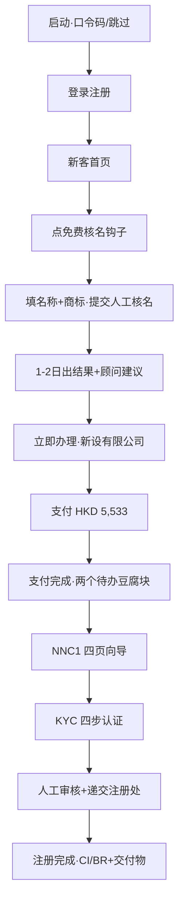
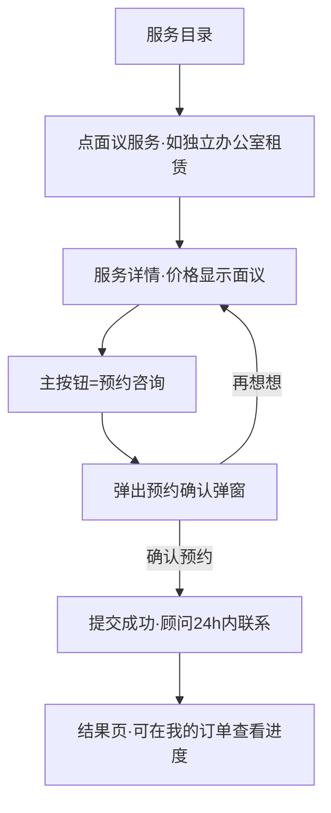
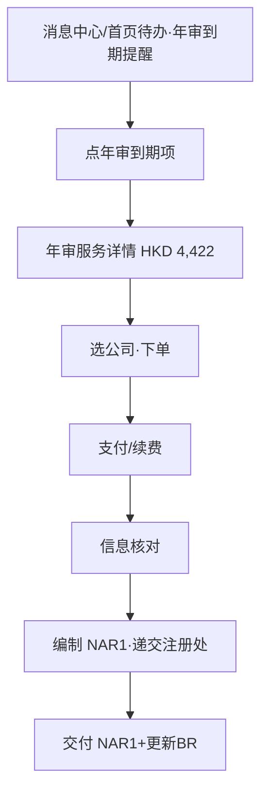
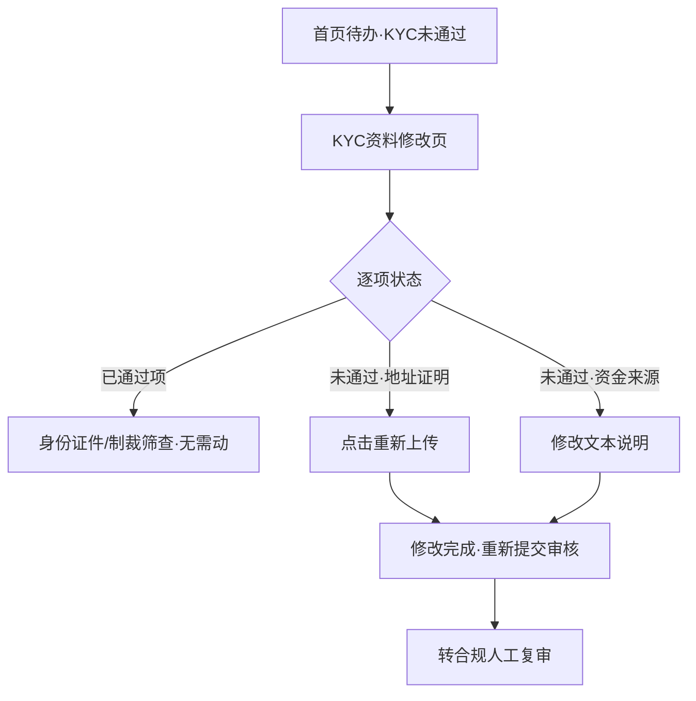
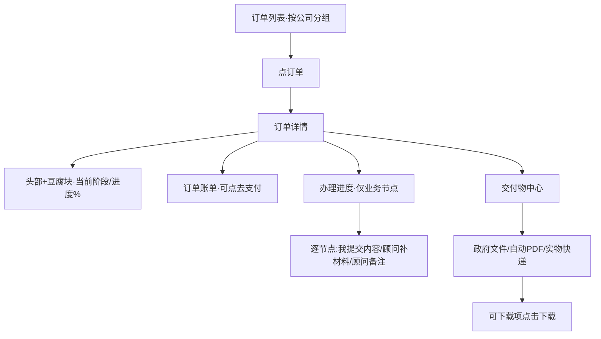
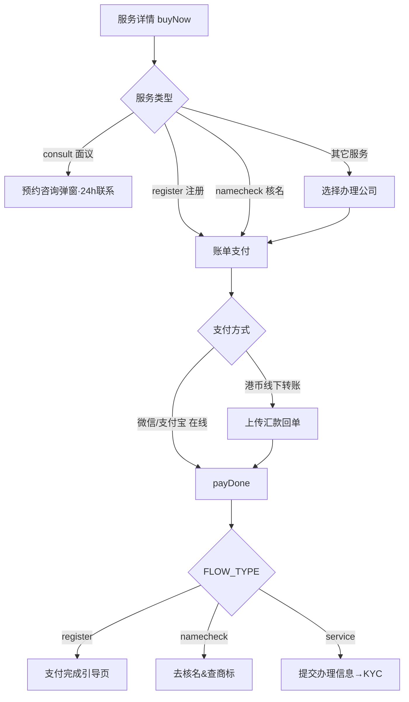
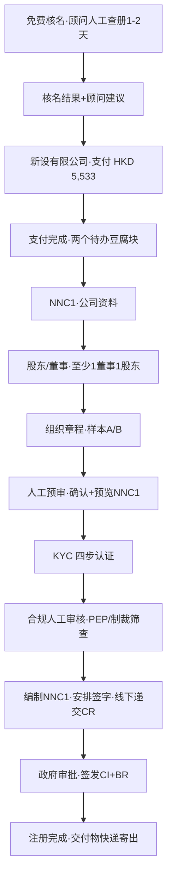
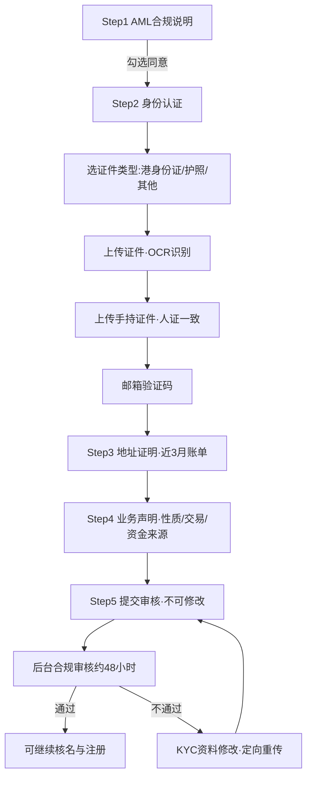
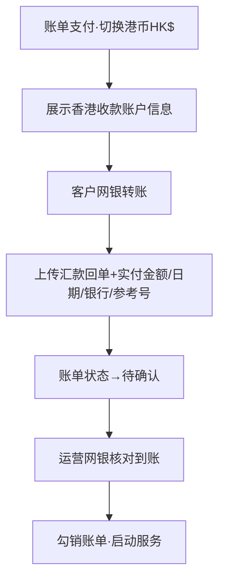

# Leapex 利柏思 · 小程序端 产品需求文档 v1.0

> 文档状态：正式 v1.0　｜　撰写角色：资深财税软件产品经理　｜　基准日期：2026-07-14
> 事实锚点：以原型代码 `backend/static/tcsp.html` 为准（`SVC_DATA` / `SVC_FORM` / `KYC_NOTE` / `ORDER_NODES` 等数据结构逐字段核对）。
> 标注规则：本文对功能标注**「原型已实现」**（当前 HTML 原型可交互演示）与**「规划中」**（业务已定义、原型未落地或仅占位）以区分交付边界。品牌视觉：暗黑金（黑底 `#0D0D0D` + 金 `#D4A853`），正文暖橙强调色 `#C15F3C`。

---

## 一、产品背景与目标

### 1.1 市场背景与数据洞察

香港作为亚太国际金融与离岸贸易枢纽，是内地企业「出海第一站」的首选注册地：无外汇管制、税制简单（利得税两级制、无增值税/关税）、公司名称可中英并用、注册主体门槛低。近年跨境电商（亚马逊/eBay 平台强制要求香港实体与地址验证）、SaaS 出海、投资控股架构（VIE/红筹）三类需求叠加，催生了对「香港公司秘书」这一持续性合规服务的刚性需求——公司一经注册，**年审（NAR1）、法定秘书、注册地址、审计报税、工商变更**便成为逐年重复的强制项。

需求侧的关键洞察：

- **合规是不可选项，而非增值项。** 香港《打击洗钱及恐怖分子资金筹集条例》（AMLO）要求持牌 TCSP 在提供服务前必须完成客户尽职调查（KYC/CDD），含 PEP 与制裁名单筛查。这使「实名认证」从体验负担变为**法定前置**，也构成持牌机构的核心壁垒。
- **信息高度不对称。** 传统代理链条层层转包，客户对「办到哪一步、下一步做什么、政府官费多少、还要交什么材料」普遍不透明，「好了没」式追问是主要痛点。
- **服务离散、复购隐形。** 客户往往在注册时接触一家代理，年审/变更却分散办理，服务商难以沉淀客户资产（公司档案、KYC 存档、到期提醒）。

**香港公司注册处一手统计（精确可核，来源：Companies Registry 官方统计页 `cr.gov.hk`）：**

| 指标 | 2023 | 2024 | 2025 | 备注 |
|---|---|---|---|---|
| 登记册有效本地公司总数（含迁册） | 1,430,758 | 1,460,494 | **1,557,103** | 截至 2026-05 累计约 1,601,089 |
| 年度新注册本地公司数 | 132,246 | 145,053 | **195,343** | 2025 同比约 +35%，其中私人有限公司 194,125 |
| 注册非香港公司（境外公司）总数 | 14,826 | 15,126 | 15,586 | 2025 新设营业地点 1,532，较 2024（1,079）约 +42% |

- **TCSP 持牌监管（AMLO Cap. 615，2018-03-01 生效）**：所有信托及公司服务提供商须向公司注册处申领牌照、通过「适当人选」测试并履行 KYC 与记录保存义务，无牌经营属刑事罪行；牌照审批服务标准为目标 2.5 个月内处理、2024/25 年度达标率 99.0%（来源：公司注册处 AML/CFT Overview、Performance Pledges）。
- 全港 TCSP 持牌机构数量约 **6,000+**（*估算/待核*）；全球/亚太财税·公司服务数字化（SaaS）市场规模与渗透率**待核**——建议定稿前补入第三方报告（Statista / Grand View Research 等）并标注来源。

> 数据口径：公司总数 / 新注册数 / 非香港公司数为香港公司注册处官方一手统计，精确可核；标注「估算/待核」项因调研当期联网检索工具后端故障未能独立核实，采用前须补官方 TCSP Register / CR 年报及第三方报告来源。**这组数字直接印证产品判断：主体基数逼近 156 万、2025 年新设激增 35%、跨境增量强劲，而合规持牌又是硬门槛——正是「线上化 + 合规内嵌 + 持牌背书」平台的市场窗口。**

### 1.2 行业挑战

| 挑战 | 具体表现 |
|---|---|
| 合规成本高且刚性 | KYC/EDD、PEP/制裁筛查、资料加密留存至少 7 年，均为持牌机构强制义务，无法省略 |
| 流程链条长、跨政府部门 | 涉及公司注册处（CR）、税务局（IRD）、知识产权署（IPD）多部门，表格繁多（NNC1/NAR1/ND2A/NNC2/NDR1/IR1263…）|
| 定价不透明 | 服务费与政府官费混淆，面议项无锚点，客户决策成本高 |
| 交付黑箱 | 进度不可见、交付物无统一归集，客户信任成本高 |
| 复购断层 | 缺少公司档案与到期提醒，年审/变更类高频复购流失严重 |

### 1.3 产品定位与用户目标

**Leapex 利柏思** 是香港持牌信托及公司服务提供商（TCSP，牌照号 **TC10988**）打造的**线上一站式公司秘书平台**。小程序端定位为**面向终端客户（内地/香港中小企业主、跨境卖家、投资人）的自助办理与进度追踪入口**，将「核名 → 注册 → 年审 → 变更 → 记账报税 → 商标 → 地址租赁」全链路服务电商化、进度可视化、合规内嵌化。服务地区支持 **香港 / 新加坡 / 迪拜 / BVI**（当前香港为主，其余地区规划中）。

用户目标（User Goals）：

1. **看得懂**——每项服务明码标价（服务费 vs 官费分离），交付内容、时效、所需材料一目了然。
2. **办得动**——注册前先免费核名降低驳回风险；下单-支付-办理三段式，面议项一键预约顾问。
3. **信得过**——KYC 合规前置且「审核不通过全额退款」；持牌 TCSP 背书。
4. **追得到**——办理进度按业务节点实时同步，交付物集中归集可下载，年审到期主动提醒。

商业目标：以「免费核名」为获客钩子 →「新设公司」为高客单转化 →「年审/变更/报税」为逐年复购，通过公司档案沉淀客户资产，通过口令码体系承接渠道/合作伙伴分销。

---

## 二、功能定义和概述

### 2.1 功能模块清单（模块 × 功能点 × 优先级 × 核心价值）

优先级定义：**P0** = MVP 必备、合规/交易主干；**P1** = 提升转化与体验；**P2** = 规划增强。

| 模块 | 功能点 | 优先级 | 状态 | 核心价值 |
|---|---|---|---|---|
| 登录与准入 | 口令码启动页（Splash）| P0 | 原型已实现 | 渠道/合作伙伴分销入口，绑定优惠 |
| 登录与准入 | 手机号验证码 / 微信授权登录 | P0 | 原型已实现 | 未注册手机号自动建号 |
| 登录与准入 | 地区选择（HK/SG/DXB/BVI）| P1 | 原型已实现（HK 为主）| 多地区扩展，当前香港落地 |
| 登录与准入 | 新客/老客人设（persona）切换 | P0 | 原型已实现 | 首页千人千面：新客重种草、老客重管理 |
| 首页 | 新客首页（品牌 Hero + 免费核名钩子 + 服务种草）| P0 | 原型已实现 | 获客转化 |
| 首页 | 老客首页（我的公司 + 待办事项聚合）| P0 | 原型已实现 | 复购与待办驱动 |
| 首页 | 品牌宣传页（关于 Leapex）| P1 | 原型已实现 | 信任背书 |
| 服务电商 | 服务目录（地区+类型双筛选，17 商品）| P0 | 原型已实现 | 服务货架 |
| 服务电商 | 服务详情（8 字段结构化 + 券后价 + 面议预约）| P0 | 原型已实现 | 明码标价、降决策成本 |
| 服务电商 | 下单确认（价格明细 + 口令码优惠 + 条款勾选）| P0 | 原型已实现 | 交易转化 |
| 服务电商 | 面议预约咨询弹窗（24h 顾问联系）| P0 | 原型已实现 | 承接非标/面议服务 |
| 交易支付 | 账单支付（微信/支付宝 + 港币线下转账双通道）| P0 | 原型已实现 | 内地/香港双主体收款 |
| 交易支付 | 上传汇款回单 | P0 | 原型已实现 | 线下到账核销 |
| 交易支付 | 支付完成引导（注册流程专属豆腐块）| P0 | 原型已实现 | 支付后不流失，引导下一步 |
| 核名商标 | 公司核名 + 商标查询（多选、两种查册方式）| P0 | 原型已实现 | 获客钩子、降注册驳回风险 |
| 核名商标 | 核名 & 商标查询结果页 + 顾问建议 | P0 | 原型已实现 | 结构化呈现查册结论 |
| 公司注册 | NNC1 四页向导（公司资料/股东董事/章程/预审）| P0 | 原型已实现 | 核心高客单转化 |
| 公司注册 | 添加股东/董事（OCR + 手持证件）| P0 | 原型已实现 | 身份采集、KYC 复用 |
| 公司注册 | 业务办理/注册完成结果页 | P0 | 原型已实现 | 结果反馈与交付引导 |
| 合规 KYC | KYC 认证四步向导 | P0 | 原型已实现 | AMLO 强制合规 |
| 合规 KYC | KYC 进度（人工审核中/尽调五步）| P0 | 原型已实现 | 审核透明 |
| 合规 KYC | KYC 资料修改（驳回项定向重传）| P0 | 原型已实现 | 审核不通过闭环 |
| 订单中心 | 订单列表（按公司分组 + 状态筛选）| P0 | 原型已实现 | 交易管理 |
| 订单中心 | 订单详情（账单上移 + 办理进度仅业务节点）| P0 | 原型已实现 | 进度可视、顾问备注/补材料同步 |
| 公司资产 | 我的公司（档案 + 新增/删除）| P0 | 原型已实现 | 客户资产沉淀 |
| 公司资产 | 交付物中心（政府文件/PDF/实物三类）| P0 | 原型已实现 | 交付物集中归集下载 |
| 营销 | 优惠券（免费核名券 / 立减券）| P1 | 原型已实现 | 转化激励 |
| 触达 | 消息中心（合规/流程/年审提醒）| P0 | 原型已实现（静态）| 合规通知与年审递进提醒 |
| 我的 | 个人中心（公司/账单/券/KYC/协议/隐私）| P0 | 原型已实现 | 账户入口聚合 |
| 我的 | 用户协议 / 隐私政策 | P0 | 原型已实现 | PDPO/个保法合规 |

### 2.2 功能结构图

```mermaid
graph TD
    A[Leapex 利柏思 小程序] --> B[登录与准入]
    A --> C[首页]
    A --> D[服务电商]
    A --> E[核名/注册]
    A --> F[合规 KYC]
    A --> G[交易支付]
    A --> H[订单与资产]
    A --> I[营销/触达/我的]

    B --> B1[口令码启动页]
    B --> B2[手机验证码/微信登录]
    B --> B3[地区选择]
    B --> B4[新客/老客人设]

    C --> C1[新客首页·免费核名钩子]
    C --> C2[老客首页·我的公司+待办]
    C --> C3[品牌宣传页]

    D --> D1[服务目录·双筛选·17商品]
    D --> D2[服务详情·8字段]
    D --> D3[下单确认]
    D --> D4[面议预约咨询]

    E --> E1[公司核名+商标查询]
    E --> E2[核名结果+顾问建议]
    E --> E3[NNC1 四页向导]
    E --> E4[添加股东/董事·OCR]
    E --> E5[业务办理/注册完成]

    F --> F1[KYC 四步向导]
    F --> F2[KYC 进度/人工审核]
    F --> F3[KYC 资料修改]

    G --> G1[账单支付·双通道]
    G --> G2[上传汇款回单]
    G --> G3[支付完成引导]

    H --> H1[订单列表·按公司分组]
    H --> H2[订单详情·业务节点]
    H --> H3[我的公司档案]
    H --> H4[交付物中心]

    I --> I1[优惠券]
    I --> I2[消息中心]
    I --> I3[我的/协议/隐私]
```

---

## 三、用户角色和使用场景

### 3.1 角色说明

| 角色 | 描述 | 核心诉求 | persona 映射 |
|---|---|---|---|
| 新客（出海创业者）| 首次在港设立公司，无经验，价格敏感、怕踩坑 | 先查名不踩雷、明码标价、快速拿证 | `PERSONA='new'`（首页 `s-home-new`）|
| 老客（存续企业主）| 已有 1+ 家香港公司，关注年度合规与变更 | 到期不逾期、变更省心、进度可查、交付物随手取 | `PERSONA='user'`（首页 `s-home`）|
| 渠道/合作伙伴客户 | 经口令码（如 LEX888）进入，享渠道优惠 | 绑定优惠、获得专属报价 | 任一 persona + `CHANNEL` |
| 顾问/合规/供应商（后台角色）| 在后台履约、审核、维护节点 | 与小程序端进度实时同步（本 PRD 不展开后台）| — |

> 注：`payDone()` 支付成功后自动 `setPersona('user')`，即**完成首次付款即从新客转为老客**，首页切换为「我的公司/待办」管理视图。

### 3.2 核心场景

#### 场景一：新客首次注册香港公司（免费核名 → 注册 → 拿证）

- **痛点**：不知道拟用名称是否可用、会不会撞商标；不清楚要交哪些材料、官费多少；怕代理黑箱、拿不到进度。
- **用户故事**：作为一名跨境电商卖家，我希望先免费核名确认「TimeLeap」可用且不撞商标，再一站式下单注册，全程看到办到哪一步，10 个工作日内拿到 CI/BR，这样我就能安心开店铺、过平台地址验证。

#### 场景二：面议服务预约（工位/办公室/审计/注销等非标项）

- **痛点**：非标服务无法直接标价，客户不知如何咨询、担心无人跟进。
- **用户故事**：作为需要实体办公空间的企业主，我希望对「独立办公室租赁」这类面议服务一键预约，明确 24 小时内有顾问联系我报价，而不必自己找客服。

#### 场景三：老客年审到期处理（到期提醒 → 复购）

- **痛点**：容易忘记年审日、逾期被政府罚款递增。
- **用户故事**：作为已有恒丰贸易公司的老客，我希望系统在到期前分轮提醒我，点一下就能续办年审，避免逾期罚款。

#### 场景四：KYC 审核不通过 → 定向修改重提

- **痛点**：审核被拒后不知道错在哪、要不要全部重传。
- **用户故事**：作为一名 KYC 被驳回的用户，我希望清楚看到哪几项未通过、为什么，只重传出错的项，快速重新提交，不必重来一遍。

#### 场景五：老客查订单进度与下载交付物

- **痛点**：不知道办到哪一步、顾问是否需要补材料、交付文件散落。
- **用户故事**：作为老客，我希望在订单详情按业务节点看到进度、顾问备注和需补交的材料，并在交付物中心集中下载 CI/BR/章程等文件。

---

## 四、核心业务流程

### 4.1 主干流程一：三段式下单履约（下单 → 支付 → 办理）

> 代码事实：`buyNow()` 按 `form` 分流——`register` 直接支付；`namecheck` 直接支付后去核名；其余非注册服务先 `选公司(s-selectcompany)`。面议服务（`consult:true`）主按钮改为 `预约咨询`。

### 4.2 主干流程二：公司注册全链路（核名 → 支付 → NNC1 → KYC → 递交 → 交付）

> 代码事实（`KYC_NOTE.register`）：注册类流程顺序为 **公司核名 → 支付 → 提交注册信息（NNC1）→ KYC 认证（最后）**；KYC 通过后由顾问编制表格、安排签字、线下递交注册处。

### 4.3 主干流程三：KYC 尽职调查（AMLO 合规）

### 4.4 主干流程四：港币线下转账核销

---

## 五、功能详细说明（逐页面 / 逐字段）

> 组件类型约定：单行输入（input）、多行文本（textarea）、下拉选择（select）、单选卡（radio-card）、多选/勾选（checkbox/chk-pill）、分段切换（segment）、上传区（uploader）、只读展示（readonly）。校验默认「非空必填」以外的规则单列。

### 5.0 页面全景与状态枚举总表

**订单状态枚举**（`ORD_STATUS`）：`待支付` · `服务中` · `已完成` · `已取消`
**账单状态枚举**（`BS_CHIP`）：`待支付` · `待确认` · `已到账` · `已含` · `办理中` · `已交付` · `已作废`
**办理节点状态枚举**（`OD_TAG` / `st`）：`done`（已通过/已完成）· `act`（进行中）· `wait`（未开始/已取消）· `todo`
**KYC 步骤枚举**：`合规说明` → `身份认证` → `地址证明` → `业务声明` → `提交`（5 步）
**NNC1 步骤枚举**：`公司资料` → `股东/董事` → `组织章程` → `人工预审`（4 步）
**服务类型枚举**（目录筛选）：`全部/核名商标/注册/年审服务/变更/记账报税/商标/地址租赁`
**地区枚举**：`香港(hk)` · `新加坡(sg)` · `迪拜(dxb)` · `BVI(bvi)`

---

### 5.1 口令码启动页（Splash · `#splash`）｜原型已实现

整页暗黑金背景酷炫入口，首屏须填口令码并注册后进入。

| 字段/元素 | 组件 | 必填 | 默认值 | 校验 / 状态 |
|---|---|---|---|---|
| 口令码 | input（大字距，自动大写）| 是（`loginGo` 强校验）| 空 | 6 位；`000000` 视为无效；实时提示「✓ 有效口令码 / ✗ 请确认」|
| 主按钮「登录 / 领优惠」| button | — | — | 校验通过 → `go('s-login')`；`_markRegistered()` 标记已注册 |
| 「跳过口令码」`spSkip` | link | — | — | 渠道置为「自然流量 / Leapex 利柏思 直营」，进入新客首页 |

> 注：`boot()` 判断 `localStorage.tcsp_registered`，未注册展示 Splash，已注册直接 `goHome()`。

### 5.2 登录页（`#s-login`）｜原型已实现

| 字段 | 组件 | 必填 | 默认值 | 校验 / 状态 |
|---|---|---|---|---|
| 手机号 | input | 是 | `+852 9123 4567`（演示）| 支持 +852 / +86 |
| 获取验证码 | button | — | — | toast「验证码已发送」（规划中：真实短信网关）|
| 短信验证码 | input | 是 | 空 | 6 位 |
| 《用户协议》《隐私政策》勾选 | checkbox | 是 | 已勾选 | `loginDone` 未勾选拦截 toast |
| 登录/注册 / 微信授权登录 | button | — | — | 未注册手机号自动建号；成功 → `s-home-new` |
| 地区标识 `login-region` | readonly | — | 香港 | 跟随首屏地区 |

### 5.3 新客首页（`#s-home-new`）｜原型已实现

- **品牌 Hero**（可点进品牌页）：`香港持牌 TCSP · 牌照号 TC10988`；标语「香港公司，线上办妥」。
- **免费核名钩子卡**：三步（公司核名查册 / 商标查询 / 1–2 日出结果）→ `openSvc('nametm')`。
- **能帮你做什么**（grid2）：新公司注册 / 年审服务 / 工商变更 / 记账报税。
- **为什么选我们**（暗黑金信任面板）：香港持牌 TCSP / 一手注册地址 / 全链路自营履约 / 进度全程可见。
- **推荐服务**：新设有限公司 / 法定公司秘书 / 年度审计（点击 `openSvc`）。

### 5.4 老客首页（`#s-home`）｜原型已实现

- **我的公司**卡：示例「星辰科技（注册进行中·第3/6步）」「恒丰贸易（CI 78451236·下次年审 2026-09-15）」。
- **待办事项**聚合（跳转对应流程）：核名未通过需改名重核 / 支付失败重新支付 / KYC 未通过需修改资料 / 补充地址证明 / 账单待支付 / 年审到期提醒。

> 待办项状态色：红（阻断，需处理）、橙（待办）、蓝（提醒）。

### 5.5 服务目录（`#s-services`）｜原型已实现

- **双筛选**：地区（HK/SG/DXB/BVI，`svcRegion`）+ 类型（8 类，`svcType`），`applySvcFilter` 联动显隐分组，空态展示「该地区暂无此类服务」。进入时地区默认跟随首屏所选（`syncSvcRegion`）。
- **商品卡**：图标 + 名称 + 描述 + 价格（划线原价/券后价/面议）。

**17 个商品（SVC_DATA）完整枚举**：

| key | 名称 | 报价（HKD）| 表单 form | 备注 |
|---|---|---|---|---|
| nametm | 公司名称查册 + 商标查询 | 99 · **券后 0 元** | namecheck | 新客赠 3 张免费券 |
| reg | 新设香港本地有限公司 | 5,533 | register | 10 工作日以内 |
| annual | 年审服务 | 4,422 | annual | 法定秘书+注册地址+NAR1 年费 |
| bookkeep | 审计（含理账）| **面议** consult | — | 理账+审计+利得税 PTR |
| salarytax | 公司薪俸税 IR56A&B | 556/人 | salarytax | 约 3 工作日 |
| persontax | 个别人士报税 | 2,222 | persontax | BIR60 |
| director | 董事变更 | 333 | director | ND2A/ND4 |
| secretary | 变更秘书公司 | 333 | secretary | 转入 Leapex |
| address | 变更注册地址 | 333 | address | NR1 |
| rename | 公司更名 | 1,667 | rename | NNC2+新印章×2 |
| transfer | 股份转让（股东变更）| **面议** consult | transfer | 含印花税 0.2% |
| deregister | 公司注销（撤销注册）| **面议** consult | deregister | NDR1+IR1263，约 8 个月 |
| tmreg | 商标注册申请 | 3,311/类别 | tmreg | 约 6 个月 · IPD |
| tmrenew | 商标注册续期 | 2,200 | tmrenew | 每 10 年 |
| addr-solo | 独立注册地址 | 6,000/年 | addr | 不可办公 |
| addr-seat | 工位租赁 | **面议** consult | — | 可办公·可作注册地址 |
| addr-office | 独立办公室租赁 | **面议** consult | — | 甲级物业·可办公 |

> 价格换算规则（代码注释）：`人民币 = HKD × 0.9`（`BILL_CNY` 取整）。面议项 `consult:true`。

### 5.6 服务详情（`#s-svcdetail`）｜原型已实现

暗黑金头部（图标+名称+tags+价格）。**8 个结构化字段**（由 `SVC_DATA` 逐项渲染）：

| 区块 | 数据字段 | 说明 |
|---|---|---|
| 头部 tags | `tags` | 价格/时效/关键词摘要 |
| 服务简要介绍 | `intro` | 一句话卖点 |
| 服务交付内容 | `incl[]` | 交付清单（勾选列表）|
| 办理时效 | `sla` | 时效承诺 |
| 所需材料 | `materials[]` | 需客户提供的材料 |
| 办理流程 | `process[]` | 步骤条 |
| 详细描述 | `meta` | 富文本，官费/规则等 |
| 券后/面议 | `couponAfter` / `couponNote` / `consult` | 见价格逻辑 |

**底部购买栏（buybar）价格逻辑（`openSvc`）**：
- `consult:true` → 价格「面议」，标签「顾问报价」，主按钮「**预约咨询**」→ `openConsultSheet()`。
- `couponAfter`（如 nametm）→ 顶部原价划线 + 券后价高亮（金色「0 元」），标签「券后价」，「已抵免 1 张免费核名券」提示，主按钮「立即办理」。
- 普通 → 「HKD xxx」，主按钮「立即办理」→ `buyNow()`。

### 5.7 填写服务信息（`#s-svcform`）｜原型已实现

按 `SVC_FORM[form]` 动态渲染字段（input），顶部展示 `KYC_NOTE[form]` 流程提示。示例字段（部分）：

| 服务 | 字段（必要信息）|
|---|---|
| register | 期望公司英文名 / 中文名 / 联系人 / 联系邮箱 |
| annual | 公司名称 / CI / BR / 财政年度结算日 |
| director | 公司名称 / BR首8位 / 变更类型 / 董事中英文名 / 证件类型号码 / 原因·生效日期 |
| rename | 现有中英文名 / BR / 拟用新中英文名 |
| transfer | 公司名称 / 转让方 / 受让方 / 转让股数 / 转让对价（预估印花税）|
| tmreg | 商标名称图样 / 申请类别 Class / 申请人 / 联系邮箱 |
| addr | 公司名称 / 用途 / 联系人·手机 / 备注 |

> 注：**注册（register）与核名（namecheck）不走此表单页**，`buyNow` 直接进支付（注册信息在 NNC1 向导中采集）。

### 5.8 下单确认（`#s-svcorder`）｜原型已实现

| 字段 | 组件 | 默认/来源 | 说明 |
|---|---|---|---|
| 服务清单 | readonly | `CURRENT_SVC` | 图标+名称+tags+价格 |
| 服务原价 `so-orig` | readonly | `origPrice` | 划线原价 |
| 口令码优惠 `so-disc` | readonly | `op-cp` | 无优惠显示 −HKD 0 |
| 应付合计 `so-total` | readonly | `channelPrice` | |
| 同意条款 `so-agree` | checkbox | 未勾选 | `submitOrder` 未勾选拦截 toast |
| 提交订单·去支付 | button | — | 生成 `ORD-2026-0xxx`，插入订单列表，跳 `s-bill` |

### 5.9 账单支付（`#s-bill`）｜原型已实现

三段步骤条（下单✓→支付→办理）。

| 元素 | 组件 | 状态/枚举 | 说明 |
|---|---|---|---|
| 币种切换 | segment | 人民币¥ / 港币HK$ | `setCur`；切港币展示线下转账面板 |
| 金额 `bill-amt` | readonly | — | 人民币=HKD×0.9 取整 |
| 状态 | tag | 待支付 | t-orange |
| 优惠券抵扣 | readonly | — | `openSheet('coupon-sheet')` 可换券 |
| 在线支付 | button | — | 微信支付 / 支付宝 → `payDone()` |
| 港币线下转账 | 展示卡 | — | 户名 TimeLeap Technology (HK) Ltd / 招商永隆银行 / 账号 60100807956 / SWIFT WUBAHKHH |
| 已转账·上传回单 | button | — | → `s-proof` |
| 取消订单 | link | — | `cancelOrder`：订单→已取消，账单→已作废 |

### 5.10 上传汇款回单（`#s-proof`）｜原型已实现

| 字段 | 组件 | 必填 | 默认 | 说明 |
|---|---|---|---|---|
| 回单截图 | uploader | 是 | — | JPG/PNG/PDF |
| 实付金额(HKD) | input | 是 | 2800.00 | |
| 转账日期 | date | 是 | 2026-06-11 | |
| 付款银行 | input | 是 | 空 | 如 HSBC |
| 转账参考号/附言 | input | 否 | LEA-2026-0188-1 | |
| 提交回单 | button | — | — | 账单→待确认，待运营核销 |

### 5.11 支付完成 / 支付成功 / 通用结果页｜原型已实现

- **支付成功页（`#s-paysuccess`）**：成功环 + 订单号/服务/实付/状态（已支付）+「KYC 审核不通过全额退款」提示 + 「去完成 KYC（最后一步）」。
- **支付完成页（`#s-paydone`，注册专属）**：三段步骤条 + 两个待办豆腐块——① 完成 KYC 实名认证（`goKyc`）② 提交公司注册信息（NNC1 四步预览）。
- **通用结果页（`#s-result`）**：`showResult()` 渲染标题/描述/步骤条/信息卡/下一步按钮，服务类与预约类共用。

### 5.12 公司核名 + 商标查询（`#s-namecheck`）｜原型已实现

| 字段 | 组件 | 必填 | 默认 | 校验/状态 |
|---|---|---|---|---|
| 办理项目（可多选）| 多选 chk | 至少 1 | 名称+商标均选中 | `ncToggleSec` 显隐对应区块 |
| 查册方式 | segment | — | 以全名查册 | 「以全名/以名称起首」，`ncMode` 切换提示文案 |
| 拟用公司全名（繁体中文）| input | 二选一 | 空 | 繁体；`ncZhConv` 简→繁提示 |
| 拟用公司全名（英文）| input | 二选一 | TimeLeap | 只支持英文/繁体中文查册 |
| 商标关键字 | input | 选商标时必填 | Leapex | 英文或繁体中文 |
| 提交人工核名 | button | — | — | → 人工核名中（1–2 天，小程序消息通知）|

### 5.13 核名 & 商标查询结果（`#s-ncresult`）｜原型已实现

- **公司名称查册结果**：逐条卡（公司名 / 商业登记号 / 名称现况「现用」/ 状态「仍注册·已告解散」）；名称类别 1/2/3 说明。
- **商标查询结果**：商标图样 + 名称 + 状态（Registered）+ 商标编号 + 类别（如 9/35/42）+ 拥有人。
- **顾问建议**（暖橙卡）：冲突提示与更名/避类建议，「最终以公司注册处核准为准」。
- 主按钮「新公司注册」→ `openSvc('reg')`。

### 5.14 公司注册 NNC1 四页（`#s-reg`）｜原型已实现

**Step 1 · 公司资料**

| 字段 | 组件 | 必填 | 默认 | 说明 |
|---|---|---|---|---|
| 拟用公司全名（繁中）| input | 二选一 | 空 | 须以「有限公司」结尾 |
| 拟用公司全名（英文）| input | 二选一 | TimeLeap Limited | 须以 Limited 结尾；复用核名记录 |
| 拟经营业务性质 | select-sheet | 是 | 未选 | HSIC 香港标准行业分类 |
| 注册办事处地址 | radio-card | 是 | 秘书公司地址 | 「填秘书地址」/「先填秘书地址后续租赁」|
| 电邮地址 | input | 是 | 空 | |
| 股份类别 | readonly | — | 普通股 | disabled |
| 货币单位 | select | — | HKD | HKD/USD/CNY |
| 发行股份总数 | input | 是 | 10,000 | |
| 认购股本总额 | input | 是 | 10,000 | 尚未缴付款额自动结算 |

**Step 2 · 股东/董事**：至少 1 名董事（自然人）+ 1 名股东；公司秘书由 Leapex 内嵌担任，无需填写；身份信息可由 KYC 复用。列表 + 「添加股东/董事」。

**Step 3 · 组织章程**：样本 A（简化格式，推荐）/ 样本 B（radio-card）；章程语言英文/繁中（segment）；预览章程全文 PDF。

**Step 4 · 人工预审**：资料汇总（公司名称/业务性质/注册地址/股本/章程/股东董事）+ 预览 NNC1 表格 + 确认勾选（`reg-confirm`，未勾选按钮禁用）→ 提交人工预审。

> 每步含「暂存（`regSaveDraft`）」。

### 5.15 添加股东/董事（`#s-regperson`）｜原型已实现

| 字段 | 组件 | 必填 | 默认 | 说明 |
|---|---|---|---|---|
| 类型 | segment | 是 | 自然人 | 自然人/法人团体 |
| 身份（可多选）| chk-pill | 至少 1 | 董事 | 股东/董事 |
| 证件类型 | segment | 是 | 香港身份证 | 港身份证/护照/其他证件 |
| 上传证件照片 | uploader | 是 | — | **OCR 自动识别 + 人工复核**（`pfOcr`）|
| 上传手持证件照片 | uploader | 是 | — | **人证一致核验** |
| 姓名 | input（OCR 带出）| 是 | 陳大文 CHAN TAI MAN | |
| 证件号码 | input（OCR 带出）| 是 | A123456(7) | |
| 通讯地址 | segment+多 input | 是 | 香港地址 | 室/楼/座·大厦·街道·区；非香港加「国家/地区」|
| 常驻地址 | checkbox+多 input | 是 | 同通讯地址 | 取消勾选展开独立填写 |
| 联络电邮 | input | 是 | 空 | |
| 出任董事同意书勾选 | checkbox | 是 | 已勾选 | |

> 提示：通讯/常驻地址/证件等身份信息可由 KYC 环节复用。

### 5.16 KYC 认证四步（`#s-kyc`）｜原型已实现

> 步骤条为 5 段展示（合规说明/身份认证/地址证明/业务声明/提交），业务实为「四步采集 + 提交」。

| Step | 字段 | 组件 | 必填 | 校验/状态 |
|---|---|---|---|---|
| 1 AML 合规说明 | 说明全文 + 同意勾选 | checkbox | 是 | 未勾选禁用「下一步」（尽调义务/PEP/制裁/数据保存7年/PDPO 权利）|
| 2 身份认证 | 证件类型 | segment | 是 | 港身份证/护照/其他 |
| | 上传证件照片 | uploader | 是 | OCR 识别 + 人工复核 |
| | 上传手持证件照片 | uploader | 是 | 人证一致 |
| | 邮箱 + 验证码 | input+button | 是 | 本人验证=邮箱验证 |
| 3 地址证明 | 上传地址证明 | uploader | 是 | **近 3 个月内**（水/电/煤/银行对账单）|
| 4 业务声明 | 业务性质 | select | 是 | 贸易/咨询/投资控股/电商/其他 |
| | 预期交易类型 | select | 是 | 本地/跨境贸易/跨境服务 |
| | 资金来源 | select | 是 | 营业收入/股东注资/银行贷款/投资收益 |
| | 补充说明 | textarea | 否 | |
| 5 提交审核 | 汇总 + 提交 | readonly+button | — | **提交后不可修改**，转后台审核约 48 小时 |

### 5.17 KYC 进度（`#s-kycprogress` / `#s-kycaudit`）｜原型已实现

- **尽调五步进度**（`s-kycprogress`）：头部「2/5 已完成」；纵向时间轴逐步展开核心内容与关键规则（AML 说明/身份认证/地址证明/业务声明/提交）。
- **人工审核中**（`s-kycaudit`）：三节点——KYC 资料已提交（done）→ 合规人工审核中（act，PEP/制裁筛查，约 1 工作日）→ 审核通过递交注册处（wait，政府审批 1–2 工作日）。

### 5.18 KYC 资料修改（`#s-kycfix`）｜原型已实现

驳回闭环：顶部红条「审核未通过·2 项需修改」；逐项状态（已通过/未通过）：

| 项 | 状态 | 处理 |
|---|---|---|
| 身份证件（港身份证）| 已通过（OCR 置信度 96%）| 无需动 |
| 地址证明 | 未通过（超期）| 点击重新上传（`fixUpload`）|
| 业务性质/资金来源说明 | 未通过（描述过简）| 修改文本 input |
| PEP/制裁筛查 | 未命中 | 无需动 |

> 仅需修改「未通过」项；「修改完成·重新提交审核」（`kycResubmit`）。

### 5.19 我的公司（`#s-mycompany`）｜原型已实现

| 元素 | 说明 |
|---|---|
| 公司数 `mc-count` | 动态统计（示例 2 家）|
| 新增公司 | `openCompanyForm` |
| 公司卡 | 中英文名 + 状态标签（注册进行中/存续中）+ CI/BR/下次年审信息 |
| 年审入口 | 存续公司展示「距到期 N 天·提醒中」|
| 删除 | **有进行中订单锁定不可删**（`active`）；否则二次确认删除（仅移除档案展示，不影响政府登记）|

### 5.20 订单列表（`#s-orders`）｜原型已实现

- **状态筛选**（`ord-filter`）：全部/待支付/服务中/已完成/已取消。
- **按公司维度分组**（`renderOrders`）：每公司一组，组内多个服务订单。
- **订单卡**：图标+服务名+订单号+当前阶段+金额（HKD 或「—」）+状态标签。空态「暂无订单」。

> 数据：`ORDERS[]` 每单含 no/company/service/icon/color/channel/status/stage/amt/bill/bs。

### 5.21 订单详情（`#s-orderdetail`）｜原型已实现（账单上移 + 办理进度仅业务节点）

渲染顺序（`openOrderDetail`）：

1. **头部**：公司名 + 状态标签 + 服务·订单号·口令码。
2. **豆腐块**（tofu）：当前阶段（第 N/总步）+ 办理进度（%，已完成 X/Y 节点）。
3. **订单账单**（**上移至进度之前**）：服务 + 账单号 + 金额 + 账单状态 chip（可点去支付）。
4. **办理进度（按节点）**：**仅呈现业务办理节点**——代码显式 `filter` 剔除以「下单/支付」开头的节点（属账单环节，不计入办理进度）。每节点含：
   - 节点名 + 责任方（我/平台/合规/供应商）+ 状态标签（done/act/wait）；
   - **我提交的内容/资料**（`mine[]`）；
   - **顾问补充的材料（可下载）**（`files[]`）；
   - **顾问备注**（`remark`）。
5. 底部说明：进度与顾问备注/补充材料由后台实时维护同步。

> 进度百分比 = done 节点数 / 总节点数；「当前阶段」取第一个未完成节点；已取消订单当前阶段显示「已取消」。

### 5.22 交付物中心（`#s-deliverables`）｜原型已实现

头部进度条（示例 6/17 项就绪，KYC 存档不对外）。三类分区：

| 分区 | 示例项 | 状态枚举 |
|---|---|---|
| 政府文件 | CI / BR | 待签发（t-gray）|
| 自动生成文件 PDF | 章程/董事名册/股东名册/秘书任命书/股票证书… | 可下载（t-green）|
| 实物（快递寄送）| 印章套装 / 公司文件册 Company Kit | 制作中（t-orange）/ 运输中（t-blue，含快递单号）|

### 5.23 优惠券（`#s-coupons`）｜原型已实现

- **可用**：免费核名券 ×3（HKD 99 价值，新客赠，有效期至 2026-12-31，去使用→核名）；新客注册立减券 HK$200（满 HK$2,000 可用，有效期至 2026-09-30，去使用→注册）。
- **已使用/已过期**：置灰展示。
- 规则：不可提现、不可叠加。

### 5.24 消息中心（`#s-messages`）｜原型已实现（静态展示，规划中：真实推送）

| 分区 | 示例 | 特性 |
|---|---|---|
| 合规通知·不可关闭 | KYC 审核已通过 / 核名结果完成 | 强制触达 |
| 流程通知 | 首付款账单已生成 | 交易节点 |
| 年审提醒·6 轮递进 | 恒丰贸易：年审到期前 60 天（第 1 轮）| 到期递进提醒 |

### 5.25 我的（`#s-me`）｜原型已实现

用户卡（头像/姓名/邮箱/口令码/KYC 已认证标签）+ 功能入口：我的公司（2 家）/我的账单（1 待付）/优惠券（1 可用）/KYC 认证/通知订阅（合规不可关闭）/用户协议/隐私政策/关于 Leapex。

> 协议页（`s-agreement`，生效 2026-08-01）与隐私政策页（`s-privacy`，PDPO/个保法）为原型已实现的静态法务文本。

### 5.26 面议预约咨询弹窗（`consult-sheet`）｜原型已实现

对面议服务（`consult:true`）触发（`openConsultSheet`）：文案「你正在预约 **{服务名}**。确认后，专属顾问将在 **24 小时内**与你联系并提供报价方案」；「再想想」/「确认预约」；确认后 `showResult` 预约成功，可在「我的订单」查看进度。

---

## 六、异常处理

| 异常场景 | 提示文案 | 处理方式 |
|---|---|---|
| 口令码位数不足/无效（000000）| ✗ 请输入 6 位口令码 / ✗ 请确认口令码 | 拦截提交，红色 hint |
| 未勾选用户协议登录 | 请先阅读并勾选《用户协议》与《隐私政策》| toast 拦截 |
| 下单未勾选服务条款 | 请先勾选同意服务条款 | `submitOrder` 拦截 |
| 核名未通过 | 核名未通过·需改名重核（与已注册公司近似）| 首页待办引导重新核名 |
| 支付失败 | 支付失败·请重新支付（上次微信支付未完成）| 首页待办→重回账单支付 |
| 港币线下转账待核销 | 提交后账单变为「待确认」，运营核对到账后勾销并启动服务 | 账单状态→待确认，人工核销 |
| KYC 审核不通过 | KYC 审核未通过·N 项需修改（附逐项原因，如地址证明超期/资金来源描述过简）| 进入 KYC 资料修改页定向重传 |
| 地址证明超期 | 须为近 3 个月内、显示完整姓名与地址；你上传的银行对账单已超期 | 重新上传 |
| KYC 提交后欲修改 | 提交后资料不可修改，将转后台合规审核（约 48 小时）| 提交前红条警示，锁定 |
| PEP/制裁命中 | （规划中）命中将冻结流程并转人工审查 | 冻结 + 转 EDD/人工 |
| 服务目录该地区无对应类型 | 该地区暂无此类服务，试试切换筛选条件 | 空态占位 |
| 订单列表无数据 | 暂无订单 | 空态占位 |
| 面议服务误按下单 | （面议服务主按钮即为「预约咨询」，不进入支付）| 交互层面规避 |
| 有进行中订单删除公司 | 有进行中订单·暂不可删除 | 删除入口锁定 |
| 取消订单 | 订单已取消 | 订单→已取消、账单→已作废 |
| 非香港地区选择 | {地区} 公司注册即将开放·当前以香港为例 | toast 提示，规划中 |

> 规划中补强项：网络异常/支付超时/OCR 识别失败/上传格式或大小超限/验证码错误或过期，均需在实装阶段补齐统一错误码与文案（当前原型以 toast 演示为主）。

---

## 七、数据埋点方案

> 目标：覆盖获客→转化→合规→复购全漏斗关键行为。建议统一 `page_view` + `element_click` + 关键 `business_event` 三层；以下为业务关键点位。

| 事件名 | 触发时机 | 业务意义 |
|---|---|---|
| `splash_view` | 启动页曝光 | 冷启入口量、口令码渗透 |
| `channel_code_submit` | 口令码提交成功 | 渠道/合作伙伴分销归因 |
| `channel_code_skip` | 跳过口令码 | 自然流量占比 |
| `login_success` | 登录/注册成功 | 新增用户、注册转化 |
| `region_select` | 切换服务地区 | 各地区需求分布，扩区决策依据 |
| `persona_switch` | 新客/老客视角切换 | persona 分层运营 |
| `free_namecheck_click` | 点首页免费核名钩子 | 获客钩子有效性 |
| `service_detail_view` | 进入服务详情（带 svc_key）| 各商品热度、种草效果 |
| `namecheck_submit` | 提交人工核名 | 核名漏斗入口、注册前置转化 |
| `namecheck_result_view` | 核名结果页曝光 | 核名→注册转化率分母 |
| `buy_now_click` | 点「立即办理」（带 svc_key/form）| 加购意向、各服务转化起点 |
| `consult_reserve_confirm` | 面议预约确认 | 面议服务线索量、顾问承接效率 |
| `order_submit` | 提交订单去支付（带订单号/金额）| GMV 意向、下单转化 |
| `pay_success` | 支付成功（在线/线下，币种，金额）| 核心成交、支付方式偏好、HK/CNY 占比 |
| `proof_upload_submit` | 上传汇款回单 | 港币线下转账核销漏斗 |
| `order_cancel` | 取消订单 | 流失分析、取消原因定位 |
| `nnc1_step_complete` | NNC1 每步完成（step 1-4）| 注册向导流失定位、逐步转化 |
| `nnc1_draft_save` | 暂存 NNC1 草稿 | 半途中断复访率、召回依据 |
| `person_add_save` | 保存股东/董事 | 复杂股权采集完成度 |
| `ocr_recognize` | 证件 OCR 识别（成功/失败）| OCR 可用性、人工复核负载 |
| `kyc_step_complete` | KYC 每步完成（step 1-5）| 合规漏斗流失点、审核前置转化 |
| `kyc_submit` | KYC 提交审核 | 合规提交量 |
| `kyc_reject_view` | KYC 资料修改页曝光 | 驳回率、驳回项分布 |
| `kyc_resubmit` | 重新提交审核 | 驳回闭环回收率 |
| `order_detail_view` | 订单详情曝光（带订单号）| 进度追踪活跃、「好了没」替代效果 |
| `deliverable_download` | 交付物下载（带文件名）| 交付触达、文件价值 |
| `coupon_use_click` | 优惠券「去使用」| 券核销转化、营销 ROI |
| `annual_reminder_click` | 点年审到期提醒 | 复购召回有效性 |
| `message_view` | 消息中心曝光 | 触达到达率 |
| `company_add` / `company_delete` | 新增/删除公司档案 | 客户资产沉淀规模 |

---

> **附：核对源文件** `backend/static/tcsp.html`（`SVC_DATA` / `SVC_FORM` / `KYC_NOTE` / `ORDERS` / `ORDER_NODES` / `openOrderDetail` / `boot`）。第一章市场数据取自香港公司注册处官方统计（2023–2025，见 1.1 数据表），标注「估算/待核」项定稿前须补权威来源。
>
> **版本记录**：v1.0（2026-07-14）结合最新原型代码重制——覆盖品牌改名 Leapex 利柏思、暗黑金视觉、核名商品化（99 港币 + 3 免费券）、17 项服务电商化、下单/支付/办理三段式、股东/董事、KYC 手持证件照片人证一致、订单详情（账单上移 + 办理进度仅业务节点）等。同步修复：服务目录「工位租赁」卡片价格由 `HKD 3,000/月` 更正为「面议」以对齐 `consult:true`。