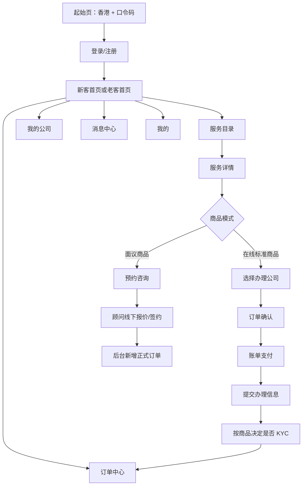
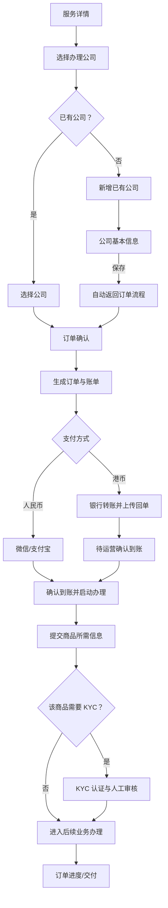
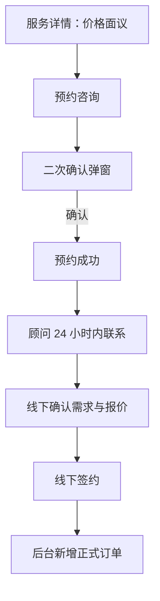

# Leapex 利柏思小程序产品需求文档 v1.0

> 文档状态：v1.0 修订版
>
> 修订日期：2026-07-30
>
> 当前交付形态：可交互静态原型，暂不接入真实 API、支付、OCR、短信或政府系统
>
> 原型代码：`backend/static/tcsp.html`
>
> 办理流程基准：`业务办理流程文案_复核_小程序_v0712harry.xlsx`

## 0. 文档口径

### 0.1 信息优先级

当需求、文案与原型存在冲突时，按以下顺序确认：

1. 本次客户确认的最新需求；
2. 最新办理流程 Excel 中对应商品的专属行；
3. Excel 末尾的全局备注；
4. Excel 的“通用下单流程”页；
5. 当前原型代码。

特别说明：

- Excel 已明确“面议的，都是线下签约，后台新增订单”。因此面议商品即使某一行误留了支付、填表或 KYC 文案，用户端仍统一走“预约咨询 → 顾问对接 → 线下报价/签约”，正式订单由后台创建。
- 通用页面文案只作为兜底。商品行中明确写出的表单、结果页和 KYC 要求优先。
- 本文描述的是当前原型应呈现的产品规则，不代表后端接口已经完成。

### 0.2 本次修订结论

- 服务目录共 17 个香港商品：12 个在线标准商品、5 个面议商品。
- 所有在线标准商品在下单时统一先进入“选择办理公司”。
- 用户可以选择已有公司，也可以进入与“我的－我的公司－新增公司”一致的“公司基本信息”页；保存后自动继续订单确认。
- 账单金额、人民币金额、港币金额、优惠券和订单进度必须由当前商品配置驱动，不允许复用公司注册的固定金额或固定节点。
- KYC 按商品分流，不再让所有服务统一进入 KYC。
- 订单办理节点按各商品的最新流程生成；账单中的“下单/支付”不重复计入业务办理进度。
- 起始页当前只展示香港；新加坡、迪拜、BVI 不作为本期可办理地区。
- 起始页与应用内页采用两套协调视觉：起始页为香港实景照片、深蓝蒙层和绿色品牌图标；应用内页为浅色底、暖橙强调色和绿色/蓝色状态色。

---

## 1. 产品定义

### 1.1 产品定位

Leapex 利柏思小程序是面向香港公司服务客户的移动办理入口，覆盖：

- 渠道口令码准入；
- 服务浏览、下单和支付；
- 公司档案选择与维护；
- 公司名称查册、公司注册、年审、税务、工商变更、商标和地址服务；
- KYC 客户尽调；
- 订单进度、顾问备注和交付物查看；
- 面议服务预约。

### 1.2 产品目标

1. 让用户在下单前看懂价格、时效、交付内容、材料与办理流程。
2. 让标准商品形成“选公司 → 确认订单 → 支付 → 提交资料 → 办理”的完整闭环。
3. 让每个商品使用自己的字段、KYC 规则和办理节点。
4. 让订单状态和办理进度可追踪，减少重复询问。
5. 让公司档案沉淀为年审、变更与复购的统一入口。
6. 让面议商品形成可跟进的咨询线索，同时避免在价格未确认前在线收款。

### 1.3 本期不包含

- 真实微信登录、手机号登录和验证码；
- 真实口令码校验；
- 真实微信支付、支付宝和银行到账核销；
- 真实 OCR、证件识别、活体或人脸核验；
- 真实 KYC、PEP、制裁名单筛查；
- 真实文件上传、下载和电子签署；
- 真实邮件、短信和客服系统；
- 真实公司注册处、税务局或知识产权署接口；
- 新加坡、迪拜、BVI 商品与履约。

---

## 2. 用户与核心场景

| 用户角色 | 核心诉求 | 主要入口 |
|---|---|---|
| 新客户 | 了解香港服务、核名、注册、查看明确价格 | 口令码起始页、新客首页、服务目录 |
| 已有香港公司的客户 | 年审、税务、变更、商标、地址服务与进度管理 | 老客首页、我的公司、订单 |
| 渠道客户 | 使用口令码进入并绑定来源 | 起始页口令码 |
| 顾问/运营 | 承接面议咨询、维护订单节点、补充材料和备注 | 后台，本 PRD 只定义用户端结果 |
| 合规人员 | 审核 KYC 资料与反馈不通过原因 | 后台，本 PRD 只定义用户端状态 |

核心场景：

1. 新客户使用口令码进入，先查册，再办理公司注册。
2. 已有公司客户从年审提醒进入，选择公司并续办年审。
3. 用户购买工商变更、税务、商标或独立注册地址服务。
4. 用户预约审计、股份转让、公司注销、工位或办公室等面议服务。
5. 用户在订单中查看当前办理节点、顾问备注、补充材料与交付物。

---

## 3. 信息架构与视觉基线

### 3.1 页面结构


```mermaid
flowchart TD
    A["起始页：香港 + 口令码"] --> B["登录/注册"]
    B --> C["新客首页或老客首页"]
    C --> D["服务目录"]
    C --> E["我的公司"]
    C --> F["订单中心"]
    C --> G["消息中心"]
    C --> H["我的"]
    D --> I["服务详情"]
    I --> J{"商品模式"}
    J -->|在线标准商品| K["选择办理公司"]
    K --> L["订单确认"]
    L --> M["账单支付"]
    M --> N["提交办理信息"]
    N --> O["按商品决定是否 KYC"]
    O --> F
    J -->|面议商品| P["预约咨询"]
    P --> Q["顾问线下报价/签约"]
    Q --> R["后台新增正式订单"]
```

### 3.2 起始页视觉

- 背景：香港城市实景照片全屏铺设。
- 蒙层：深海军蓝半透明蒙层，保证文字可读性。
- Logo：绿色 Leapex 图标，不额外增加边框。
- 主标题：两行展示“开启您的 / 海外商业布局”。
- 地区：仅保留“香港”。
- 表单：6 位口令码；当前原型不提供跳过入口。
- 页面气质：稳重、合规、国际化，避免将照片高光区域直接作为白色文字底。

### 3.3 应用内视觉

- 页面底色：浅暖灰/浅米色。
- 主强调色：暖橙棕 `#C15F3C` 及其深浅层级。
- 成功/合规状态：绿色。
- 信息/进行中状态：蓝色。
- 警告/待支付状态：橙色。
- 卡片：白底、圆角、轻边框或轻阴影。
- 金色只用于局部品牌或优惠表达，不作为全局暗黑金主题。

---

## 4. 全局业务规则

### 4.1 在线标准商品主流程


```mermaid
flowchart TD
    A["服务详情"] --> B["选择办理公司"]
    B --> C{"已有公司？"}
    C -->|是| D["选择公司"]
    C -->|否| E["新增已有公司"]
    E --> F["公司基本信息"]
    F -->|保存| G["自动返回订单流程"]
    D --> H["订单确认"]
    G --> H
    H --> I["生成订单与账单"]
    I --> J{"支付方式"}
    J -->|人民币| K["微信/支付宝"]
    J -->|港币| L["银行转账并上传回单"]
    K --> M["确认到账并启动办理"]
    L --> N["待运营确认到账"]
    N --> M
    M --> O["提交商品所需信息"]
    O --> P{"该商品需要 KYC？"}
    P -->|是| Q["KYC 认证与人工审核"]
    P -->|否| R["进入后续业务办理"]
    Q --> R
    R --> S["订单进度/交付"]
```

规则：

- 公司选择是在线标准商品的统一前置步骤。
- “公司基本信息”页与“我的－我的公司－新增公司”使用同一页面和字段。
- 保存公司后，不返回服务详情，直接进入订单确认。
- 订单确认必须显示当前商品名称、原价、优惠、应付合计和服务条款。
- 人民币与港币金额从当前商品配置读取。
- 港币上传回单后状态为“待确认”，运营确认到账前不得显示“已到账”或启动业务。
- 商品信息提交后，按商品配置判断是否进入 KYC。

### 4.2 面议商品主流程


```mermaid
flowchart TD
    A["服务详情：价格面议"] --> B["预约咨询"]
    B --> C["二次确认弹窗"]
    C -->|确认| D["预约成功"]
    D --> E["顾问 24 小时内联系"]
    E --> F["线下确认需求与报价"]
    F --> G["线下签约"]
    G --> H["后台新增正式订单"]
```

规则：

- 用户端不在线支付、不在线签署、不展示未经确认的金额。
- 预约成功后生成咨询记录，可在订单列表查看“待顾问联系”。
- 正式订单由顾问/运营在后台创建。

### 4.3 商品级 KYC 规则

| 类型 | 商品 |
|---|---|
| 在线流程需要 KYC | 新设香港本地有限公司、年审服务、董事变更、变更秘书公司、商标注册申请、商标注册续期、独立注册地址 |
| 在线流程不进入 KYC | 公司名称查册 + 商标查询、公司薪俸税、个别人士报税、变更注册地址、公司更名 |
| 面议线下确认 | 审计（含理账）、股份转让、公司注销、工位租赁、独立办公室租赁 |

面议商品如在线下成交后需要 KYC，由后台订单与正式合同规则决定，不在预约阶段强制用户进入 KYC。

### 4.4 订单进度规则

- 每个商品使用自己的 `process` 生成订单节点。
- 支付完成后，“下单/支付”节点标记为完成，第一个业务节点进入进行中。
- 用户提交资料时，只推进“提交/信息核对/确认接任”类节点。
- 用户提交 KYC 时，只推进 KYC 节点。
- 商品配置要求 KYC、但原办理流程未单列 KYC 时，系统在资料提交后自动插入“KYC 认证”节点。
- 订单详情只统计业务节点；以“下单”或“支付”开头的账单节点不计入办理进度百分比。
- 全部业务节点完成后，订单状态为“已完成”，账单/交付状态为“已交付”。

---

## 5. 商品目录

### 5.1 商品与价格

| # | 商品 | HKD | CNY | 时效 | 模式 |
|---:|---|---:|---:|---|---|
| 1 | 公司名称查册 + 商标查询 | 99 | 89，券后 0 | 约 1–2 个工作日 | 在线 |
| 2 | 新设香港本地有限公司 | 5,533 | 4,980 | 10 个工作日以内 | 在线 |
| 3 | 年审服务 | 4,422 | 3,980 | 10 个工作日以内；NAR1 须在周年日起 42 天内递交 | 在线 |
| 4 | 审计（含理账） | 面议 | 面议 | 按年度；视资料完整度 | 面议 |
| 5 | 公司薪俸税 IR56A&B | 556/人 | 500/人 | 约 3 个工作日 | 在线 |
| 6 | 个别人士报税 | 2,222 | 2,000 | 约 3 个工作日 | 在线 |
| 7 | 董事变更 | 333 | 300 | 约 5 个工作日 | 在线 |
| 8 | 变更秘书公司 | 333 | 300 | 约 5 个工作日 | 在线 |
| 9 | 变更注册地址 | 333 | 300 | 约 5 个工作日 | 在线 |
| 10 | 公司更名 | 1,667 | 1,500 | 7–10 个工作日；新 BR 约增加 2 周 | 在线 |
| 11 | 股份转让（股东变更） | 面议 | 面议 | 约 5 个工作日 | 面议 |
| 12 | 公司注销（撤销注册） | 面议 | 面议 | 约 8 个月 | 面议 |
| 13 | 商标注册申请 | 3,311/类别 | 2,980/类别 | 约 6 个月 | 在线 |
| 14 | 商标注册续期 | 2,200 | 1,980 | 约 5 个工作日 | 在线 |
| 15 | 独立注册地址 | 6,000/年 | 5,400/年 | 付款后 1–2 个工作日出资料 | 在线 |
| 16 | 工位租赁 | 面议 | 面议 | 预约后线上或香港实地看位 | 面议 |
| 17 | 独立办公室租赁 | 面议 | 面议 | 预约后线上或香港实地看房 | 面议 |

### 5.2 商品办理节点

| 商品 | 办理节点 |
|---|---|
| 公司名称查册 + 商标查询 | 下单并支付 → 填写并提交查册信息 → 顾问人工查册 → 出核查结果 |
| 新设香港本地有限公司 | 支付 → KYC 认证 → 提交注册信息 → 预审与文件编制 → 文件签字 → 递交注册处 → 交付 CI/BR |
| 年审服务 | 支付/续费 → 信息核对 → KYC 年度复核 → 编制 NAR1 → 递交注册处 → 交付 NAR1 与 BR |
| 审计（含理账） | 预约 → 顾问联系 → 线下报价/签约；正式订单节点：资料收集 → 理账与财报 → 独立审计 → 利得税 PTR → 提交 IRD |
| 公司薪俸税 IR56A&B | 支付 → 提交员工薪金 → 编制 IR56B/IR56A → 雇主签署并提交 IRD → 完结 |
| 个别人士报税 | 支付 → 提交收入资料 → 编制 BIR60 → 客户签署并提交 IRD → 完结 |
| 董事变更 | 支付 → 提交关键信息 → 新董事 KYC → 编制 ND2A → 文件签字确认 → 递交注册处 → 完结 |
| 变更秘书公司 | 支付 → 确认接任信息 → KYC → 编制 ND2A → 文件签字确认 → 递交注册处 → 完结 |
| 变更注册地址 | 支付 → 提交关键信息 → 编制 NR1 → 文件签字确认 → 递交注册处 → 交付新 BR |
| 公司更名 | 支付 → 提交拟用新名称 → 人工查名 → 编制 NNC2 与决议 → 文件签字确认 → 递交注册处 → 交付新 BR |
| 股份转让 | 预约 → 顾问联系 → 线下报价/签约；正式订单节点：提交转让信息 → 核定作价与印花税 → 受让方 KYC → 备文书缴印花 → 文件签字 → 完结 |
| 公司注销 | 预约 → 顾问联系 → 线下报价/签约；正式订单节点：提交注销信息 → 申请 IR1263 → 备决议与 NDR1 → 文件签字 → 递交与公告 |
| 商标注册申请 | 支付 → 提交商标信息 → KYC → 递交 IPD → 审查与公告 → 发证 |
| 商标注册续期 | 支付 → 提交商标编号 → KYC → 递交续期 IPD → 完结 |
| 独立注册地址 | 支付 → 提交公司资料 → KYC → 平台配置地址 → 出厘印税单与水电单 → 完结 |
| 工位租赁 | 预约 → 达利对接 → 看位/报价 → 线下签约 → 后台新增订单 |
| 独立办公室租赁 | 预约 → 达利对接 → 看房/报价 → 客户与达利线下直签 → 后台新增订单 |

---

## 6. 商品表单

### 6.1 公司名称查册 + 商标查询

- 顶部项目多选：公司名称查册、商标查询；至少选择一项。
- 查册方式：以全名查册、以名称起首查册。
- 公司名称：繁体中文和英文至少填写一项。
- 输入简体中文时，页面提示转换后的繁体文本。
- 商标查询：商标名称/关键字；如需图形查询，可补图样。
- 联系邮箱。
- 提交后进入“顾问人工核名中”，约 1–2 个工作日出结果。

### 6.2 新设香港本地有限公司

注册资料使用四页 NNC1 向导。

**第 1 页：公司资料**

- 拟用公司全名（繁体中文）；
- 拟用公司全名（英文）；
- 拟经营业务性质（HSIC）；
- 注册办事处地址：秘书公司地址/需要租赁办公室；
- 公司电邮；
- 股份类别、币种、发行股数、认购股本。

**第 2 页：成员/董事**

- 身份：创办成员、董事，可多选；
- 证件类型：香港身份证、护照、其他；
- 证件照片；
- OCR 识别并回填姓名、证件号；
- 手持证件照片；
- 通讯地址；
- 常驻地址，默认同通讯地址；
- 非香港地址展示国家/地区，默认中国；
- 联络邮箱。

**第 3 页：组织章程**

- 样本 A（简化格式，推荐）；
- 样本 B；
- 章程语言：英文、繁体中文；
- 章程 PDF 预览。

**第 4 页：人工预审**

- 汇总公司、成员、股本、地址和章程信息；
- NNC1 预览；
- 确认资料真实完整；
- 暂存或提交人工预审。

支付完成页同时展示两个待办入口：

1. 完成 KYC 实名认证；
2. 提交公司注册信息。

两项均完成后才进入人工预审与后续文件编制。

### 6.3 其他在线商品表单

| 商品 | 字段 |
|---|---|
| 年审服务 | 公司名称、公司注册编号 CI、商业登记证号 BR、财政年度结算日（如 03-31） |
| 公司薪俸税 IR56A&B | 公司名称、员工人数、申报年度 |
| 个别人士报税 | 姓名、香港身份证/税务档案号、申报年度 |
| 董事变更 | 公司名称、BR、变更类型、董事英文名、董事中文名、证件类型/号码、原因/生效日期 |
| 变更秘书公司 | 公司名称、BR、现任秘书公司、是否确认由 Leapex 利柏思接任 |
| 变更注册地址 | 公司名称、BR、新注册地址或选用 Leapex 利柏思地址、生效日期 |
| 公司更名 | 现有中英文名、BR、拟用新中英文名 |
| 商标注册申请 | 商标名称、商标图样（如需）、申请类别 Class、申请人、联系邮箱 |
| 商标注册续期 | 商标名称、商标注册编号、续期年度 |
| 独立注册地址 | 公司名称/拟注册名称、用途、联系人及手机、备注 |

面议商品在预约阶段不展示在线办理表单。

---

## 7. 页面需求

### 7.1 起始页

| 项目 | 需求 |
|---|---|
| 服务地区 | 只展示香港 |
| 品牌 | 绿色 Leapex 图标 |
| Slogan | “开启您的海外商业布局”，分两行 |
| 口令码标题 | “口令码” |
| 按钮 | “输入口令码开始服务” |
| 校验 | 必须输入 6 位口令码；无效时展示明确错误 |
| 跳过 | 本期不提供 |

### 7.2 服务目录

- 类型筛选：全部、核名商标、注册、年审服务、变更、记账报税、商标、地址租赁。
- 目录展示 17 个香港商品。
- 商品卡展示名称、简述、时效、HKD 价格或“面议”。
- 非香港地区若保留筛选占位，不得产生可下单商品。
- 空态：“该地区暂无此类服务，请切换筛选条件。”

### 7.3 服务详情

统一展示：

1. 商品名称；
2. 价格/面议；
3. 简要介绍；
4. 服务交付内容；
5. 办理时效；
6. 所需材料；
7. 办理流程；
8. 详细说明；
9. 底部主操作。

操作规则：

- 在线商品：按钮“立即办理”。
- 面议商品：按钮“预约咨询”。
- 公司名称查册 + 商标查询：展示 HKD 99 / ¥89 与免费券抵扣结果。

### 7.4 选择办理公司

- 页面显示当前商品名称。
- 展示已有公司列表。
- 选择公司后进入订单确认。
- “新增已有公司”进入“公司基本信息”。
- 公司基本信息字段：中文名称、英文名称、CI、BR、成立日期。
- 中文名与英文名至少填写一个；CI、BR 在原型阶段允许暂不填写。
- 从结算流程新增并保存后，自动选择该公司并进入订单确认。

### 7.5 订单确认

- 当前商品、商品说明、商品价格；
- 原价、优惠金额、应付合计；
- 当前选中的办理公司；
- 服务条款勾选；
- 未勾选条款时禁止提交；
- 提交后生成唯一订单号和账单号。

### 7.6 账单支付

- 三步提示：下单、支付、办理。
- 币种：人民币、港币。
- 金额必须读取当前商品：
  - 有明确 CNY 价格时使用商品配置；
  - 无独立 CNY 配置时，可按 HKD × 0.9 取整作为原型展示。
- 优惠券只展示当前商品可用券；无券时提示“本单暂无可用优惠券”。
- 人民币：微信支付、支付宝。
- 港币：展示香港收款账户，转账后上传回单。
- 回单页的金额和账单参考号从当前订单带入，不使用固定示例金额。
- 回单提交后：
  - 账单状态：待确认；
  - 订单阶段：待确认到账；
  - 提示运营核对到账后启动服务。

### 7.7 支付结果与信息提交

在线支付成功：

- 标题：“支付成功”；
- 文案：“已收到你的款项。请继续提交本次办理所需的信息。”；
- 下一步按钮：提交办理信息。

资料提交后：

- 需要 KYC：提示“办理所需信息已提交。最后一步：完成 KYC 实名认证（香港持牌 TCSP 合规必做）。”
- 不需要 KYC：提示顾问将继续编制、签署或递交，用户可在订单中查看进度。

港币回单：

- 标题：“回单已提交”；
- 文案：“运营人员将在网银核对到账。确认到账后，订单会自动进入办理流程。”

### 7.8 KYC

五段展示：

1. 合规说明与同意；
2. 身份认证：证件类型、证件照片、手持证件照、邮箱验证码；
3. 地址证明：近 3 个月内；
4. 业务声明：业务性质、交易类型、资金来源、补充说明；
5. 提交审核。

状态：

- 未提交；
- 人工审核中；
- 已通过；
- 未通过，展示逐项原因并允许定向重传。

原型审核时效文案统一为“约 1 个工作日”，避免同一页面同时出现 24 小时和 48 小时。

### 7.9 订单列表与详情

订单状态：

- 待支付；
- 待顾问联系；
- 服务中；
- 已完成；
- 已取消。

账单状态：

- 待支付；
- 待确认；
- 已到账；
- 面议；
- 办理中；
- 已交付；
- 已作废。

订单列表：

- 按公司分组；
- 显示服务、订单号、当前阶段、金额和状态；
- 面议咨询金额显示“—”；
- 支持状态筛选。

订单详情：

- 公司名、商品名、订单号、口令码；
- 当前阶段与进度百分比；
- 账单信息；
- 业务节点；
- 每个节点可包含用户已提交资料、顾问补充文件和顾问备注；
- 下单和支付节点不纳入办理进度。

### 7.10 我的公司

- 展示公司中英文名、CI、BR、状态和年审信息。
- 支持新增公司。
- 无进行中订单的公司可以二次确认后删除。
- 有进行中订单的公司不可删除。
- 公司档案是订单、交付物和年审提醒的统一归属主体。

### 7.11 面议咨询

- 二次确认文案包含当前商品名；
- 明确顾问将在 24 小时内联系；
- 预约成功后咨询记录状态为“待顾问联系”；
- 预约阶段不显示在线支付、KYC 和正式合同；
- 正式成交后由后台新增订单。

---

## 8. 数据对象

### 8.1 商品

```text
Service {
  key
  name
  icon
  price_hkd
  price_cny
  consult
  form
  kyc_required
  intro
  deliverables[]
  sla
  materials[]
  process[]
  detail
}
```

### 8.2 公司

```text
Company {
  id
  name_zh
  name_en
  ci
  br
  incorporation_date
  status
  has_active_order
  annual_due
}
```

### 8.3 订单

```text
Order {
  order_no
  company_id
  service_key
  channel_code
  status
  current_stage
  amount_hkd
  bill_no
  bill_status
  nodes[]
}
```

### 8.4 办理节点

```text
OrderNode {
  name
  responsible_party
  status
  user_materials[]
  advisor_files[]
  advisor_remark
}
```

---

## 9. 异常与边界

| 场景 | 处理 |
|---|---|
| 口令码少于 6 位 | 阻止提交，提示“请输入 6 位口令码” |
| 口令码无效 | 提示“请确认口令码” |
| 未选择办理公司 | 不允许进入订单确认 |
| 公司中英文名均为空 | 不允许保存 |
| 未勾选服务条款 | 不允许生成订单 |
| 当前商品无优惠券 | 优惠券入口提示“本单暂无可用优惠券” |
| 在线支付失败/取消 | 保持待支付，可重新支付 |
| 港币回单待核对 | 保持待确认，不提前启动业务 |
| KYC 未通过 | 展示未通过项目与原因，只重传相关资料 |
| 面议商品点击办理 | 只进入预约咨询，不进入账单 |
| 公司有进行中订单 | 禁止删除公司 |
| 订单取消 | 订单为已取消，账单为已作废 |
| 非香港地区 | 本期不展示可办理商品 |

---

## 10. 埋点建议

| 事件 | 关键参数 |
|---|---|
| `splash_view` | source |
| `channel_code_submit` | channel_code、result |
| `login_success` | user_type |
| `service_list_view` | category、region |
| `service_detail_view` | service_key |
| `company_select` | service_key、company_id |
| `company_add` | source |
| `order_confirm_view` | service_key、amount |
| `order_submit` | order_no、service_key、company_id |
| `pay_start` | order_no、currency、method、amount |
| `pay_success` | order_no、currency、method、amount |
| `proof_submit` | order_no、amount |
| `service_form_submit` | order_no、service_key |
| `kyc_start` | order_no、service_key |
| `kyc_submit` | order_no、service_key |
| `namecheck_submit` | selected_items、mode |
| `consult_submit` | service_key |
| `order_detail_view` | order_no、stage |
| `deliverable_download` | order_no、file_type |
| `annual_reminder_click` | company_id、days_to_due |

---

## 11. 验收标准

### 11.1 商品完整性

- [ ] 服务目录展示 17 个商品，名称与最新 Excel 一致。
- [ ] 12 个在线商品和 5 个面议商品分流正确。
- [ ] 每个有价格商品的 HKD/CNY 金额与商品配置一致。
- [ ] 年审首页推荐价为 HKD 4,422，不再显示旧价。
- [ ] 公司注册价为 HKD 5,533 / ¥4,980。

### 11.2 在线下单

- [ ] 所有在线标准商品点击“立即办理”后先进入选择办理公司。
- [ ] 新增公司保存后自动进入订单确认。
- [ ] 订单确认展示当前商品和当前公司。
- [ ] 账单金额随商品变化，不固定为公司注册金额。
- [ ] 回单金额和参考号随订单变化。

### 11.3 商品表单与 KYC

- [ ] 年审只采集公司名称、CI、BR、财政年度结算日。
- [ ] 商标注册采集商标名称/图样、Class、申请人和邮箱。
- [ ] 面议商品不展示在线办理表单。
- [ ] 7 个需要 KYC 的在线商品进入 KYC。
- [ ] 5 个不需要 KYC 的在线商品提交资料后直接进入后续办理。

### 11.4 订单进度

- [ ] 新生成订单拥有对应商品的办理节点。
- [ ] 支付后进入第一个业务节点。
- [ ] 资料提交与 KYC 只推进自己的节点。
- [ ] 订单详情不把下单/支付计入业务进度。
- [ ] 面议预约生成“待顾问联系”记录，金额为“—”。

### 11.5 视觉与文案

- [ ] 起始页仅展示香港。
- [ ] 起始页使用香港实景、深蓝蒙层和绿色 Leapex 图标。
- [ ] Slogan 为“开启您的海外商业布局”。
- [ ] 应用内页保持浅色、暖橙强调色，不误写为全局暗黑金。
- [ ] 结果页、按钮和流程文案与最新 Excel 一致。

---

## 12. 原型实现状态

| 范围 | 当前状态 |
|---|---|
| 起始页、首页、服务目录、服务详情 | 可交互原型 |
| 17 商品配置、价格、材料、流程 | 已进入原型配置 |
| 选择公司、新增公司、订单确认 | 可交互原型 |
| 动态账单与商品优惠券 | 可交互原型 |
| 商品级表单与 KYC 分流 | 可交互原型 |
| 商品级订单节点 | 可交互原型 |
| 面议预约 | 可交互原型 |
| NNC1、KYC、订单、交付物 | 可交互原型/静态示例数据 |
| API、真实支付、真实上传、真实审核 | 未接入 |

---

## 13. 版本记录

| 版本 | 日期 | 说明 |
|---|---|---|
| v1.0 初稿 | 2026-07-14 | 基于早期原型整理 |
| v1.0 修订版 | 2026-07-30 | 对齐最新小程序设计、17 个商品办理流程与 `v0712harry` Excel；统一选公司流程；修正动态计价、商品表单、KYC 分流、面议线下签约和订单节点 |
